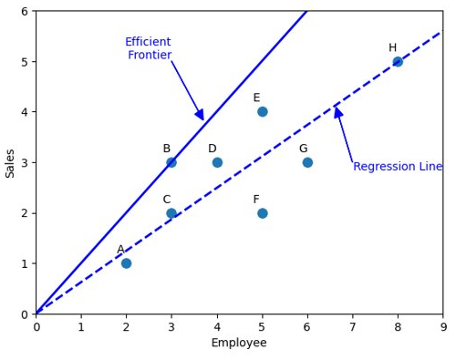

<!-- **Đánh giá Hiệu suất là gì​?** -->

Khi chúng ta có đầu vào, và nhận được kết quả, chúng ta hay đánh giá hiệu suất của kết quả xem với đầu vào như thế thì kết quả liệu có tốt không.​ Một số ví dụ cơ bản: Giá thành/sản phẩm, Lợi nhuận/sản phẩm.​
<!-- truncate -->

$$
\frac{Output}{Input}
$$

Công thức trên được gọi là thước đo hiệu quả.​
Chúng ta có thể mở rộng công thức trên với Nhiều đầu vào (Inputs) và nhiều đầu ra (Outputs)​

## Ví dụ đơn giản với một input và một output

Ví dụ một nhãn hàng có 8 cửa hàng được gán nhãn là A,B,C,D,E,F,G,H với tham số đầu vào là Số lượng nhân viên (Employee) của cửa hàng đó và đầu ra là số lượng hàng bán được (Sales) của cửa hàng. Hệu suất của cửa hàng được tính theo công thức đơn giản là Sales/Employees. Kết quả thu được cửa hàng B có hiệu suất cao nhất là 1 và cửa hàng F có hiệu suất thấp nhất là 0.4

Ta có thể biểu diễn mối tương quan giữa Input và Output bằng scatterplot.
Độ dốc của đường nối với mỗi điểm và gốc tọa độ O(0,0) tương ứng với Sales/ Employee ( hiệu quả). Trong hình trên ta có thể tính được đường thằng OB có dạng $y=1x$, do đó hiệu suất của B là 1. ​

Đường có độ dốc cao nhất (nối với điểm B) được gọi là Efficient  Frontier (Đường biên hiệu quả).​ Các điểm sẽ nằm cùng 1 phía so với đường thẳng, hoặc ở trên, hoặc ở dưới.​ Nếu chúng ta vẽ Output là trục tung và Input là trục hoành thì các điểm sẽ nằm phía dưới đường biên hiệu quả. Ngược lại nếu chúng ta vẽ Output là trục hoành và Input là trục tung thì các điểm sẽ nằm phía trên của đường biên hiệu quả.

Chúng ta có thể  vẽ một đường thống kê hồi quy $y=0.622x$ để ước lượng mối quan hệ tuyến tính giữa input và output.​ Đường hồi quy này đi qua chính giữa của tập dữ liệu, do đó chúng ta có thể xem các điểm ở phía trên đường là hiệu quả tốt và điểm dưới là chưa tốt, khoảng cách giữa điểm tới hình chiếu của điểm đó trên đường hồi quy chính ta mức độ hiệu quả/không hiệu quả​ so với trung bình. Trong ví dụ trên, chúng ta có thể thấy điểm H gần với trung bình nhất, 

<!-- Khoảng cách từ các điểm đến đường Efficient Frontier nêu lên độ lệch so với điểm tốt nhất​ -->

### So sánh với đường biên

Với cửa hàng A, có hai cách để so sánh với đường biên. Bằng cách chiếu theo trục tọa độ, chúng ta có hai điểm A1 và A2​

- Với điểm A2, để đạt được hiệu suất như B mà vẫn giữ nguyên số lượng nhân viên, chúng ta cần phải cố gắng tăng Sale lên 2​
- Với điểm A1, nếu muốn giữ nguyên sale mà vẫn muốn đạt được hiệu suât cao, chúng ta cần phải cắt giảm nhân sự xuống 1.

Ngoài ra, bất cứ điểm nào nằm trong đoạn A1A2 cũng là kết quả tối ưu cho cửa hàng B, đối với các điểm này, chúng ta cần phải thay đổi cả giá trị Sale lẫn Employee.

