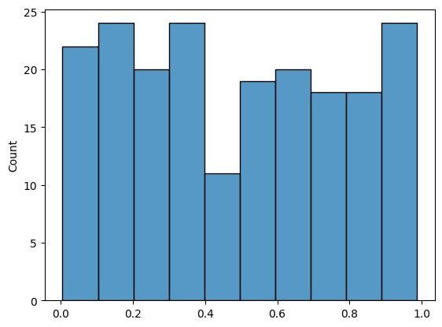
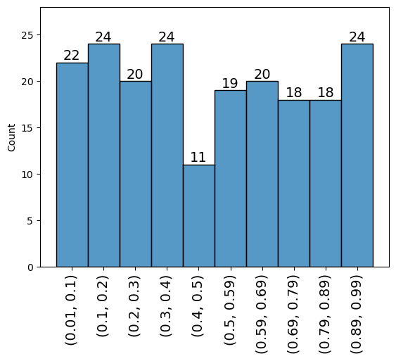

Thông thường, khi visualize mặc định histogram của seaborn sẽ không thể hiện tất cả các nhãn của bins và số lượng mỗi bin
Với cách làm như trên sẽ rất khó theo dõi các khoảng giá trị của từng bin và số lượng của bin đó. May mắn thay seaborn histogram tương tự numpy nên ta có thể dùng hàm np.histogram để giải quyết vấn đề này
<!-- truncate -->

Dưới đây là ví dụ cơ bản khi visualize dữ liệu bằng histogram mặc định của seaborn

```python
import numpy as np
import seaborn as sns 
np.random.seed(42)
x = np.random.uniform(size=200)
sns.histplot(x, bins=10)
```



Kết quả không cho ta thấy được bin đầu tiên nằm trong khoảng giá trị nào, và số lượng phần tử là bao nhiêu, điều này dẫn đến khó khăn để hiểu được biểu đồ cũng như đánh giá kết quả. Để giải quyết vấn đề trên, chúng ta tìm cách điền vào biểu đồ bằng phương thức `plt.text`. Trước hết, chúng ta cần tính được khoảng mỗi bin và số lượng các phần tử trong bin, may mắn thay np.histogram có thể giúp ta tính được các giá trị này

```python
counts, bin_labels = np.histogram(x, bins=10)
print(len(counts), counts)
print(len(bin_labels), bin_labels)
```

```
10 [22 24 20 24 11 19 20 18 18 24]
11 [0.00552212 0.1036586  0.20179508 0.29993156 0.39806804 0.49620453
 0.59434101 0.69247749 0.79061397 0.88875045 0.98688694]
```

Các bạn có thể thấy với tham số bins đưa vào chỉ có 10 trong khi kết quả nhãn bin_labels lại có 11 giá trị, trong đó giá trị đầu là giá trị nhỏ nhất của x và giá trị cuối là giá trị cao nhất của x. Do đó khoảng đầu tiên của bin đầu tiên có giá trị nằm từ [0.00552212, 0.1036586)
Để kiểm tra xem có đúng thể không, ví dụ kiểm tra bin đầu tiên có phải 22 phần tử không?

```python
len(x[(x>=bin_labels[0]) & (x<bin_labels[1])])
```

```
22
```

Sau đó, ta dùng matplotlib để plot text

```python
import matplotlib.pyplot as plt 

ax = sns.histplot(x, bins=10)
bin_heights = [p.get_height() if p.get_height() > 0 else 0.1 for p in ax.patches]
# Hiển thị giá trị count từng bin
for i in range(len(bin_heights)):
    plt.text(ax.patches[i].get_x() + ax.patches[i].get_width() / 2,
            bin_heights[i],
            str(int(bin_heights[i])),
            fontsize=14,
            ha='center',
            va='bottom')
mids = [rect.get_x() + rect.get_width() / 2 for rect in ax.patches]
labels = [(round(i,2),round(j,2)) for i,j in zip(bin_labels[:-1], bin_labels[1:])]
ax.set_xticks(mids, labels=labels, fontsize=14, rotation=90)
ax.set_ylim(0,28)
```




Follow Fanpage của mình để nhận được các bài viết mới nhất nhé!!  https://www.facebook.com/datasciencedances/