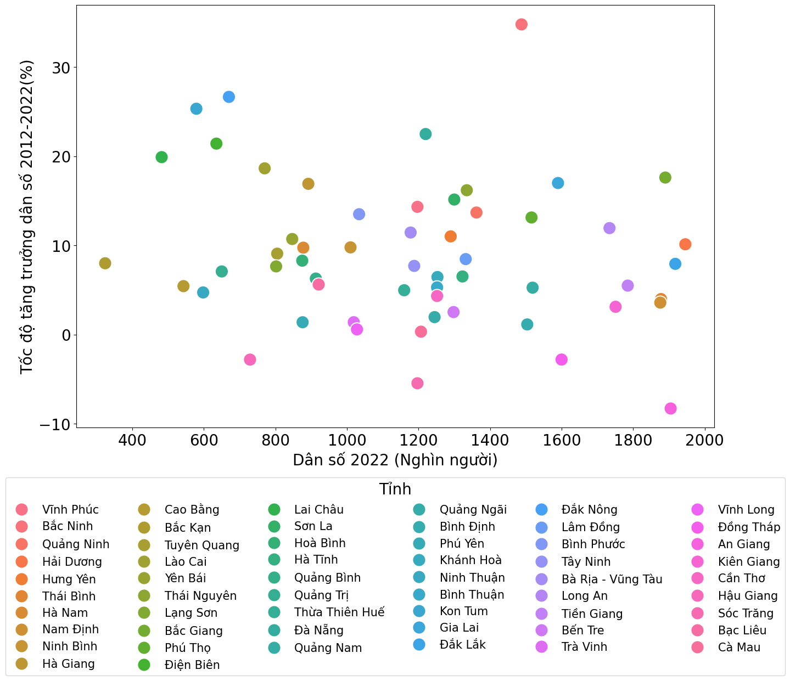
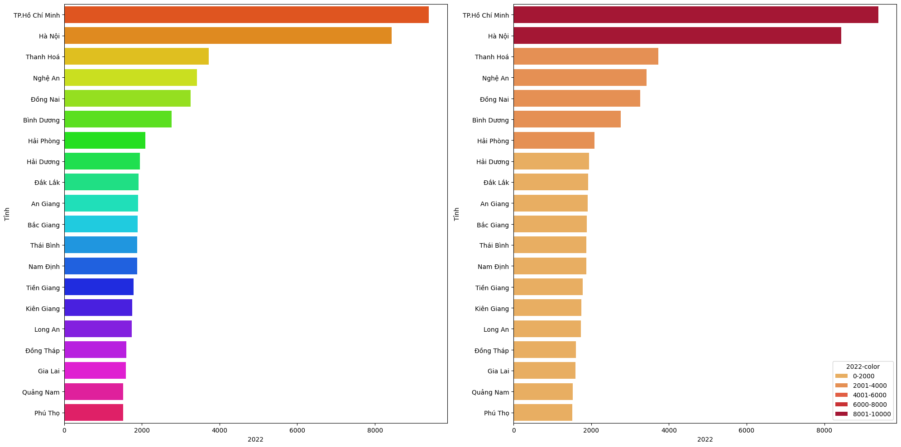
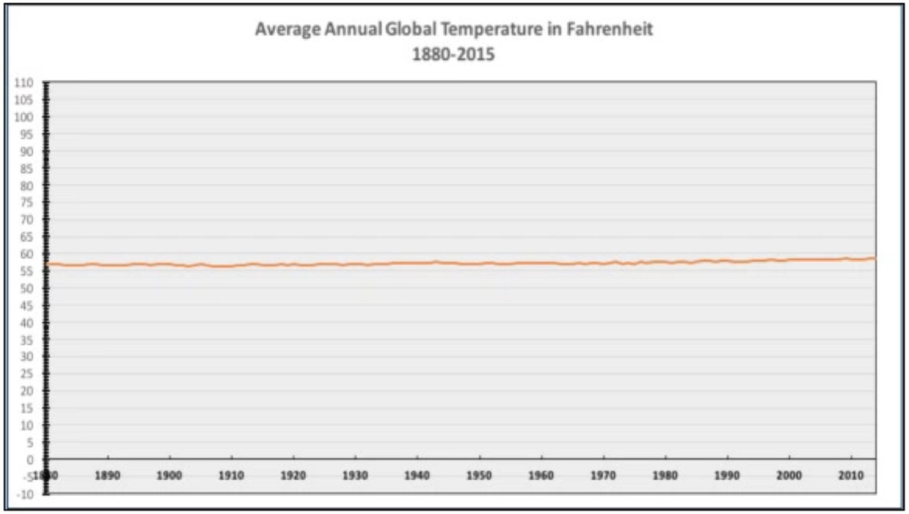
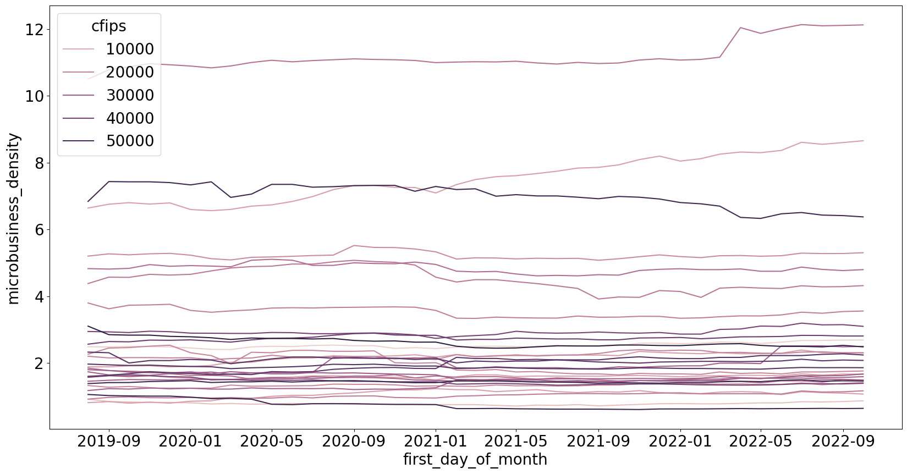
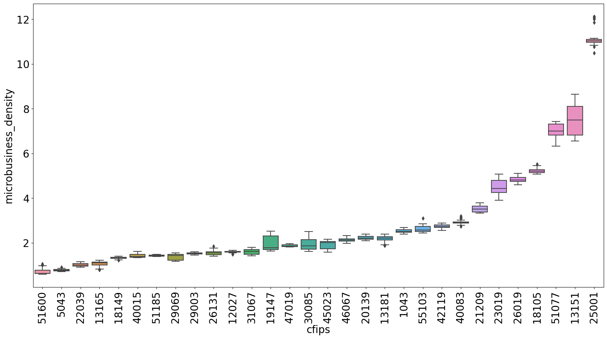
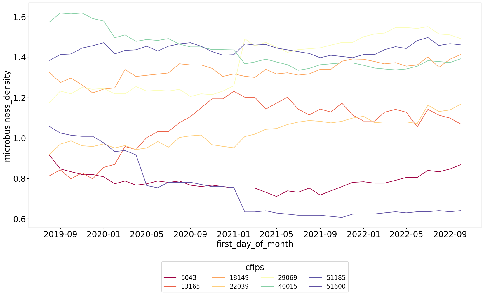

<!-- truncate -->

## Dấu hiệu của một biểu đồ trực quan kém

- Dữ liệu liên quan bị ẩn: Những thông tin cần thiết bị che khuất hoặc không được đánh dấu
- Biểu đồ quá tải: Bao gồm quá nhiều thông tin khiến biểu đồ khó đọc
- Sai lệch dữ liệu: Sử dụng tỉ lệ  hoặc định dạng dữ liệu sai
- Mô tả dữ liệu sai: Mô tả dữ liệu không đúng với hình vẽ
- Hình ảnh khó hiểu: Thiết kế hình ảnh gây khó hiểu làm cho người đọc không nắm được thông tin

Dưới đây là các lỗi sai trong Data Visualization

## Độ tương phản màu gây hiểu lầm

Một sai lầm phổ biến là đưa quá nhiều màu vào visualize. Ví dụ vẽ biểu đồ scatter plot về dân số và tốc độ tăng trưởng dân số của Việt Nam, với 63 tỉnh thành ta có 63 màu cho mỗi tỉnh, điều này gây ra vấn đề khó khăn khi nhận biết màu nào là của tỉnh thành nào.

<figure>

<figcaption>Dân số và tốc độ tăng trưởng dân số (Đã bỏ các tỉnh > 2 triệu dân)</figcaption>
</figure>

Theo nguyên tắc chung, thang màu chất lượng hoạt động tốt nhất khi có ba đến năm loại màu khác nhau. Do đó, thay vì để 63 màu cho 63 tỉnh thành, chúng ta nên phân chia màu 3 miền và để xác định từng tỉnh thành, chúng ta thêm các nhãn tỉnh thành vào biểu đồ. Dĩ nhiên chúng ta không cần phải thêm tất cả các nhãn của tất cả tỉnh thành vào biểu đồ mà chỉ cần thêm một vài nhãn tiêu biểu ứng với từng khu vực. Ngoài ra, chúng ta cần nên kèm theo dữ liệu dạng bảng với các thông tin đầy đủ để người đọc có thể truy cập toàn bộ dữ liệu.
<figure>

<figcaption>Dân số và tốc độ tăng trưởng dân số (Đã bỏ các tỉnh > 2 triệu dân)</figcaption>
</figure>

Lỗi phố biến thứ hai là sử dụng quá nhiều màu sắc nhưng không thể hiện mục đích rõ ràng
của màu sắc trong biểu đồ. Ví dụ như hình bên dưới là biểu đồ hình cột thể hiện dân số của các tỉnh năm 2022, màu sắc cầu vồng của biều đồ không thể hiện được giá trị dân số mà chỉ làm rối thêm hình ảnh. Cách khắc phục của biểu đồ này là chia thành các nhóm khác nhau và dùng màu để đại diện, hoặc có thể là chỉ dùng một màu cho tất cả các dữ liệu

<figure>

<figcaption>Biểu đồ dân số</figcaption>
</figure>

## Chọn đường biểu diễn cơ sở không phù hợp

Lỗi visualization tiếp theo là chọn đường biểu diễn cơ sở không phù hợp. Biều đồ bị cắt bớt đường cơ sở có thể là do vô tình được cắt ngắt để tiết kiệm không gian (Dữ liệu cột quá lớn) hoặc cố ý biểu diễn để thể hiện sự chênh lệch giữa các giá trị. 

Trong biểu đồ dưới đây, người tạo ra biểu đồ đã sử dụng điểm bắt đầu tại vị trí 3000 thay vì vị trí 0, với việc cắt tại vị trí này cho thấy sự chênh lệch giữa Thư viện A và Thư viện B, nhưng liệu việc chênh lệch này có được thể hiện đúng?

<figure>

<figcaption>Nguồn : [www.lrs.org](https://www.lrs.org/2020/06/10/visualizing-data-manipulating-the-y-axis/)</figcaption>
</figure>

Chúng ta có thể sẽ hiểu lầm rằng thư viện A có số lượng sách được lưu hành gấp đôi số lượng sách lưu hành tại Thư Viện B, trong khi thực tế Số lượng sách được lưu hành ở Thư viện A bằng 106% số lượng sách lưu hành tại Thư Viện B. 

Dưới đây là dữ liệu tương tự nếu chúng ta thêm vào đường cơ sở (giá trị 0), cả ba thư viện đều có số lượng sách lưu hành gần nhau, sự khác biệt giữa các thư viện có vẻ ít quan trọng hơn nhiều.

<figure>

<figcaption>Nguồn : [www.lrs.org](https://www.lrs.org/2020/06/10/visualizing-data-manipulating-the-y-axis/)</figcaption>
</figure>

Tuy nhiên, trong một số trường hợp chúng ta vẫn có thể điều chỉnh trục tung mà không phải bắt đầu tại đường mốc cơ sở là 0. Vào Tháng 12 năm 2015, National Review đã đưa ra một biểu đồ về nhiệt độ trung bình hằng năm từ dữ liệu công bố của NASA. Tất nhiên dữ liệu của NASA là chính xác nhưng vì  National Review  đã chọn một khoảng scale bắt đầu từ 0 đến 110 (có thể là độ F) dẫn đến việc minh họa dữ liệu nhiệt độ không còn ý nghĩa
<figure>

<figcaption>Nguồn : National Review</figcaption>
</figure>

Tháng 12 năm 2015, tờ Washington Post đã sửa lại biểu đồ của National Review bằng một biểu đồ có ý nghĩa hơn. Họ đã cắt đường cơ sở ở trục tung về 55 - 60 độ, điều này giúp ta có thể nhận biết được nhiệt độ trung bình năm của toàn cầu không thay đổi quá nhiều trong 200 năm gần đây

<figure>

<figcaption>Nguồn : [Washington Post](https://www.washingtonpost.com/news/the-fix/wp/2015/12/14/why-the-national-reviews-global-temperature-graph-is-so-misleading)</figcaption>
</figure>

Vậy lựa chọn đường cơ sở như thế nào cho đúng? Đối với ví dụ một, chúng ta đang so sánh nhiều đối tượng với nhau (Thư viện A, B, C) và giá trị cơ sở tại điểm 0 mang ý nghĩa về mức so sánh chênh lệch giữa các đối tượng (so sánh mức độ lệch phần trăm). Đối với ví dụ thứ hai, độ 0 trong thang F gần như ít có ý nghĩa trong dữ liệu nhiệt độ toàn cầu(tương tự như nhiệt độ con người rất khó đạt ở nhiệt độ 0 độ C), và sự chênh lệch các giá trị rất ít, lúc đó ta nên đưa giá trị đường cơ sở gần với dữ liệu thực tế để việc trực quan hóa dữ liệu có ý nghĩa hơn.

## Đưa quá nhiều dữ liệu với các khoảng dữ liệu khác nhau

Lỗi tiếp theo là lỗi chúng ta thường gặp ở dữ liệu Chuỗi thời gian. Chúng ta sẽ bàn về cuộc thi dự báo hoạt động kinh doanh vi mô ở các bang của Hoa Kỳ được đo bằng mật độ  doanh nghiệp ở các bang [GoDaddy - Microbusiness Density Forecasting](https://www.kaggle.com/competitions/godaddy-microbusiness-density-forecasting), mỗi mã `cfips` tương ứng với một quận của bang.

<figure>

<figcaption>Microbusiness Density Forecasting</figcaption>
</figure>

Theo như cách biểu diễn trên, các đường biểu diễn mật độ gần như là các đường thẳng và khó nhận thấy các pattern. Ngoài ra, việc biểu diễn như thế này còn nảy sinh vấn đề các nhóm ở mật độ thấp rất nhiều dẫn đến việc chồng chéo các đường làm cho việc phân biệt các đường rất khó. Hơn nữa, việc số lượng các đường quá nhiều còn làm ảnh hưởng đến việc chia màu sắc, việc này cũng làm rối loạn việc nhận biết các đường.

Do đó chúng ta cần chia các đường biểu diễn thành các nhóm có mức độ khác nhau, cụ thể ở đây là chia các nhóm quận có mật độ doanh nghiệp "gần tương tự nhau". Để làm được điều này, chúng ta có thể dùng phương pháp biểu diễn phân phối của từng đường bằng cách sử dụng biểu đồ hình hộp (boxplot). 

Như hình dưới đây, nhóm có mật độ tập trung dày đặc ở ngưỡng dưới 6 và chia làm 2 nhóm tách biệt ở ngưỡng trên 6. Ở ngưỡng trên 6 chỉ cần chia làm 2 nhóm đó là ngưỡng trên 8 vầ ngưỡng dưới 8. Trong khhi nhóm ngưỡng dưới 6 cần chia thành các nhóm nhỏ hơn để đảm bảo không quá nhiều đường trong một nhóm.

<figure>

<figcaption>Boxplot</figcaption>
</figure>

Hình dưới đây biểu diễn một số đường cho nhóm quận với mật độ nhỏ hơn 1.8. Biểu diễn nãy giúp ta nhìn rõ hơn về tính xu hướng, tính mùa vụ của dữ liệu. Ngoài ra, cách biểu diễn chia nhỏ nhóm này còn giúp chúng ta nhìn được các giá trị ngoại lệ hoặc các đoạn tăng bất thường, qua đó có thể ước lượng được các quận nào có thể dự báo tương lai tốt hơn các quận nào.
<figure>

<figcaption>Timeseries</figcaption>
</figure>