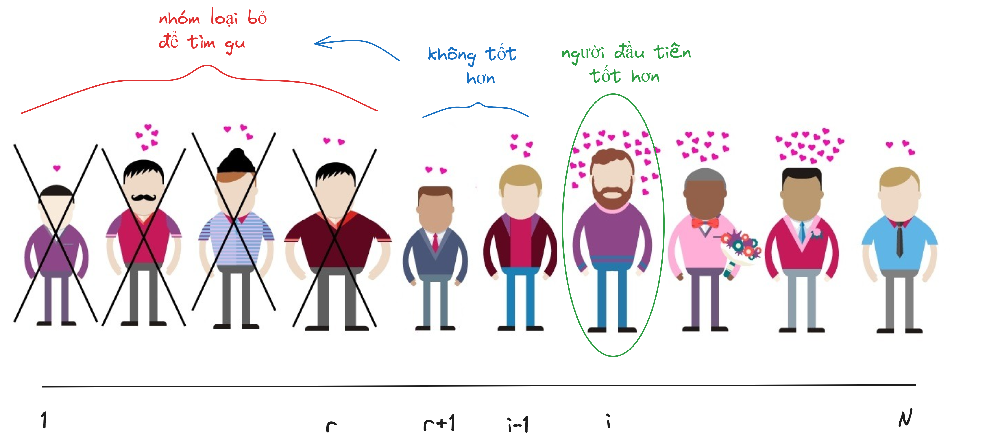
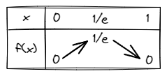
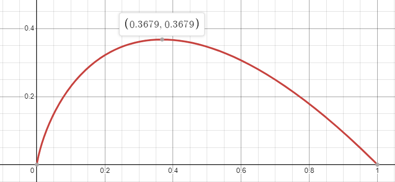
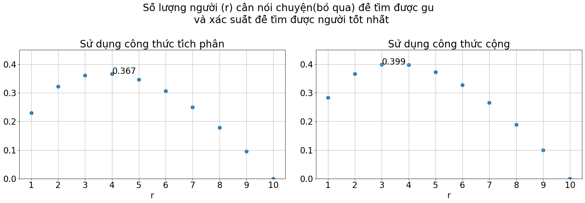

## Giới thiệu

**Câu đố**

Bạn đang trải nghiệm hẹn hò cấp tốc (speed-dating) với 10 người lạ mặt, với điều kiện:

- Chỉ được gặp 10 phút mỗi người
- Chỉ được trò chuyện 1:1 với từng người
- Không được biết người tiếp theo sẽ có ngoại hình, tính cách như thế nào
- Cần ra quyết định ngay có 'chốt' người này không
- Một khi bạn đã ra quyết định thì không thể thay đổi

Bạn rất ngại gặp cả 10 người và muốn chọn ra "người ấy" ưng ý bạn nhất và bớt tốn thời gian công sức nhất!

**Câu hỏi**

- Bạn sẽ cần nói chuyện với ít nhất bao nhiêu người để xác định được "gu" của mình?
- Tỷ lệ chọn được người "ưng ý" với bạn là bao nhiêu phần trăm?

Bài toán trên tương tự như bài The Secretary Problem được xuất bản năm 1960.
Theo Martin Gardner, người đã mô tả công thức này vào năm 1960 thì cách thực hiện tốt nhất đó là phỏng vấn 
36,78% ứng viên đầu tiên trong danh sách của bạn và đừng tuyển dụng bất kỳ ai trong đó. 
Sau đó bạn tiếp tục quy trình đó với các ứng viên còn lại trong danh sách, nếu bạn tìm ra được một người tốt hơn tất cả 
ứng viên ban đầu bạn chọn thì hãy tuyển dụng người đấy.

Dưới đây là diễn giải cách thức lựa chọn tối ưu

## Chiến lược chọn lựa

- **Bước 1:** Nói chuyện với $r$ người đầu tiên trong $N$ người để xác định gu của mình $1 \le r \le N$, tuy nhiên sẽ không chọn bất cứ ai trong những người này
- **Bước 2:** Trong $N-r$ người còn lại, chúng ta sẽ chọn ứng viên "hợp gu" hơn tất cả các ứng viên trong $r$ ứng viên đầu tiên

Câu hỏi được chuyển thành tìm giá trị $r$ hoặc tỉ lệ $\frac{r}{N}$ sao cho xác suất tìm được ứng viên giỏi là tốt nhất.

Gọi $B_i$ là vị trí mà chúng ta có thể chọn được người tốt nhất. Xác suất toàn phần chọn được ứng viên tốt nhất $P(E)$ là

$P(E) = \sum_{i=1}^{N}P(E|B_i)*P(B_i)$ 

## Lý luận 

Giả sử rằng xác suất để ứng viên được xếp ở các vị trí là như nhau. Do đó $P(B_i) = \frac{1}{N}$. \
$P(E)$ được viết lại như sau 

$P(E) = \sum_{i=1}^{N}P(E|B_i)*P(B_i) = \frac{1}{N} \sum_{i=1}^{N}P(E|B_i)$ 

- Xét $i \le r$, vì các ứng viên trong khoảng này đã bị ta loại bỏ theo **Bước 1** nên ta có $P(E|B_i) = 0$
- Xét $r < i \le N$, Theo **Bước 2**, để chọn được người tại $i$ thì những người từ $r+1$ đến $i-1$ phải không có người nào "hợp gu" tức là họ luôn 
không tốt hơn nhóm người từ 1 đến $r$(vì nếu có ai đó tốt hơn thì sẽ dừng lại và không chọn người thứ $i$ nữa) do đó người tốt nhất trong tập 1 đến $i-1$ cũng là 
người nằm trong nhóm từ 1 đến $r$. Xác suất của sự kiện này sẽ là $\frac{r}{i-1}$
tương ứng $P(E|B_i)=\frac{r}{i-1}$

$$P(E) =  \frac{1}{N} \sum_{i=r+1}^{N}\frac{r}{i-1}$$

$$P(E) = \frac{r}{N}\sum_{i=r+1}^{N}\frac{1}{i-1} $$

$$P(E) = \frac{r}{N}\sum_{i=r}^{N-1}\frac{1}{i} $$

Khi N đủ lớn, Tổng $\sum_{i=r}^{N-1}\frac{1}{i}$ sẽ được tính bằng tích phân   $\int_{r}^{N}\frac{1}{x}dx$

<figcaption>Minh họa tích phân</figcaption>

\
Ta lại có 
$\int_{r}^{N}\frac{1}{x}dx = ln(x)|^N_r = ln(N) - ln(r) = ln(\frac{N}{r})$

Do đó $P(E)$ được viết lại

$$P(E) = \frac{r}{N}ln(\frac{N}{r})$$.

Để tìm giá trị tối đa của $P(E)$ ta có thể dùng đạo hàm và giải phương trình đạo hàm bằng 0

Đặt $x=\frac{r}{N}$ Hàm ở trên sẽ trở thành $f(x) = xln(\frac{1}{x}) = -xln(x)$

$f^{'}(x) = (-xln(x))^{'} = -(ln(x) + 1)$

$f^{'}(x) = 0 \Rightarrow -(ln(x) + 1)=0 \Leftrightarrow x = \frac{1}{e}$

Hay $\frac{r}{N} = \frac{1}{e} \Leftrightarrow r = \frac{N}{e}$

**Bảng biến thiên**

Ta có bảng biến thiên hàm số $f(x) = -xln(x)$  từ nửa khoảng $(0,1]$

<figcaption>Bảng biến thiên hàm số $f(x)$</figcaption>

**Đồ thị hàm số của $f(x)$**

<figcaption>Đồ thị hàm số $f(x)$</figcaption>

## Kết luận

Vậy với bài toán hẹn hò với $N$ ứng viên và $r$ ứng viên bị bỏ qua để tìm được "gu", ta có hai công thức về xác suất lựa chọn
ứng viên giỏi nhất

- Công thức cộng
$$P(E) =  \frac{1}{N} \sum_{i=r+1}^{N}\frac{r}{i-1}$$

- Công thức nhân
$$P(E) = \frac{r}{N}ln(\frac{N}{r})$$

Với $N=10$ ta có thể vẽ biểu đồ thể hiện các giá trị $r$ ảnh hưởng như thế nào đến xác suất lựa chọn ứng viên tốt nhất

