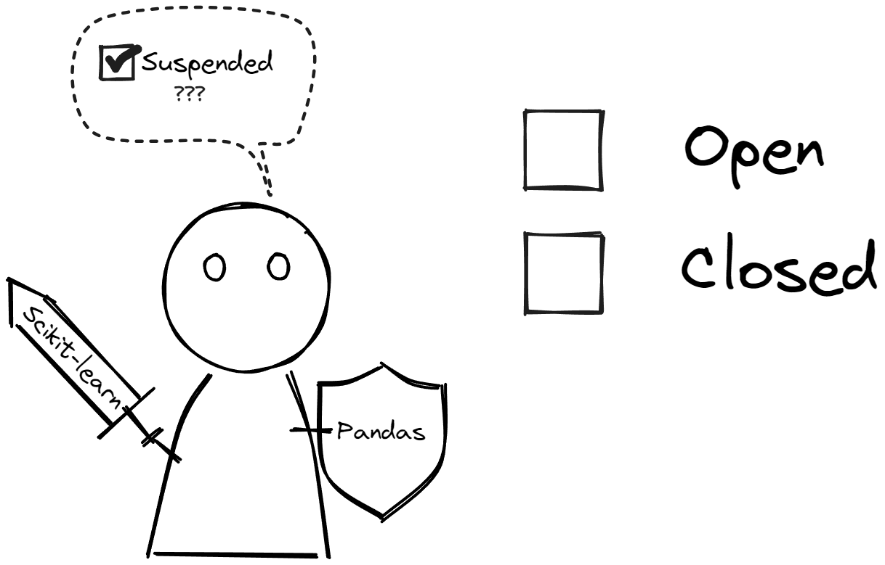

## Giới thiệu 

Chất lượng dữ liệu là một khía cạnh quan trọng không chỉ trong lĩnh vực công nghệ thông tin mà còn trong nhiều lĩnh vực khác như kinh doanh, khoa học dữ liệu,
y tế, tài chính, v.v. Dữ liệu chất lượng cao là nền tảng quan trọng cho việc ra quyết định đúng đắn, phát triển sản phẩm và dịch vụ, cũng như nghiên cứu và
phát triển trong nhiều lĩnh vực. Dưới đây là một số chiều quan trọng về chất lượng dữ liệu:

**:one: Tính chính xác (Accuracy):** Dữ liệu phải chính xác và phản ánh đúng thực tế. Sự không chính xác có thể dẫn đến việc đưa ra quyết định sai lầm và kết quả không chính xác.

**:two: Tính đầy đủ (Completeness):** Dữ liệu cần phải hoàn thiện, không bị thiếu sót quan trọng. Thiếu dữ liệu có thể dẫn đến hiểu biết hạn chế và phân tích không chính xác.

**:three: Tính nhất quán (Consistency):** Dữ liệu phải nhất quán với nhau và không có mâu thuẫn. Nếu có sự không nhất quán, việc phân tích và đưa ra quyết định sẽ trở nên khó khăn và không đáng tin cậy.

**:four: Tính duy nhất (Uniqueness):** Dữ liệu phải đảm bảo tính duy nhất. Nếu dữ liệu không đảm bảo tính duy nhất có thể gây ảnh hưởng đến việc thống kê dữ liệu và thời gian xử lý dữ liệu.

**:five: Tính hợp lệ (Validity):** Dữ liệu phải tuần theo các định dạng hoặc yêu cầu cụ thể theo business. Dữ liệu không hợp lệ có thể gây khó khăn trong quá trình chuẩn hóa dữ liệu và sai sót trong việc thống kê.

**:six: Tính kịp thời (Timeliness):** Dữ liệu cần phải được cập nhật đúng thời điểm để phản ánh thực trạng hiện tại. Dữ liệu quá cũ có thể không còn mang tính đáng tin cậy và không thể áp dụng vào các quyết định hiện tại.

## Accuracy (Tính chính xác)

Tính chính xác thể hiện mức độ đại diện, mức độ thể hiện của dữ liệu đối với các sự vật, sự việc có thực. Có nhiều cách khác khau để xác thực dữ liêu đó
là chính xác hay không:
- **Xác thực vật lý:** 
Khi mua hàng thường phải kiểm tra hàng trong giỏ hàng có giống với các món hàng được liệt kê trong hóa đơn hay không?

- **So sánh nguồn tham chiếu:**
    - So sánh xem các thông tin các tỉnh thành trong bảng nội bộ có trùng khớp với dữ liệu thông tin quốc gia hay không?
    - Kiểm tra dữ liệu crawl có trùng với dữ liệu từ trang gốc.

Việc dữ liệu không chính xác là rất bình thường, và khi dữ liệu không được ghi chép chính xác có thể ảnh hưởng đến quyền lợi của người dùng. Ví dụ khi một 
người dùng đăng kí tài khoản trên một ứng dụng, họ có xu hướng không khai thật tên tuổi của mình, việc làm này có thể ảnh hưởng đến quyền lợi sinh nhật hoặc ưu đãi cho người trong độ tuổi. 
Một người đang tuổi 20 nhưng khai báo thông tin là tuổi 40 sẽ không nhận được voucher xem phim cho U22 chẳng hạn. 

Dữ liệu có độ chính xác cao giúp cho báo cáo sát với thực tế và tin cậy, qua đó giúp mang lại hiệu quả kinh doanh. Độ chính xác đặc biệt quan trọng đối với các lĩnh vực như
chăm sóc sức khỏe và tài chính ngân hàng.
## Completeness (Tính đầy đủ)

Tính đầy đủ của dữ liệu đạt được khi những dữ liệu cần thiết được điền đầy đủ theo một yêu cầu nào đấy, không nhất thiết dữ liệu phải điền 100% đầy đủ mà chỉ cần đảm bảo
các trường có liên quan được điền phù hợp.
- **Thiếu dữ liệu do mất bản ghi:**
    - Chúng ta cần đưa ra biểu đồ về thông tin của 63 tỉnh thành nhưng chỉ có bản ghi của 60 tỉnh thành, thiếu bản ghi của 3 tỉnh thành còn lại.
    - Bạn điền vào đơn đăng ký cuộc thi nhưng tên của bạn lại bị thiếu trong danh sách người tham gia
    
- **Thuộc tính bị thiếu:**
Một số người dùng bị thiếu cột thông tin về email, số điện thoại
    - Đối với yêu cầu về thông tin liên lạc thì dữ liệu vẫn mang tính đầy đủ vì chúng ta có thể gửi thông tin thông qua email hoặc thông qua hình thức tin nhắn số điện thoại
    - Đối với mục đích telesale thì rõ ràng thông tin về những người thiếu số điện thoại sẽ vi phạm tính đầy đủ
- **Thiếu dữ liệu tham chiếu**
    - Một nhân viên ngân hàng muốn cập nhật trạng thái của một tài khoản nằm trong ba trạng thái Open, 
Closed, Supspended nhưng trong bảng tham chiếu chỉ có 2 trạng thái Open và Closed do đó anh ấy không tìm thấy
giá trị tham chiếu Supspended để điền vào đơn cập nhật.

- **Dữ liệu bị cắt**

    - Trong quá trình ETL dữ liệu, có thể dữ liệu đã bị cắt mất so với dự định, ví dụ như cột dữ liệu về tên chúng ta thường chỉ đặt tối đa 20 ký tự, do đó những người có tên
dài hơn sẽ bị cắt đi dẫn đến sự mất mát thông tin.

## Consistency (Tính nhất quán)

Tính nhất quán dữ liệu thể hiện phần trăm đồng nhất của cùng một dữ liệu nhưng được được lưu sang các nơi khác nhau, hoặc sự đồng nhất giữa dữ liệu và bảng tham chiếu của nó.
Tính nhất quán dữ liệu đảm bảo rằng các hoạt động phân tích nắm bắt và tận dụng được dữ liệu tốt hơn.

- **Cấp độ bản ghi**

Khi dữ liệu được tải từ nguồn này sang nguồn khác, cần đảm bảo số lượng bản ghi trong bảng đích khớp với nguồn dữ liệu ban đầu

<figcaption>Nguồn: [icedq.com](https://icedq.com)</figcaption>

- **Cấp độ thuộc tính**

Mặc dù đầy đủ bản ghi như thực tế thuộc tính có thể bị thiếu

<figcaption>Nguồn: [icedq.com](https://icedq.com)</figcaption>

- **Không đồng nhất về cột dữ liệu**

Ví dụ trong cửa hàng quần áo, số lượng sản phẩm Order bị sai lệch so với bảng Shipment

<figcaption>Nguồn: [icedq.com](https://icedq.com)</figcaption>

- **Nhất quán transaction**

Ví dụ ngày 1 gửi 9000\$, ngày 2 rút 1000\$ thì số tiền cuối ngày 2 phải đảm bảo là 8000\$

<figcaption>Nguồn: [icedq.com](https://icedq.com)</figcaption>

- **Nhất quán theo thời gian**

Dữ liệu thường không thay đổi quá nhiều theo thời gian trừ khi gặp trường hợp biến động lớn. 
    - Ví dụ nhiệt độ hôm nay không chênh lệch quá nhiều so với ngày hôm qua, nhiệt độ ngày hôm qua 20 độ C thì ngày hôm nay có thể là 23 hoặc 17 độ C
    - Lượng Daily active user truy cập vào trang web thường là một giá trị ổn đinh. Nếu như lượng truy cập mỗi ngày là 1000 người dùng mà đột nhiên hôm nay tăng lên
    2000 người dùng thì khả năng cao dữ liệu bị tính toán hai lần. Nếu dữ liệu bằng 0 thì khả năng luồng thống kê dữ liệu đã gặp lỗi không xử lý được.

- **Nhất quán biểu diễn dữ liệu trên các hệ thống**

Ví dụ Bảng giới tính, bảng gốc chỉ có Male, Female, Unknown nhưng qua hệ thống khác lại bị viết tắt hoặc thiếu

<figcaption>Nguồn: [icedq.com](https://icedq.com)</figcaption>

## Uniqueness (Tính duy nhất)

Tính duy nhất thể hiện với cùng một nội dung trong bảng thì mỗi bản ghi nên là duy nhất. Việc này giúp giảm thiểu bộ nhớ lưu trữ cũng như tránh
sai sót trong quá trình thống kê. Bản ghi bị trùng lặp cũng ảnh hưởng đến tốc độ xử lý dữ liệu đầu vào và có thể gây sai lệch trong 
quá trình huấn luyện mô hình. Đảm bảo tính duy nhất trong dữ liệu giúp tránh trường hợp dự đoán các bản ghi giống nhau nhiều lần.

- **Cùng một thực thể nhưng hai tên khác nhau**

Ví dụ cùng một người nhưng lại có 2 tên khác nhau 

- **Cùng một thực thể nhưng xuất hiện nhiều lần với cùng một định danh**

## Validity (Tính hợp lệ)

Tính hợp lệ dữ liệu thể hiện dữ liệu có tuân theo theo các định dạng, kiểu dữ liệu, một khoảng cho trước hoặc phù hợp với một yêu cầu cụ thể của business.

- **Hợp lệ theo business rule hoặc công thức tính toán**

Ví dụ:
Công thức tính Net theo business như sau

Net amount = Gross amt - Tax amt - Fee amt - Commission amt

Gross amt = 1000\$

Tax amt = 100\$ 

Fee amt = 200\$

Commission amt = 200\$

Nếu như cột dữ liệu lưu Net amount = 600\$ ≠  1000\$ - 100\$ - 200\$ - 200\$ = 500\$ thì dữ liệu vi phạm tính hợp lệ
- **Hợp lệ theo khoảng**
    - Ví dụ ngày tháng phải nằm trong khoảng  1-28 hoặc 1-29 đối với tháng 2, 1-30 hoặc 1-31
    - Hoặc phân loại tuổi phải đúng nhóm tuổi, ví dụ tuổi 80 không thể nằm trong nhóm độ tuổi lao động

- **Trình tự không hợp lệ**
    - Thời gian giao hàng không được nhỏ hơn thời gian đặt hàng
    - Giá trị updated_date phải lớn hơn hoặc bằng giá trị created_date

Việc dữ liệu hợp lệ không có nghĩa là dữ liệu đó chính xác. Ví dụ dễ thấy nhất đó là định dạng ngày tháng, ví dụ định dạng trong dữ liệu là "mm/dd/yy".
Tại thời điểm hiện tại của bài viết này là ngày 06 tháng 05 năm 2024. Giả như người nhập liệu không biết định dạng của hệ thống và nhập vào "06/05/2024" 
thì định dạng vẫn hợp lệ theo "mm/dd/yy" nhưng lúc này hệ thống sẽ hiểu là ngày 05 tháng 06 năm 2024 là ngày chưa tồn tại dữ liệu.

Ngược lại dữ liệu chính xác chưa chắc đã hợp lệ, như trong ví dụ trên mặc dù ngày 06 tháng 05 năm 2024 là chính xác nhưng nếu nhập vào theo chuỗi "ngày 06 tháng 05 năm 2024" 
sẽ không hợp lệ vì hệ thống đang định dạng "mm/dd/yy"

## Timeliness (Tính kịp thời)

Tính kịp thời của dữ liệu nói về mức độ sẵn sàng của dữ liệu khi cần thiết.

- **Trễ do business process**: 
    - Người dùng đặt pizza vào lúc 11:00 và Nhà hàng cam kết sẽ giao hàng trong 50 phút. Nhưng vì lý do nào đó người nhập 
    liệu lại nhập trễ vào lúc 13:00. Hậu quả là đơn bị giao trễ và có khả năng nhà hàng bị đánh giá tiêu cực.

- **Trễ trong hệ thống thời gian thực**: Dữ liệu có thể chính xác nhưng quá trình xử lý chậm hơn so với yêu cầu thực tế.
    - Hệ thống xe tự lái đòi hỏi thời gian phản hồi phải nhanh để phản ứng kịp với môi trường thực tế. 
    - Hệ thống phòng chống gian lận đòi hỏi phải truy cập dữ liệu theo thời gian thực

Tùy vào tần suất yêu cầu dữ liệu mà tính kịp thời có thể đánh giá khác nhau. Như ví dụ xử lý hệ thống thời gian thực cần dữ liệu đảm bảo có sẵn trong thời gian thực,
trong khi những báo cáo hằng ngày thì có mức độ yêu cầu kịp thời chỉ cần đảm bảo trong ngày hay những báo cáo hàng quý thì có thể yêu cầu về tính kịp thời không quá cao.    

## Tài liệu tham khảo
- https://estuary.dev/data-quality/
- https://icedq.com/6-data-quality-dimensions
- https://www.sagacitysolutions.co.uk/about/news-and-blog/data-quality-dimensions/
- https://www.precisely.com/blog/data-quality/data-quality-dimensions-measure#:~:text=across%20multiple%20systems.-,Timeliness,can%20be%20even%20more%20important.