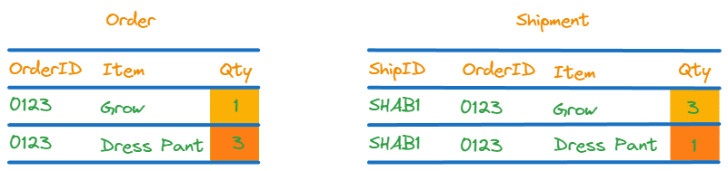
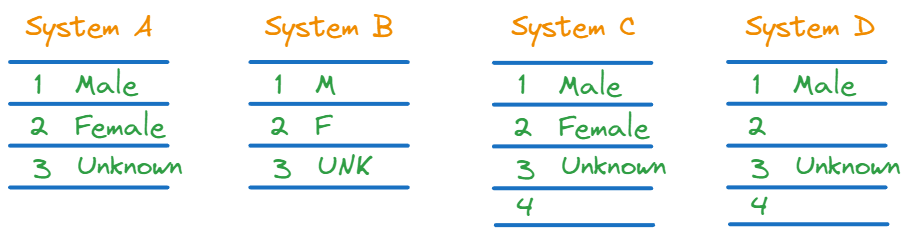

## Accuracy (Tính chính xác)

Tính chính xác thể hiện mức độ đại diện, mức độ thể hiện của dữ liệu đối với các sự vật, sự việc có thực

Ví dụ:
- **Xác thực vật lý** 

Khi mua hàng thường phải kiểm tra hàng trong giỏ hàng có giống với các món hàng được liệt kê trong hóa đơn hay không?

- **So sánh nguồn tham chiếu**
    - So sánh xem các thông tin các tỉnh thành trong bảng nội bộ có trùng khớp với dữ liệu thông tin quốc gia hay không?
    - Kiểm tra dữ liệu crawl có trùng với dữ liệu từ trang gốc.

## Completeness (Tính đầy đủ)

Tính đầy đủ thể hiện 100% giá trị được điền vào bảng

- **Thiếu dữ liệu do mất bản ghi**

Việt Nam có 63 tỉnh thành nhưng dữ liệu lại thiếu bản ghi của một số tỉnh thành

- **Thuộc tính bị thiếu**

Một số người dùng bị thiếu thông tin về email, số điện thoại

- **Thiếu dữ liệu tham chiếu**

Một nhân viên ngân hàng muốn cập nhật trạng thái của một tài khoản nằm trong ba trạng thái Open, 
Closed, Supspended nhưng trong bảng tham chiếu chỉ có 2 trạng thái Open và Closed. Anh ấy không tìm thấy
giá trị tham chiếu Supspended để điền vào đơn cập nhật.

- **Dữ liệu bị cắt**

Trong quá trình ETL dữ liệu, có thể dữ liệu đã bị cắt mất so với dự định, ví dụ như đoạn text dài quá có thể bị cắt thành 256 kí tự

## Consistency (Tính nhất quán)

Thể hiện phần trăm đồng nhất dữ liệu của bảng này với bảng khác hoặc là bảng tham chiếu

- **Cấp độ bản ghi**

Khi dữ liệu được tải từ nguồn này sang nguồn khác, cần đảm bảo số lượng bản ghi không bị thiếu hoặc thừa

- **Cấp độ thuộc tính**

Mặc dù đầy đủ bản ghi như thực tế thuộc tính có thể bị thiếu

- **Không đồng nhất về cột dữ liệu**

Ví dụ trong cửa hàng quần áo, số lượng sản phẩm Order bị sai lệch so với bảng Shipment

- Nhất quán transaction

Ví dụ ngày 1 gửi 3000\$, ngày 2 rút 2000\$ thì số tiền cuối ngày 2 phải đảm bảo là 1000\$

- Nhất quán theo thời gian

Dữ liệu thường không thay đổi quá nhiều theo thời gian trừ khi gặp trường hợp biến động lớn. Ví dụ nhiệt độ hôm nay không
chênh lệch quá nhiều so với ngày hôm qua

- Nhất quán biểu diễn dữ liệu trên các hệ thống

Ví dụ Bảng giới tính, bảng gốc chỉ có Male, Female, Unknow nhưng qua hệ thống khác lại bị viết tắt hoặc thiếu

## Uniqueness (Tính duy nhất)
Không muốn có sự trùng lặp dữ liệu 

- **Cùng một thực thể nhưng hai tên khác nhau**

Ví dụ cùng một người nhưng lại có 2 tên khác nhau 

- **Cùng một thực thể nhưng xuất hiện nhiều lần với cùng một định danh**

## Validity (Tính hợp lệ)

- **Hợp lệ theo business rule hoặc công thức tính toán**

Ví dụ:
Net amount = Gross amt - Tax amt - Fee amt - Commission amt
- **Hợp lệ theo khoảng**
    - Ví dụ ngày tháng phải nằm trong khoảng  1-28 hoặc 1-29 đối với tháng 2, 1-30 hoặc 1-31
    - Hoặc phân loại tuổi phải đúng nhóm tuổi, ví dụ tuổi 80 không thể nằm trong nhóm độ tuổi lao động

- **Trình tự không hợp lệ**
    - Thời gian giao hàng không được nhỏ hơn thời gian đặt hàng

## Timeliness (Tính kịp thời)
Khoảng thời gian trễ giữa thời gian trên hệ thống và thời gian thực
- **Trễ do business process**: 
    - Người dùng đặt pizza vào lúc 11:00 và Nhà hàng cam kết sẽ giao hàng trong 50 phút. Nhưng vì lý do nào đó người nhập 
    liệu lại nhập trễ vào lúc 13:00. Hậu quả là đơn bị giao trễ và có khả năng nhà hàng bị đánh giá tiêu cực.

- **Trễ trong hệ thống thời gian thực**: Dữ liệu có thể chính xác nhưng quá trình xử lý chậm hơn so với yêu cầu thực tế.
    - Hệ thống xe tự lái đòi hỏi thời gian phản hồi phải nhanh để phản ứng kịp với môi trường thực tế. 
    - Hệ thống phòng chống gian lận đòi hỏi phải truy cập dữ liệu theo thời gian thực

Ngoài ra còn có các tiêu chí khác để đánh giá chất lượng dữ liệu

- Khả năng kiểm toán

## Tài liệu tham khảo
- https://estuary.dev/data-quality/
- https://icedq.com/6-data-quality-dimensions
- https://www.sagacitysolutions.co.uk/about/news-and-blog/data-quality-dimensions/
- https://www.precisely.com/blog/data-quality/data-quality-dimensions-measure#:~:text=across%20multiple%20systems.-,Timeliness,can%20be%20even%20more%20important.