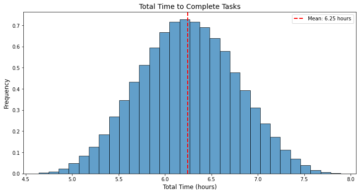
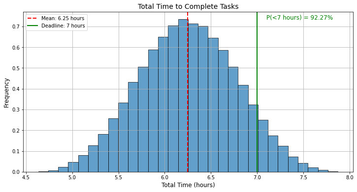
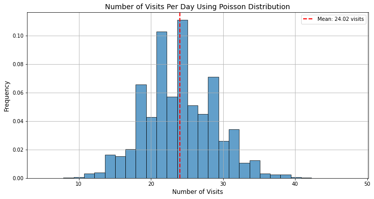
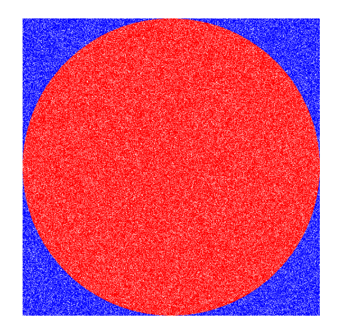
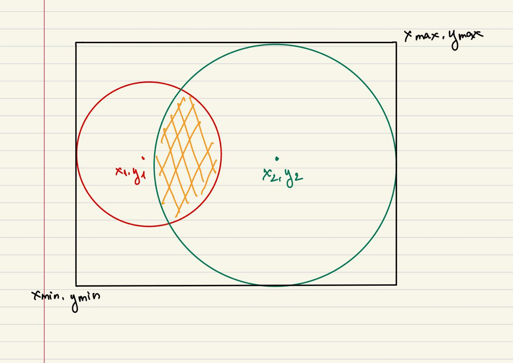

## Khái niệm chung

Monte Carlo Simulation là một kỹ thuật toán học dùng để hiểu và đánh giá tác động của rủi ro và không chắc chắn trong các mô hình dự đoán và dự án. Phương pháp này sử dụng các biến ngẫu nhiên để mô phỏng nhiều kịch bản có thể xảy ra của một hệ thống hoặc quy trình, giúp chúng ta ước lượng phân phối của kết quả đầu ra.

Tên gọi “Monte Carlo” xuất phát từ thành phố Monte Carlo ở Monaco, nổi tiếng với các sòng bạc và hoạt động đánh bạc. Phương pháp này được phát triển kỹ thuật bởi các nhà khoa học làm việc tại Dự án Manhattan khi họ cần giải quyết các vấn đề phức tạp liên quan đến phản ứng hạt nhân và các tính toán liên quan đến vật lý. Hai nhà khoa học trong nhóm, Stanislaw Ulam và John von Neumann, đã phát triển và sử dụng kỹ thuật này và chọn tên “Monte Carlo” để phản ánh bản chất ngẫu nhiên và các phép thử mô phỏng nhiều lần của phương pháp như các sòng bạc hoạt động.

### Một vài ví dụ thực tế

**Ví dụ đầu tiên:**

Bạn được giao làm một bài thuyết trình về Monte Carlo, để ước lượng được thời gian hoàn thành bài thuyết trình này, bạn chia thành các bước nhỏ hơn với các thời gian ngắn hơn như sau:

- Tìm hiểu các tài liệu liên quan đến Monte Carlo Simulation: 1 - 2h (1)
- Viết tài liệu lên Confluence: 2 - 3h (2)
- Làm slide: 1 - 2h (3)
- Luyện tập kịch bản present: 0.5 - 1h (4)

Dưới góc độ của một người làm dữ liệu, bạn đang cố gắng tìm hiểu xem tổng thời gian mình bỏ ra để làm bài thuyết trình này là bao nhiêu, và nếu chỉ giới hạn trong một khoảng thời gian ngắn thì khả năng bạn có thể làm được bao nhiêu. Dựa vào các khoảng thời gian cho các đầu việc ngắn hơn, chúng ta có thể ước lượng được rằng thời gian ngắn nhất có thể hoàn thành là 1h + 2h + 1h + 0.5h = 4.5h và thời gian dài nhất có thể hoàn thành bài thuyết trình là 2h + 3h + 2h + 1h = 8h. 

Tuy nhiên, để trực quan hóa hơn, chúng ta sẽ sử dụng phương pháp Monte Carlo để mô phỏng các khoảng thời g ian từ 4.5h đến 8h để xem phân phối tổng thời gian có thể hoàn thành một bài thuyết trình là như thế nào. Để làm được điều này, với mỗi đầu công việc nhỏ, chúng ta sử dụng phương pháp tạo ngẫu nhiên dựa trên các phân phối đều. Phân phối đều là một cách đơn giản và trực quan để mô phỏng các biến ngẫu nhiên, trong đó tất cả các kết quả giữa một giá trị tối thiểu và tối đa đều có xác suất xảy ra như nhau. Sau đó chúng ta sẽ tính tổng các giá trị của từng đầu việc để được tổng thời gian hoàn thành bài thuyết trình.

Giờ chúng ta sẽ sử dụng máy tính để có thể chọn ngẫu nhiên thời gian hoàn thành từng đầu việc bé và tính tổng thời gian cần. Chúng ta sẽ mô phỏng chúng hàng ngàn, triệu lần như sau:

- Lần 1: 1.2h **(1)** + 2.8h **(2)** + 1.1h **(3)** + 0.5h **(4)** = 5.6h
- Lần 2: 1.25h **(1)** + 2.3h **(2)** + 1.4h **(3)** + 0.7h **(4)** = 5.65h
- Lần 3: 1.1h **(1)** + 2.2h **(2)** + 1.3h **(3)** + 0.8h **(4)** = 5.4h
- …
- Lần 100000: 1.7h **(1)** + 2.1h **(2)** + 1.5h **(3)** + 0.7h **(4)** = 6h

Sau rất nhiều lần mô phỏng, ta được một phân phối như sau:



Vậy nhìn vào biểu đồ này ta có thể dễ dàng nói rằng ta sẽ cần khoảng từ 4.5 - 8 tiếng để hoàn thành bài thuyết trình và thời gian trung bình để hoàn thành nó là 6.25.

Nhưng ta hãy mở rộng bài toán này ra một chút. Giả sử chúng ta chỉ dành được thời gian 7 tiếng để có thể hoàn thành được công việc này. Vậy khả năng bao nhiêu % là có thể hoàn thành được bài thuyết trình này.



Như vậy, ta có thể thấy xác suất chúng ta có thể làm đúng hạn là 92.26%

**Ví dụ thứ hai:**

Bạn tạo và viết một số bài blog trang web Data Science Dances. Sau một thời gian marketing, bạn nhận ra rằng trung bình sẽ có 24 lượt truy cập mỗi ngày. Bạn muốn biết xác suất rằng một ngày bất kỳ sẽ nhiều hơn 30 lượt truy cập xem là bao nhiêu để có thể đặt target phù hợp cho tương lai.

Chú ý, dạng phân phối cho việc quan sát số lượt truy cập theo một khoảng thời gian cụ thể thuộc dạng phân phối Poisson. Chúng ta sẽ dùng Monte Carlo Simulation để tính toán.

```python
import numpy as np
import matplotlib.pyplot as plt

# Số lần mô phỏng
num_simulations = 100000

# Trung bình số lượt truy cập mỗi ngày
lambda_visits_per_day = 24

# Mô phỏng số lượt truy cập mỗi ngày theo phân phối Poisson
visits_per_day = np.random.poisson(lambda_visits_per_day, num_simulations)

# Vẽ biểu đồ histogram của số lượt truy cập mỗi ngày
plt.figure(figsize=(12, 6))
plt.hist(visits_per_day, bins=30, density=True, edgecolor='k', alpha=0.7)
plt.title("Number of Visits Per Day Using Poisson Distribution", fontsize=14)
plt.xlabel("Number of Visits", fontsize=12)
plt.ylabel("Frequency", fontsize=12)

# Hiển thị đường thẳng chỉ giá trị trung bình
mean_visits = np.mean(visits_per_day)
plt.axvline(mean_visits, color='r', linestyle='--', linewidth=2, label=f'Mean: {mean_visits:.2f} visits')
plt.legend()

# Hiển thị lưới và biểu đồ
plt.grid(True)
plt.show()
```



Từ phân phối này, ta có thể tính được xác suất để số lượt truy cập web mỗi ngày lớn hơn 30 là 9.53%. Vậy nếu muốn đặt mục tiêu là 30 lượt truy cập/ngày thì sẽ cần cố gắng rất nhiều mới có thể đạt được mục tiêu.


## Các bước thực hiện
Monte Carlo Simulation được thực hiện thông qua 4 bước chính dưới đây:

**Bước 1: Xây dựng mô hình** 

Cần xác định bài toán hoặc hệ thống mà chúng ta muốn mô phỏng. Đây có thể là một phương trình, một hệ thống phương trình hay một quy trình mô phỏng phức tạp mô tả hệ thống.

Ví dụ như trong ví dụ 1, bài toán ta mô phỏng ở đây là tổng thời gian chúng ta cần hoàn thành sau khi đã chia 4 đầu việc.

**Bước 2: Chọn các biến để mô phỏng**

Ta cần chọn các biến số ngẫu nhiên cần mô phỏng và xác định phân phối xác suất của từng biến số đó. Điều này sẽ từ việc ta thu thập dữ liệu lịch sử và sử dụng kiến thức chuyên môn để xác định.

Ví dụ trong ví dụ 1, các biến chính là 4 đầu việc phân phối chuẩn với các range khác nhau. Hay trong ví dụ 2, đó là phân phối Poisson số lượt truy cập theo ngày.

**Bước 3: Thực hiện các mô phỏng lặp đi lặp lại**

Chạy các biến ngẫu nhiên thông qua mô hình xây dựng ở bước 1 và 2 và thực hiện nhiều lần lặp lại mô phỏng đó.  Mỗi lần lặp lại sử dụng một bộ giá trị ngẫu nhiên khác nhau cho các biến số để tạo ra một kết quả đầu ra khác nhau.

**Bước 4: Tổng hợp kết quả**

Tổng hợp các kết quả từ các lần mô phỏng. Từ kết quả này, ta có thể tính toán được xác suất các giá trị, khoảng giá trị và các thống kê quan trọng như trung bình, độ lệch chuẩn và phương sai để đánh giá kết quả. Ta cũng có thể trực quan hoá bằng sử dụng các đồ thị như histogram để hiêủ và phân tích.

## Ưu điểm, nhược điểm của Monte Carlo Simulation

Ta có thể thấy Monte Carlo Simulation là một phương pháp hiệu quả và linh hoạt được sử dụng trong nhiều lĩnh vực và bài toán khác nhau từ tài chính, kỹ thuật đến quản lý dự án,… Tuy nhiên, phương pháp nào cũng có ưu và nhược điểm của riêng mình. Chính vì vậy, chúng ta phải hiểu rõ để đánh giá xem liệu phương pháp này có phù hợp với bài toán cụ thể hay không.

### Ưu điểm:

- ***Xử lý các bài toán phức tạp:*** Monte Carlo Simulation có thể giúp xử lý các bài toán hay hệ thống phức tạp không giải quyết được theo cách thông thường. Điều này có thể do quy trình nhiều biến ngẫu nhiên hay các biến có phân phối phức tạp và khác nhau.

- ***Phân tích và ước lượng các kịch bản:*** Monte Carlo Simulation cho phép ước lượng xác suất và rủi ro liên quan đến các kịch bản kết quả khác nhau, giúp các nhà quản lý đưa ra các quyết định chính xác hơn và quản lý rủi ro được tốt hơn. Ta có thể dễ dàng visualize được các kết quả khác nhau như mean, std hay trả lời câu hỏi khả năng kịch bản cụ thể xảy ra là bao nhiêu %.

- ***Phân tích độ nhạy:*** Monte Carlo Simulation cho phép phân tích độ nhạy của các biến đầu vào đối với kết quả đầu ra thông qua tìm giá trị tương quan giữa các biến, từ đó chúng ta có thể xác định được các biến số quan trọng và ảnh hưởng của chúng để ra các quyết định tốt hơn.

- ***Dễ dàng thực hiện:*** Một ưu điểm rất lớn của Monte Carlo Simulation là có thể dễ dàng mô phỏng tạo ra các kịch bản khác nhau và phân tích kết quả nhanh chóng chỉ cần sự trợ giúp của máy tính hay các phân mềm mô phỏng hiện đại. Phương pháp này ta cũng không yêu cầu các giả định nghiêm ngặt nên có thể áp dụng với nhiều bài toán thực tế khác nhau.

### Nhược điểm:

- ***Cần tài nguyên tính toán lớn:*** Dễ dàng thấy Monte Carlo Simulation dự đoán kết quả qua việc thực hiện lặp lại nhiều mô phỏng. Số lần mô phỏng tỷ lệ thuận với hiệu suất phương pháp, càng nhiều lần mô phỏng thì kết quả càng chính xác. Nhưng điều đó cũng đòi hỏi nhiều tài nguyên cũng như thời gian thực hiện hơn, đặc biệt với các bài toán hay hệ thống phức tạp.

- ***Khó xác định phân phối đầu vào:*** Kết quả của Monte Carlo Simulation có thể bị ảnh hưởng lớn bởi các giả định về phân phối đầu vào. Tuy nhiên, việc xác định phân phối xác suất chính xác cho các biến số này có thể khó khăn hoặc bias do thiếu dữ liệu lịch sử hoặc thông tin biến số.

- ***Phức tạp trong triển khai:*** Tuy Monte Carlo Simulation dễ dàng hiểu và thực hiện, việc triển khai phương pháp cũng cần các kiến thức chuyên môn và xác suất, cũng như việc sử dụng các công cụ hỗ trợ cho quá trình mô phỏng. Đặc biệt, việc phân tích và diễn giải kết quả có thể phức tạp, đặc biệt khi mô hình có nhiều biến số và kịch bản khác nhau.

- ***Độ chính xác kết quả:*** Dù Monte Carlo Simulation mô phỏng nhiều kịch bản nhưng cũng không thể dự đoán mọi yếu tổ bất ngờ có thể xảy ra trong thực tế. Kết quả Monte Carlo Simulation như đã nói ở trên phụ thuộc nhiều vào giả định ban đầu về các biến số ngẫu nhiêu và phân phối của chúng, điều có thể không được phản ảnh thực tế

## Ứng dụng

### Trong hình học
Chúng ta sẽ thử áp dụng Monte Carlo Simulation trong việc tính diện tích hình tròn để có thể hiểu concept và áp dụng vào các trường hợp phức tạp hơn.

Công thức tính hình tròn $\pi r^2$ khá đơn giản và quen thuộc với đại đa số nhiều người, nhưng ta sẽ thử tính diện tích thông qua Monte Carlo Simulation.




Bài toán đặt ra ở đây là thông qua **Monte Carlo Simulation, làm sao để ta tính được diện tích hình tròn đỏ trong hình vuông, khi được cho trước bán kính hình tròn (r)?**

Đầu tiên, ta cần giả sử tâm của hình tròn là (0, 0) và tất cả các điểm trong hình trên sẽ có toạ độ là $(x, y)$ với $-r \le x,y \le r$. Khi đó, nếu một điểm muốn nằm trong hình tròn đỏ, $(x^2 + y^2) <= r^2$ ($r$ là bán kính của hình tròn).

Tiếp tục, hãy tượng tượng chúng ta chấm nhiều điểm liên tục vào hình một cách ngẫu nhiên. Dĩ nhiên, chúng ta sẽ có thể chấm điểm vào trong hình tròn (vùng màu đỏ) hoặc cũng có thể điểm chấm ngoài hình tròn (vùng xanh nước biến).

Chúng ta càng chấm nhiều, chúng ta càng điền đầy vào hình, và tỷ lệ các điểm chấm trong hình tròn với toàn bộ các điểm chấm giúp ta có thể thấy được diện tích mà chúng ta phủ kín như nào.

Bài toán chúng ta sẽ thử mô phỏng qua đoạn code sau:

```python
import random
import math
def tao_diem_ngau_nhien(ban_kinh):
    return (random.uniform(-ban_kinh, ban_kinh), random.uniform(-ban_kinh, ban_kinh))
 
def tinh_dien_tich_dua_tren_monte_carlo(ban_kinh, so_lan_mo_phong):
    tong_diem_trong_hinh_tron = 0 # Đếm các điểm nằm trong hình tròn
    tong_diem_trong_hinh_vuong = 0 
    for i in range(0, so_lan_mo_phong):
        (x, y) = tao_diem_ngau_nhien(ban_kinh) # Tạo điểm ngẫu nhiên từ -bán kính, bán kính
        tong_diem_trong_hinh_tron += x ** 2 + y ** 2 <= ban_kinh ** 2 # Nếu một điểm nằm trong hình tròn, tăng lên một
        tong_diem_trong_hinh_vuong += 1
        # Đếm và in kết quả
        if i in [1,int(so_lan_mo_phong*0.1), int(so_lan_mo_phong*0.2), int(so_lan_mo_phong*0.5), int(so_lan_mo_phong*0.8), so_lan_mo_phong-1]:
            so_diem_ngoai_hinh_tron = tong_diem_trong_hinh_vuong - tong_diem_trong_hinh_tron
            dien_tich = (2 * ban_kinh) ** 2 * tong_diem_trong_hinh_tron / tong_diem_trong_hinh_vuong
            print(f"Vòng lặp {i}: Số điểm trong hình tròn = {tong_diem_trong_hinh_tron}, Số điểm ngoài hình tròn = {so_diem_ngoai_hinh_tron}, Diện tích = {dien_tich}")
    print("Diện tích hình tròn theo Monte Carlo", dien_tich)
 
def tinh_dien_tich_theo_cong_thuc(ban_kinh):
    dien_tich = math.pi * ban_kinh ** 2
    print("Diện tích hình tròn theo công thức:", dien_tich)
 
ban_kinh = 400
tinh_dien_tich_dua_tren_monte_carlo(radius,10000000)
tinh_dien_tich_theo_cong_thuc(ban_kinh)
```

kết quả

```python
Vòng lặp 1: Số điểm trong hình tròn = 1, Số điểm ngoài hình tròn = 1, Diện tích = 320000.0
Vòng lặp 50: Số điểm trong hình tròn = 41, Số điểm ngoài hình tròn = 10, Diện tích = 514509.8039215686
Vòng lặp 1000000: Số điểm trong hình tròn = 785058, Số điểm ngoài hình tròn = 214943, Diện tích = 502436.61756338243
Vòng lặp 2000000: Số điểm trong hình tròn = 1569676, Số điểm ngoài hình tròn = 430325, Diện tích = 502296.0688519656
Vòng lặp 5000000: Số điểm trong hình tròn = 3924801, Số điểm ngoài hình tròn = 1075200, Diện tích = 502374.4275251145
Vòng lặp 8000000: Số điểm trong hình tròn = 6280901, Số điểm ngoài hình tròn = 1719100, Diện tích = 502472.01719099784
Vòng lặp 9999999: Số điểm trong hình tròn = 7851561, Số điểm ngoài hình tròn = 2148439, Diện tích = 502499.904
Diện tích hình tròn theo Monte Carlo 502499.904
Diện tích hình tròn theo công thức: 502654.8245743669
```


Khi nhìn kết quả, ta có thể dễ dàng thấy càng nhiều số điểm chấm vào hình vuông thì diện tích tính thông qua Monte Carlo Simulation càng gần bằng với diện tích tính thông qua công thức $\pi r^2$.

Ngoài ra, chúng ta có thể xấp xỉ giá trị $\pi$ bằng phương pháp trên. Ta có diện tích hình tròn $= \pi r^2 = 502499.904$, Diện tích hình vuông $= 4r^2 = 4*400^2=640000$. Do đó $\pi=\frac{502499.904}{640000}*4=3.1406244$

Ta có thể xem video dưới đây với góc nhìn tương tự để hiểu hơn. Trong video, tác giả đã mô phỏng thả những quả bóng vào một hình chữ nhật to, trong đó có một hình vuông có cạnh là $r$ và một hình tròn có bán kính là $r$. Thả nhiều lần và tính được số bóng trong mỗi hình tương ứng với diện tích hình vuông $r^2$ và diện tích hình tròn $\pi r^2$. Sau đó ước lượng $\pi$ bằng số lượng bóng có trong hình tròn chia cho bóng có trong hình vuông.

<iframe width="840" height="680" src="https://www.youtube.com/embed/7ESK5SaP-bc?si=hu0n2_RpeNcP6950&amp;clip=UgkxAIBNZpqfMcZ2cnzWkz7gB3HtyvLjQWs5&amp;clipt=EK2qBRj4zwY" title="YouTube video player" frameborder="0" allow="accelerometer; autoplay; clipboard-write; encrypted-media; gyroscope; picture-in-picture; web-share" referrerpolicy="strict-origin-when-cross-origin" allowfullscreen></iframe>

### Mở rộng bài toán Tính độ trùng khu vực

Giả sử chúng ta có một nhãn hàng X có các cửa hàng đặt tại các vị trí A, B, C, D, E với các 
[bán kính kinh doanh của cửa hàng bán lẻ](https://vietnambiz.vn/khu-vuc-kinh-doanh-cua-cua-hang-ban-le-retail-trade-area-la-gi-20200107171632108.htm) 
của chúng lần lượt là $r_A, r_B, r_C, r_D, r_E$. Để kiểm tra xem các cửa hàng này có bị trùng lặp về phần diện tích kinh doanh nào không, và chúng chiếm bao nhiêu phần trăm.
Việc tính toán diện tích trùng lặp giúp nhà quản lý đánh giá xem các vị trí đặt cửa hàng đã phù hợp chưa để tiến hành thay đổi vị trí đặt cửa hàng hoặc tìm vị trí mở cửa hàng mới.
Bài toán trên được gọi là **Phân tích ăn mòn** mà mình sẽ giới thiệu thông qua một khóa học của mình.

Bằng các công thức toán học, chúng ta có thể tính được vùng diện tích chồng lấn giữa 2 cửa hàng khác nhau. 
Tuy nhiên khi có 3 cửa hàng trở đi, việc tính toán diện tích chồng lấn của 3, 4 hoặc 5 cửa hàng lân cận bằng công thức trở nên phức tạp, 
do đó sử dụng phương pháp Monte Carlo Simulation có thể giúp ta ước lượng dễ dàng hơn.
Để đơn giản hơn, trong ví dụ dưới đây chúng ta sẽ minh họa cách tính diện tích giao nhau giữa hai hình tròn.



- Đầu tiên, ta sẽ có 2 hình tròn với toạ đô và bán kính xác định là $O1(x_1, y_1, r_1)$ và $O2(x_2, y_2, r_2)$. 

- Tiếp tục, như bài xác định diện tích hình tròn, ta cũng cần xác định vùng sẽ chấm ngẫu nhiên các điểm (hình chữ nhật bao trùm 2 hình tròn). 
Hình chữ nhật được xác định bởi cặp toạ độ $(x_{min}, y_{min})$ và $(x_{max}, y_{max})$
    - $x_{min} = min(x_1 - r_1, x_2 - r_2)$
    - $x_{max} = max(x_1 + r_1, x_2 + r_2)$
    - $y_{min} = min(y_1 - r_1, y_2 - r_2)$
    - $y_{max} = max(y_1 + r_1, y_2 + r_2)$

- Xác định điểm ngẫu nhiên có trong hình tròn với điều kiện $(x^2 + y^2) <= r^2$ ($r$ là bán kính của hình tròn). Vì vậy, để điểm ngãu nhiên trong phần giao 2 hình tròn, điểm cần ở trong cả hình tròn 1 và hình tròn 2 tức là:
    - $(x - x_1)^2 + (y - y_1)^2 <= r_{1}^{2}$
    - $(x - x_2)^2 + (y - y_2)^2 <= r_{2}^{2}$

- Tương tự bài toán trên, ta chấm càng nhiều vào hình thì tỷ lệ các điểm chấm trong hình tròn với toàn bộ các điểm chấm giúp ta có thể thấy được diện tích mà chúng ta phủ kín như nào.

```
Diện tích hình giao = Diện tích hình chữ nhật * (Số điểm trong hình giao nhau / Tổng số điểm)
```

Bài toán chúng ta sẽ thử mô phỏng qua đoạn code sau:

```python
import random

# Hàm khởi tạo các điểm nằm trong đoạn x_min, x_max và y_min, y_max
def tao_diem_ngau_nhien(x_min, x_max, y_min, y_max):
    return (random.uniform(x_min, x_max), random.uniform(y_min, y_max))

# Hàm kiểm tra điểm (x,y) có nằm trong hình tròn hay không
def nam_trong_duong_tron(x, y, cx, cy, r):
    return (x - cx) ** 2 + (y - cy) ** 2 <= r ** 2

# Hàm ước lượng diện tích giao nhau
def tinh_dien_tich_giao_nhau(x1, y1, r1, x2, y2, r2, so_mau=1000000):
    # Tim khung bao nhỏ nhất chứa hai hình tròn
    x_min = min(x1 - r1, x2 - r2)
    x_max = max(x1 + r1, x2 + r2)
    y_min = min(y1 - r1, y2 - r2)
    y_max = max(y1 + r1, y2 + r2)
    
    tong_diem = 0
    tong_diem_giao_nhau = 0

    # Thả điểm
    for _ in range(so_mau):
        x, y = tao_diem_ngau_nhien(x_min, x_max, y_min, y_max)
        # Nếu điểm nằm trong cả hai đường tròn
        if nam_trong_duong_tron(x, y, x1, y1, r1) and nam_trong_duong_tron(x, y, x2, y2, r2):
            tong_diem_giao_nhau += 1
        tong_diem += 1

    # Calculate the area of the bounding box
    dien_tich_khung_bao = (x_max - x_min) * (y_max - y_min)
    
    # Estimate the intersection area based on the ratio of points in the intersection
    dien_tich_giao_nhau = dien_tich_khung_bao * (tong_diem_giao_nhau / tong_diem)

    return dien_tich_giao_nhau

# Giả sử ta có hai đường tròn
x1, y1, r1 = 0, 0, 3
x2, y2, r2 = 3, 0, 5
dien_tich_hinh_tron_1 = 3 ** 2 *math.pi
dien_tich_hinh_tron_2 = 5 ** 2 *math.pi
# Diện tích giao nhau
dien_tich_giao_nhau = tinh_dien_tich_giao_nhau(x1, y1, r1, x2, y2, r2)
print(f"Diện tích giao nhau: {dien_tich_giao_nhau}")
print("Diện tích hình tròn 1",dien_tich_hinh_tron_1, "Tỉ lệ trùng lặp", dien_tich_giao_nhau/dien_tich_hinh_tron_1*100)
print("Diện tích hình tròn 2",dien_tich_hinh_tron_2, "Tỉ lệ trùng lặp", dien_tich_giao_nhau/dien_tich_hinh_tron_2*100)
print("Diện tích chiếm đóng thực tế", dien_tich_hinh_tron_1 + dien_tich_hinh_tron_2 - dien_tich_giao_nhau)
```

```
Diện tích giao nhau: 24.08978
Diện tích hình tròn 1 28.274333882308138 Tỉ lệ trùng lặp 85.20016811102842
Diện tích hình tròn 2 78.53981633974483 Tỉ lệ trùng lặp 30.67206051997023
Diện tích chiếm đóng thực tế 82.72437022205297
```

Theo kết quả như trên, việc đặt hai cửa hàng có 2 tọa độ $(x,y,r)$ là $(0,0,3)$ và $(3,0,5)$ không hợp lý vì tỉ lệ trùng lặp ở cửa hàng 1 lên đến 85%.
Do đó chúng ta cần thay đổi vị trí đặt cửa hàng 1 để gia tăng khu vực mua bán của nhãn hàng.

## Tổng kết

Mô phỏng Monte Carlo là một công cụ mạnh mẽ trong việc giải quyết các vấn đề phức tạp và đưa ra các quyết định dưới điều kiện không chắc chắn. Với khả năng mô phỏng nhiều kịch bản dựa trên sự phân phối ngẫu nhiên của các biến đầu vào, phương pháp này cho phép chúng ta hiểu rõ hơn về các kết quả tiềm năng và xác suất của chúng. Điều này không chỉ hữu ích trong lĩnh vực tài chính, quản lý rủi ro, mà còn trong nhiều lĩnh vực khác như sản xuất, khoa học, và kỹ thuật.

## Tài liệu tham khảo

- https://www.techtarget.com/searchcloudcomputing/definition/Monte-Carlo-simulation