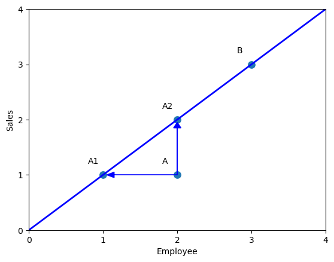

<!-- **Đánh giá Hiệu suất là gì​?** -->

Khi chúng ta có đầu vào, và nhận được kết quả, chúng ta hay đánh giá hiệu suất của kết quả xem với đầu vào như thế thì kết quả liệu có tốt không.​ Một số ví dụ cơ bản: Giá thành/sản phẩm, Lợi nhuận/sản phẩm.​
<!-- truncate -->

$$
\frac{Output}{Input}
$$

Công thức trên được gọi là thước đo hiệu quả.​
Chúng ta có thể mở rộng công thức trên với Nhiều đầu vào (Inputs) và nhiều đầu ra (Outputs)​

## Ví dụ đơn giản với một input và một output

Ví dụ một nhãn hàng có 8 cửa hàng được gán nhãn là A,B,C,D,E,F,G,H với tham số đầu vào là Số lượng nhân viên (Employee) của cửa hàng đó và đầu ra là số lượng hàng bán được (Sales) của cửa hàng. Hệu suất của cửa hàng được tính theo công thức đơn giản là Sales/Employees. Kết quả thu được cửa hàng B có hiệu suất cao nhất là 1 và cửa hàng F có hiệu suất thấp nhất là 0.4


Ta có thể biểu diễn mối tương quan giữa Input và Output bằng scatterplot.
Độ dốc của đường nối với mỗi điểm và gốc tọa độ O(0,0) tương ứng với Sales/ Employee ( hiệu quả). Trong hình trên ta có thể tính được đường thằng OB có dạng $y=1x$, do đó hiệu suất của B là 1. ​

Đường có độ dốc cao nhất (nối với điểm B) được gọi là Efficient  Frontier (Đường biên hiệu quả).​ Các điểm sẽ nằm cùng 1 phía so với đường thẳng, hoặc ở trên, hoặc ở dưới.​ Nếu chúng ta vẽ Output là trục tung và Input là trục hoành thì các điểm sẽ nằm phía dưới đường biên hiệu quả. Ngược lại nếu chúng ta vẽ Output là trục hoành và Input là trục tung thì các điểm sẽ nằm phía trên của đường biên hiệu quả.


Chúng ta có thể  vẽ một đường thống kê hồi quy $y=0.622x$ để ước lượng mối quan hệ tuyến tính giữa input và output.​ Đường hồi quy này đi qua chính giữa của tập dữ liệu, do đó chúng ta có thể xem các điểm ở phía trên đường là hiệu quả tốt và điểm dưới là chưa tốt, khoảng cách giữa điểm tới hình chiếu của điểm đó trên đường hồi quy chính ta mức độ hiệu quả/không hiệu quả​ so với trung bình. Trong ví dụ trên, chúng ta có thể thấy điểm H gần với trung bình nhất, 

<!-- Khoảng cách từ các điểm đến đường Efficient Frontier nêu lên độ lệch so với điểm tốt nhất​ -->


### So sánh với đường biên

Với cửa hàng A, có hai cách để so sánh với đường biên. Bằng cách chiếu theo trục tọa độ, chúng ta có hai điểm A1 và A2​

- Với điểm A2, để đạt được hiệu suất như B mà vẫn giữ nguyên số lượng nhân viên, chúng ta cần phải cố gắng tăng Sale lên 2​
- Với điểm A1, nếu muốn giữ nguyên sale mà vẫn muốn đạt được hiệu suât cao, chúng ta cần phải cắt giảm nhân sự xuống 1.

Ngoài ra, bất cứ điểm nào nằm trong đoạn A1A2 cũng là kết quả tối ưu cho cửa hàng B, đối với các điểm này, chúng ta cần phải thay đổi cả giá trị Sale lẫn Employee.



## Ví dụ về Dữ liệu với Hai input và Một output

Trong ví dụ đầu, chúng ta đã làm quen với đầu vào là Số lượng nhân sự của một cửa hàng và đầu ra là số sale của cửa hàng đó. Ở ví dụ này, chúng ta sẽ làm quen với việc thêm một đầu vào là Diện tích mặt bằng của cửa hàng. Để tiện lợi cho việc tính toán, chúng ta chuẩn hóa số lượng Sale ở các cửa hàng về 1


Đường nối các điểm C, D, E được gọi là đường Efficient Frontiers, đường này bao tất cả các điểm nằm trong nó. Vùng chứa các điểm ở trong này được gọi là Production Possibility Set.

### So sánh với đường biên


Với cửa hàng A,ta có thể nói rằng hai cửa hàng E,D là cửa hàng tham chiếu của nó, nghĩa là để tối ưu hiệu suất của cửa hàng A, ta cần phải dựa trên hiệu quả của cửa hàng E và D. Để làm được điều này, chúng ta vẽ đường thẳng OA cắt đường biên E, D tại P có **Employees/Sales** và **Area/Sales** lần lượt là 3.43 và 2.58. 
Do đó, hiệu quả của A sẽ được tính theo cách hình học như sau:

$\frac{OP}{OA} = \frac{4.29}{5} = 0.858$

Để tối cửa hàng A, ta có các phương án sau
- Giảm employee/sale về 3.43 và area/sale về 2.58
- Giữ nguyên employee và giảm area về điểm D
- Giữ nguyên area và giảm employee về điểm A1

##  Ví dụ về dữ liệu với Một input và Hai output

Ngược lại với ví dụ trên, chúng ta sẽ đến ví dụ với một input là số lượng nhân viên của cửa hàng và hai output là số lượng khách hàng và số sales của cửa hàng đó. Tương tự để thuận tiện cho việc tính toán, chúng ta sẽ chuẩn hóa số lượng nhân viên về 1.


Đường nối các điểm B, E, F, G được gọi là đường Efficient Frontiers, đường này bao tất cả các điểm nằm trong nó. Vùng chứa các điểm ở trong này được gọi là Production Possibility Set. 
Chúng ta để ý rằng đối với Dữ liệu tập trung Input thì đường biên sẽ nằm ở dưới, và cố gắng tối ưu tỉ lệ Input/Output nhỏ nhất có thể. Còn đối với dữ liệu tập
trung Output thì đường biên sẽ nằm ở trên thể hiện rằng Output/Input càng cao thì càng tối ưu

### So sánh với đường biên


Ta có thể nhận thấy B là điểm tham chiếu của cửa hàng A, từ B ta kẻ đường thẳng song song với trục hoành, sau đó vẽ đường thằng OA cắt đường song song tại Q, hiệu quả của cửa hàng A được tính theo $\frac{OA}{OQ} = 0.714$.

Tương tự ta có F,G là hai điểm tham chiếu của D, ta vẽ đường OD cắt FG tại P. Hiệu quả của cửa hàng D được tính bằng $\frac{OD}{OP}=0.75$

## Ví dụ về dữ liệu với Nhiều input và nhiều output


Dữ liệu các bệnh viện được đánh nhãn từ A đến L có các Inputs là Số lượng Bác sĩ (Doctors) và số lượng Y tá (Nurses), Outputs là số lượng bên nhân Ngoại trú (Outpatients) và số lượng bệnh nhân nội trú (Inpatients).

Công thức tính hiệu quả được tính như sau

$$
\Large \frac{Outpatents * u_1 + Inpatients * u_2}{Doctors * v_1 + Nurses * v_2}
$$

Trong đó $u_1, u_2, v_1, v_2 $ là các trọng số tương ứng với các Input và Output. Người quản lý có thể dựa vào kinh nghiệm để lựa chọn một tỉ lệ thích hợp. Giả sử chúng ta chọn tỉ lệ $u_1:u_2 = 1:3$ và $v_1:v_2=5:1$, Hiệu suất của các bệnh viện sẽ được tính và chuẩn hóa về 1(Bằng cách chia cho bệnh viện có hiệu suất cao nhất)


Kết quả cho thấy bệnh viện A được đánh giá cao nhất là 1 sau đó là bệnh viện B là 0.9, bênh viện F thấp nhất là 0.64. 

> **Có cách chọn các tham số nào để bệnh viện B có thể có score tốt hơn 0.9 không?**

Một trong những cách có thể chọn tham số cục bộ để tối ưu hiệu suất cho từng bệnh viện là CCR model

## CCR model

CCR model được đề xuất bởi Charnes, Cooper và Rhodes vào năm 1978. CCR đưa ra hai khái niệm Virtual input và Virtual output

$$
\Large Virtual\ input = v_1*x_1 + ... + v_m * x_m \\
\Large Virtual\ output = u_1*y_1 + ... + u_s * y_s
$$

Trong đó:
- $v_1,...,v_m$ là trọng số tương ứng với các input $x_1,...,x_m$
- $u_1,...,u_s$ là trọng số tương ứng với các output $y_1,...,y_s$

Mô hình sử dụng phương pháp Quy hoạch Tuyến tính (Linear Programming) để tối ưu hiệu suất cho từng đơn vị (Decision Marking Unit) theo tỉ lệ

$$
\Large DMU = \frac{virtual\ output}{virtual\ input}
$$

Với mô hình này, mỗi bệnh viện sẽ có bộ trọng số **tối ưu** khác nhau

### Công thức cơ bản

Ví dụ chỉ có 5 bệnh viện, để tìm các trọng số sao cho tối ưu bệnh viện A DMU(A), ta có có hàm tối ưu như sau


Chúng ta cần tìm 

$$
Maximize\ \frac{100u_1 + 90u_2}{20v_1 + 141v_2}
$$

Thỏa mãn các ràng buộc

$$
\frac{100u_1+90u_2}{20v_1+151v_2}\le 1 (A)
$$
$$
\frac{150u_1+50u_2}{19v_1+131v_2}\le 1 (B)
$$
$$
\frac{160u_1+55u_2}{25v_1+160v_2}\le 1 (C)
$$
$$
\frac{180u_1+72u_2}{27v_1+168v_2}\le 1 (D)
$$
$$
\frac{94u_1+66u_2}{22v_1+158v_2}\le 1 (E)
$$

Bài toán trên có thể chuyển đổi thành bài toán quy hoạch tuyến tính sau

$$
Maximize\ 100u_1 + 90u_2
$$

Sao cho

$$
(100u_1+90u_2) - (20v_1+151v_2) \le 0 (A)
$$

$$
(150u_1+50u_2)-(19v_1+131v_2) \le 0 (B)
$$
$$
(160u_1+55u_2)-(25v_1+160v_2)\le 0 (C)
$$
$$
(180u_1+72u_2)-(27v_1+168v_2)\le 0 (D)
$$
$$
(94u_1+66u_2)-(22v_1+158v_2)\le 0 (E)
$$
$$
20v_1 + 151v_2 = 1; u_1, u_2, v_1, v_2 \ge 0
$$

Chúng ta có thể sử dụng thư viện  `pulp` để giải quyết bài toán trên.
Kết quả thu được cho Bệnh viện A
- $u_1 = 0.004176, u_2 = 0.006471$
- $v_1 = 0.05000, v_2 = 0.000000$

Áp dụng cho các bệnh viện khác ta tìm được các trọng số như sau. Dưới đây là code của mình sử dụng pandas và pulp


```python
from pulp import LpMaximize, LpProblem, LpStatus, lpSum, LpVariable, LpMinimize
import pandas as pd
def CCR_model(_df,col_name="", type='input', Inputs=[], Outputs=[]):
    df = _df.copy()
    df.reset_index(drop=True, inplace=True)
    model = LpProblem(name="small-problem", sense=LpMaximize)
    Inputs_Variables = []
    Outputs_Variables = []
    for input in Inputs:
        var = LpVariable(name=input, lowBound=0)
        Inputs_Variables.append(var)
    for output in Outputs:
        var = LpVariable(name=output, lowBound=0)
        Outputs_Variables.append(var)
    df['Inputs'] = df.apply(lambda x: lpSum([var * x[name] for (var, name) in zip(Inputs_Variables, Inputs)]), axis=1)
    df['Outputs'] = df.apply(lambda x: lpSum([var * x[name] for (var, name) in zip(Outputs_Variables, Outputs)]), axis=1)
    df['Outputs - Inputs'] = df.apply(lambda x: x['Outputs'] - x['Inputs'] <= 0, axis=1)
    df['Inputs_St'] = df['Inputs'].apply(lambda x: x==1)
    df['Outputs_St'] = df['Outputs'].apply(lambda x: x==1)

    
    def solve(k):
        pis = []
        if type =='input':
            model = LpProblem(name=f"small-problem_{k}", sense=LpMaximize)
        if type =='output':
            model = LpProblem(name=f"small-problem_{k}", sense=LpMinimize)
        for i,sj in enumerate(df['Outputs - Inputs'].values):
            model += sj
        if type=='input':
            model+= df['Inputs_St'].values[k]
            model+= df['Outputs'].values[k]
        if type=='output':
            model+= df['Outputs_St'].values[k]
            model+= df['Inputs'].values[k]
        status = model.solve()
        for (name, constraint) in model.constraints.items():
            # print(f"{constraint}: {constraint.pi}")
            pis.append(constraint.pi)
        # print(Inputs_Variables[0].varValue)
        return status, model.objective.value(), model, pis
    
    weights = []
    models = []
    datas =[]
    for i in range(df.shape[0]):
        status, val, model, pis = solve(i)
        weight = {}
        for variable in model.variables():
            weight[variable.name] = variable.varValue
        weights.append(weight)
        datas.append(pis)
    output = pd.DataFrame(datas,columns=df[col_name].to_list() +['Efficiency'])
    output = output.apply(lambda x: round(x, 4))
    output[col_name] = df[col_name]
    output = output[[col_name, 'Efficiency']+df[col_name].to_list()]
    return output, models ,weights
```

kết quả thu được như sau

```python
output,_, weights = CCR_model(dfx, "Hospital", 'input',["Doctors",'Nurses'], ['Outpatients', 'Inpatients'])
pd.DataFrame(weights)[["Doctors",'Nurses', 'Outpatients', 'Inpatients']]
```


Và hiệu suất của các bệnh viện được tính lại

```python
output
```
So với kết quả của phương pháp chọn sẵn các trọng số, phương pháp CCR giúp tính toán hiệu suất tối ưu hơn, các điểm B và D được kéo về 1 như điểm A


Đối với bảng output, với Bệnh Viện C ta có chỉ số DMU < 1. Để phân tích hiệu suất, ta so sánh với các Bệnh viện B, D có các giá trị lambda khác 0. Lúc này B và D được gọi là 2 điểm tham chiếu của C


Ta lập bảng tính toán như sau 


Kết quả phân tích cho thấy
Bệnh viện C đang dư thừa 4 Bác sĩ và 18 Y tá cho việc điều trị 160 Bệnh nhân ngoại trú và 55 Bệnh nhân nội trú.

