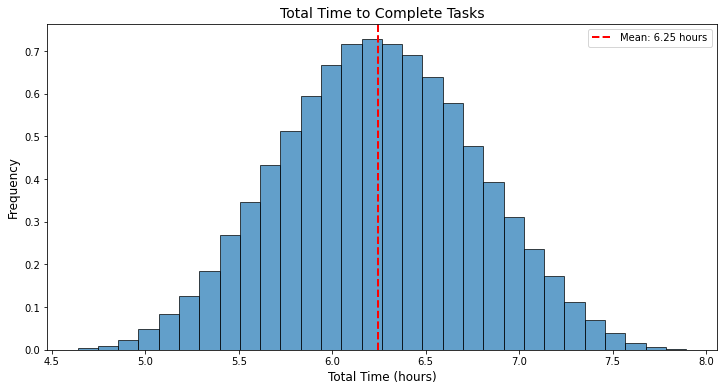
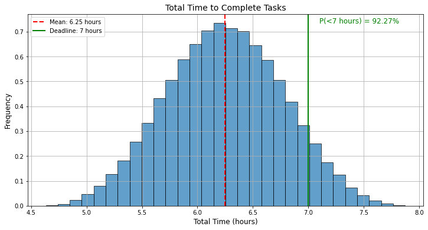
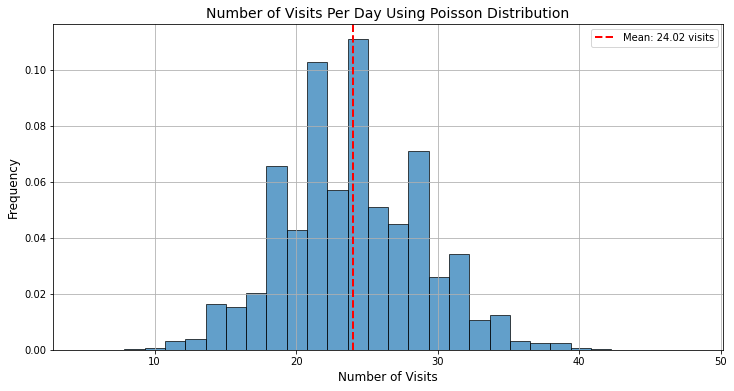
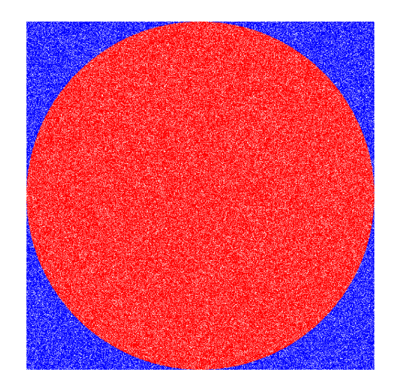

## Khái niệm chung


### Một vài ví dụ thực tế

**Ví dụ đầu tiên:**

Anh Đức giao Sơn làm task tìm hiểu về Monte Carlo Simulation, đưa một số tài liệu liên quan và muốn output cuối cùng là Sơn cần làm một buổi presentation về Monte Carlo Simulation cho anh Đức nghe.
Vậy Sơn cần bao nhiêu tiếng để có thể hoàn thành được đầu việc này?
Đầu tiên Sơn chia các đầu việc ra và ước lượng thời gian có thể hoàn thành như sau:
- Tìm hiểu các tài liệu liên quan đến Monte Carlo Simulation: 1 - 2h (1)
- Viết tài liệu lên Confluence: 2 - 3h (2)
- Làm slide: 1 - 2h (3)
- Luyện tập kịch bản present: 0.5 - 1h (4)

Một góc nhìn trực quan đóc là quyết định sử dụng phân phối đều để đại diện cho thời gian hoàn thành mỗi đầu việc bé. Phân phối đều là một cách đơn giản và trực quan để mô phỏng các biến ngẫu nhiên, trong đó tất cả các kết quả giữa một giá trị tối thiểu và tối đa đều có xác suất xảy ra như nhau.

Giờ chúng ta sẽ sử dụng máy tính để có thể chọn ngẫu nhiên thời gian hoàn thành từng đầu việc bé và tính tổng thời gian cần. Chúng ta sẽ mô phỏng chúng hàng ngàn, triệu lần như sau:

- Lần 1: 1.2h (1) + 2.8h (2) + 1.1h (3) + 0.5h (4) = 5.6h
- Lần 2: 1.25h (1) + 2.3h (2) + 1.4h (3) + 0.7h (4) = 5.65h
- Lần 3: 1.1h (1) + 2.2h (2) + 1.3h (3) + 0.8h (4) = 5.4h

…

Lần 100000: 1.7h (1) + 2.1h (2) + 1.5h (3) + 0.7h (4) = 6h

Sau rất nhiều lần mô phỏng, ta visual kết quả được như sau:



Vậy nhìn vào biểu đồ này ta có thể dễ dàng nói rằng Sơn sẽ cần khoảng từ 5 - 8 tiếng để hoàn thành đầu việc này. 

Nhưng ta hãy mở rộng bài toán này ra một chút. Giả sử Sơn chỉ dành được thời gian 7 tiếng để có thể hoàn thành được công việc này. Vậy khả năng bao nhiều % là Sơn có thể hoàn thành được phần việc mà anh Đức giao cho?



Như vậy, ta có thể thấy xác suất Sơn có thể làm đúng hạn là 92.26%

**Ví dụ thứ hai:**

Anh Đức tạo và viết một số bài blog trang web Data Science Dances. Sau một thời gian marketing, anh Đức nhận ra rằng trung bình sẽ có 24 lượt truy cập mỗi ngày. Anh Đức muốn biết xác suất rằng một ngày bất kỳ sẽ nhiều hơn 30 lượt truy cập xem là bao nhiêu để có thể đặt target phù hợp cho tương lai. 

Chú ý, phân phối số lượt truy cập theo ngày là Poisson Distribution và chúng ta sẽ dùng Monte Carlo Simulation để tính toán.

```python
import numpy as np
import matplotlib.pyplot as plt

# Số lần mô phỏng
num_simulations = 100000

# Trung bình số lượt truy cập mỗi ngày
lambda_visits_per_day = 24

# Mô phỏng số lượt truy cập mỗi ngày theo phân phối Poisson
visits_per_day = np.random.poisson(lambda_visits_per_day, num_simulations)

# Vẽ biểu đồ histogram của số lượt truy cập mỗi ngày
plt.figure(figsize=(12, 6))
plt.hist(visits_per_day, bins=30, density=True, edgecolor='k', alpha=0.7)
plt.title("Number of Visits Per Day Using Poisson Distribution", fontsize=14)
plt.xlabel("Number of Visits", fontsize=12)
plt.ylabel("Frequency", fontsize=12)

# Hiển thị đường thẳng chỉ giá trị trung bình
mean_visits = np.mean(visits_per_day)
plt.axvline(mean_visits, color='r', linestyle='--', linewidth=2, label=f'Mean: {mean_visits:.2f} visits')
plt.legend()

# Hiển thị lưới và biểu đồ
plt.grid(True)
plt.show()
```



Ta cũng có thể tính được xác suất số lượt truy cập web lớn hơn 30 là 9.53%. Vậy anh Đức nếu muốn đặt mục tiêu là 30 lượt truy cập/ngày thì sẽ cần cố gắng rất nhiều mới có thể đạt được mục tiêu.

### Khái niệm
Chúng ta đã xem qua một số ví dụ và hãy quay trở lại tìm hiểu xem Monte Carlo Simulation là gì? 

Monte Carlo Simulation là một kỹ thuật toán học dùng để hiểu và đánh giá tác động của rủi ro và không chắc chắn trong các mô hình dự đoán và dự án. Phương pháp này sử dụng các biến ngẫu nhiên để mô phỏng nhiều kịch bản có thể xảy ra của một hệ thống hoặc quy trình, giúp chúng ta ước lượng phân phối của kết quả đầu ra.

Tên gọi “Monte Carlo” xuất phát từ thành phố Monte Carlo ở Monaco, nổi tiếng với các sòng bạc và hoạt động đánh bạc. Phương pháp này được phát triển kỹ thuật bởi các nhà khoa học làm việc tại Dự án Manhattan khi họ cần giải quyết các vấn đề phức tạp liên quan đến phản ứng hạt nhân và các tính toán liên quan đến vật lý. Hai nhà khoa học trong nhóm, Stanislaw Ulam và John von Neumann, đã phát triển và sử dụng kỹ thuật này và chọn tên “Monte Carlo” để phản ánh bản chất ngẫu nhiên và các phép thử mô phỏng nhiều lần của phương pháp như các sòng bạc hoạt động. 


### Các bước thực hiện
Monte Carlo Simulation được thực hiện thông qua 4 bước chính dưới đây:

**Bước 1: Xây dựng mô hình** 

Cần xác định bài toán hoặc hệ thống mà chúng ta muốn mô phỏng. Đây có thể là một phương trình, một hệ thống phương trình hay một quy trình mô phỏng phức tạp mô tả hệ thống.

Ví dụ như trong ví dụ 1, bài toán ta mô phỏng ở đây là tổng thời gian Sơn cần hoàn thành sau khi đã chia 4 đầu việc.

**Bước 2: Chọn các biến để mô phỏng**

Ta cần chọn các biến số ngẫu nhiên cần mô phỏng và xác định phân phối xác suất của từng biến số đó. Điều này sẽ từ việc ta thu thập dữ liệu lịch sử và sử dụng kiến thức chuyên môn để xác định.

Ví dụ trong ví dụ 1, các biến chính là 4 đầu việc phân phối chuẩn với các range khác nhau. Hay trong ví dụ 2, đó là phân phối Poisson số lượt truy cập theo ngày.

**Bước 3: Thực hiện các mô phỏng lặp đi lặp lại**

Chạy các biến ngẫu nhiên thông qua mô hình xây dựng ở bước 1 và 2 và thực hiện nhiều lần lặp lại mô phỏng đó.  Mỗi lần lặp lại sử dụng một bộ giá trị ngẫu nhiên khác nhau cho các biến số để tạo ra một kết quả đầu ra khác nhau.

**Bước 4: Tổng hợp kết quả**

Tổng hợp các kết quả từ các lần mô phỏng. Từ kết quả này, ta có thể tính toán được xác suất các giá trị, khoảng giá trị và các thống kê quan trọng như trung bình, độ lệch chuẩn và phương sai để đánh giá kết quả. Ta cũng có thể trực quan hoá bằng sử dụng các đồ thị như histogram để hiêủ và phân tích.

### Ưu điểm, nhược điểm của Monte Carlo Simulation

Ta có thể thấy Monte Carlo Simulation là một phương pháp hiệu quả và linh hoạt được sử dụng trong nhiều lĩnh vực và bài toán khác nhau từ tài chính, kỹ thuật đến quản lý dự án,… Tuy nhiên, phương pháp nào cũng có ưu và nhược điểm của riêng mình. Chính vì vậy, chúng ta phải hiểu rõ để đánh giá xem liệu phương pháp này có phù hợp với bài toán cụ thể hay không.

**Ưu điểm:**

- Xử lý các bài toán phức tạp: Monte Carlo Simulation có thể giúp xử lý các bài toán hay hệ thống phức tạp không giải quyết được theo cách thông thường. Điều này có thể do quy trình nhiều biến ngẫu nhiên hay các biến có phân phối phức tạp và khác nhau.

- Phân tích và ước lượng các kịch bản: Monte Carlo Simulation cho phép ước lượng xác suất và rủi ro liên quan đến các kịch bản kết quả khác nhau, giúp các nhà quản lý đưa ra các quyết định chính xác hơn và quản lý rủi ro được tốt hơn. Ta có thể dễ dàng visualize được các kết quả khác nhau như mean, std hay trả lời câu hỏi khả năng kịch bản cụ thể xảy ra là bao nhiều %.

- Phân tích độ nhạy: Monte Carlo Simulation cho phép phân tích độ nhạy của các biến đầu vào đối với kết quả đầu ra thông qua tìm giá trị tương quan giữa các biến, từ đó chúng ta có thể xác định được các biến số quan trọng và ảnh hưởng của chúng để ra các quyết định tốt hơn.

- Dễ dàng thực hiện: Một ưu điểm rất lớn của Monte Carlo Simulation là có thể dễ dàng mô phỏng tạo ra các kịch bản khác nhau và phân tích kết quả nhanh chóng chỉ cần sự trợ giúp của máy tính hay các phân mềm mô phỏng hiện đại. Phương pháp này ta cũng không yêu cầu các giả định nghiêm ngặt nên có thể áp dụng với nhiều bài toán thực tế khác nhau.

**Nhược điểm:**

- Cần tài nguyên tính toán lớn: Dễ dàng thấy Monte Carlo Simulation dự đoán kết quả qua việc thực hiện lặp lại nhiều mô phỏng. Số lần mô phỏng tỷ lệ thuận với hiệu suất phương pháp, càng nhiều lần mô phỏng thì kết quả càng chính xác. Nhưng điều đó cũng đòi hỏi nhiều tài nguyên cũng như thời gian thực hiện hơn, đặc biệt với các bài toán hay hệ thống phức tạp.

- Khó xác định phân phối đầu vào: Kết quả của Monte Carlo Simulation có thể bị ảnh hưởng lớn bởi các giả định về phân phối đầu vào. Tuy nhiên, việc xác định phân phối xác suất chính xác cho các biến số này có thể khó khăn hoặc bias do thiếu dữ liệu lịch sử hoặc thông tin biến số.

- Phức tạp trong triển khai: Tuy Monte Carlo Simulation dễ dàng hiểu và thực hiện, việc triển khai phương pháp cũng cần các kiến thức chuyên môn và xác suất, cũng như việc sử dụng các công cụ hỗ trợ cho quá trình mô phỏng. Đặc biệt, việc phân tích và diễn giải kết quả có thể phức tạp, đặc biệt khi mô hình có nhiều biến số và kịch bản khác nhau.

- Độ chính xác kết quả: Dù Monte Carlo Simulation mô phỏng nhiều kịch bản nhưng cũng không thể dự đoán mọi yếu tổ bất ngờ có thể xảy ra trong thực tế. Kết quả Monte Carlo Simulation như đã nói ở trên phụ thuộc nhiều vào giả định ban đầu về các biến số ngẫu nhiêu và phân phối của chúng, điều có thể không được phản ảnh thực tế

## Ứng dụng
### Trong hình học
Chúng ta sẽ thử áp dụng Monte Carlo Simulation trong việc tính diện tích hình tròn để có thể hiểu concept và áp dụng vào các trường hợp phức tạp hơn.

Công thức tính hình tròn $\pi r^2$ khá đơn giản và quen thuộc với đại đa số nhiều người, nhưng ta sẽ thử tính diện tính thông qua Monte Carlo Simulation.



Bài toán đặt ra ở đây là thông qua **Monte Carlo Simulation, làm sao để ta tính được diện tích hình tròn đỏ trong hình vuông, khi được cho trước bán kính hình tròn (r)?**

Đầu tiên, ta cần giả sử tâm của hình tròn là (0, 0) và tất cả các points trong hình trên sẽ có toạ độ là $(x, y)$. Khi đó, nếu một điểm muốn nằm trong hình tròn đỏ, $(x^2 + y^2) <= r^2$ ($r$ là bán kính của hình tròn).

Tiếp tục, hãy tượng tượng chúng ta chấm nhiều điểm liên tục vào hình một cách ngẫu nhiên. Dĩ nhiên, chúng ta sẽ có thể chấm điểm vào trong hình tròn (vùng màu đỏ) hoặc cũng có thể điểm chấm ngoài hình tròn (vùng xanh nước biến).

Chúng ta càng chấm nhiều, chúng ta càng điền đầy vào hình, và tỷ lệ các điểm chấm trong hình tròn với toàn bộ các điểm chấm giúp ta có thể thấy được diện tích mà chúng ta phủ kín như nào.

Bài toán chúng ta sẽ thử mô phỏng qua đoạn code sau:

```python
import random
import math
 
def get_random_coord(radius):
    return random.uniform(-radius, radius)
 
def calculate_area_monte_carlo(radius):
 
    total_in_circle = 0 # Count the points inside circle
    total_points = 0 # Count the total points
 
    for i in range(0, 10000000):
        (x, y) = get_random_coord(radius), get_random_coord(radius) # Generate random coordinates for x and y
        in_circle = x ** 2 + y ** 2 <= radius ** 2 # Check if the point (x, y) ís inside the circle
         
        if in_circle:
            total_in_circle += 1

        total_points += 1    

        # Calculate and print the approximate area
        if i in [9999, 99999, 150000, 999999, 1500000, 9999999]:
            points_outside_circle = total_points - total_in_circle
            approximate_area = (2 * radius) ** 2 * total_in_circle / total_points
            print(f"Iteration {i}: Points inside circle = {total_in_circle}, Points outside circle = {points_outside_circle}, Approximate Area = {approximate_area}")
 
def calculate_area_formula(radius):
    area = math.pi * radius ** 2
    print("Area (reference):", area)
 
radius = 400
calculate_area_monte_carlo(radius)
calculate_area_formula(radius)
```

kết quả

```python
Iteration 9999: Points inside circle = 7863, Points outside circle = 2137, Approximate Area = 503232.0
Iteration 99999: Points inside circle = 78559, Points outside circle = 21441, Approximate Area = 502777.6
Iteration 150000: Points inside circle = 117984, Points outside circle = 32017, Approximate Area = 503395.04403303977
Iteration 999999: Points inside circle = 785188, Points outside circle = 214812, Approximate Area = 502520.32
Iteration 1500000: Points inside circle = 1178105, Points outside circle = 321896, Approximate Area = 502657.7982281345
Iteration 9999999: Points inside circle = 7854147, Points outside circle = 2145853, Approximate Area = 502665.408
Area (reference): 502654.8245743669
```

Khi nhìn kết quả, ta có thể dễ dàng thấy càng nhiều iteration (tức chấm càng nhiều điểm) thì diện tích tính thông qua Monte Carlo Simulation càng gần bằng với diện tích tính thông qua công thức $\pi r^2$.

Nhìn kỹ hơn vào Iteration 9999999, ta sẽ có tỷ lệ số points trong hình tròn với toàn bộ số points là 

```python
(2144973 + 7855027) / 7855027 # Result: 1.2730700989315504
```

Nếu tính bằng công thức thực tế diện tích hình tròn / diện tích hình vuông:

```python
radius = 400
square = radius * 2
ratio = (square * square) / ((radius ** 2) * math.pi)
print(ratio) # Result: 1.2732395447351628
```

Hai kết quả xấp xỉ bằng nhau, đúng như chúng ta nói ở trên rằng tỷ lệ các điểm chấm trong hình tròn với toàn bộ các điểm chấm giúp ta có thể thấy được diện tích mà chúng ta phủ kín như nào khi chấm càng nhiều điểm.

Ta có thể xem video dưới đây với góc nhìn tương tự để hiểu hơn. Trong video, tác giả đã mô phỏng thả những quả bóng vào một hình chữ nhật to, trong đó có một hình vuông có cạnh là r và một hình tròn có bán kính là r → Thả nhiều lần và tính được số π thông quả tỷ lệ bóng giữa 2 hình.

<iframe width="560" height="315" src="https://www.youtube.com/embed/7ESK5SaP-bc?si=hu0n2_RpeNcP6950&amp;clip=UgkxAIBNZpqfMcZ2cnzWkz7gB3HtyvLjQWs5&amp;clipt=EK2qBRj4zwY" title="YouTube video player" frameborder="0" allow="accelerometer; autoplay; clipboard-write; encrypted-media; gyroscope; picture-in-picture; web-share" referrerpolicy="strict-origin-when-cross-origin" allowfullscreen></iframe>

Mở rộng bài toán
Ta sẽ mở rộng thêm bài toán: Giả sử ta có 2 hình tròn thì diện tích giao nhau giữa 2 hình sẽ tính như nào thông qua Monte Carlo Simulation?


- Đầu tiên, ta sẽ có 2 hình tròn với toạ đô và bán kính xác định là $O1(x_1, y_1, r_1)$ và $O2(x_2, y_2, r_2)$. 

- Tiếp tục, như bài xác định diện tích hình tròn, ta cũng cần xác định vùng sẽ chấm ngẫu nhiên các điểm (hình chữ nhật bao trùm 2 hình tròn). 
Hình chữ nhật được xác định bởi cặp toạ độ $(x_{min}, y_{min})$ và $(x_{max}, y_{max})$
    - $x_{min} = min(x_1 - r_1, x_2 - r_2)$
    - $x_{max} = max(x_1 + r_1, x_2 + r_2)$
    - $y_{min} = min(y_1 - r_1, y_2 - r_2)$
    - $y_{max} = max(y_1 + r_1, y_2 + r_2)$

- Xác định điểm ngẫu nhiên có trong hình tròn với điều kiện $(x^2 + y^2) <= r^2$ ($r$ là bán kính của hình tròn). Vì vậy, để điểm ngãu nhiên trong phần giao 2 hình tròn, điểm cần ở trong cả hình tròn 1 và hình tròn 2 tức là:
    - $(x - x_1)^2 + (y - y_1)^2 <= r_{1}^{2}$
    - $(x - x_2)^2 + (y - y_2)^2 <= r_{2}^{2}$

- Tương tự bài toán trên, ta chấm càng nhiều vào hình thì tỷ lệ các điểm chấm trong hình tròn với toàn bộ các điểm chấm giúp ta có thể thấy được diện tích mà chúng ta phủ kín như nào.

```
Diện tích hình giao = Diện tích hình chữ nhật * (Số điểm trong hình giao nhau / Tổng số điểm)
```

Bài toán chúng ta sẽ thử mô phỏng qua đoạn code sau:

```python
import random

# Function to generate random coordinates within a specified range
def get_random_coord(x_min, x_max, y_min, y_max):
    return (random.uniform(x_min, x_max), random.uniform(y_min, y_max))

# Function to check if a point (x, y) is inside a circle with center (cx, cy) and radius r
def is_in_circle(x, y, cx, cy, r):
    return (x - cx) ** 2 + (y - cy) ** 2 <= r ** 2

# Function to calculate the intersection area of two circles using the Monte Carlo method
def calculate_intersection_area(x1, y1, r1, x2, y2, r2, num_samples=1000000):
    # Determine the bounding box for the area containing both circles
    x_min = min(x1 - r1, x2 - r2)
    x_max = max(x1 + r1, x2 + r2)
    y_min = min(y1 - r1, y2 - r2)
    y_max = max(y1 + r1, y2 + r2)
    
    total_points = 0
    points_in_intersection = 0

    # Generate random points and check how many fall inside both circles
    for _ in range(num_samples):
        x, y = get_random_coord(x_min, x_max, y_min, y_max)
        if is_in_circle(x, y, x1, y1, r1) and is_in_circle(x, y, x2, y2, r2):
            points_in_intersection += 1
        total_points += 1

    # Calculate the area of the bounding box
    square_area = (x_max - x_min) * (y_max - y_min)
    
    # Estimate the intersection area based on the ratio of points in the intersection
    intersection_area = square_area * (points_in_intersection / total_points)

    return intersection_area

# Example: Centers and radii of two circles
x1, y1, r1 = 0, 0, 3
x2, y2, r2 = 3, 0, 5

# Calculate the intersection area
intersection_area = calculate_intersection_area(x1, y1, r1, x2, y2, r2)
print(f"Diện tích giao nhau: {intersection_area}")

### Result: Diện tích giao nhau: 24.10936
```