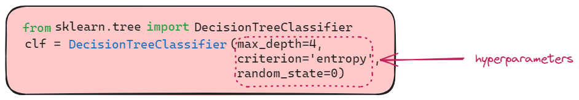
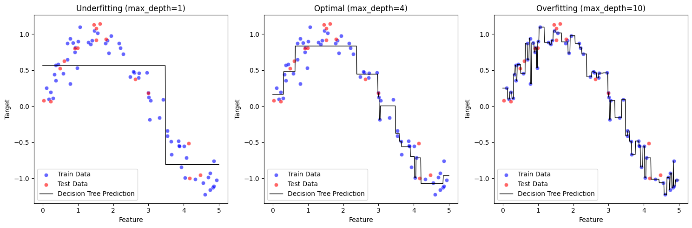
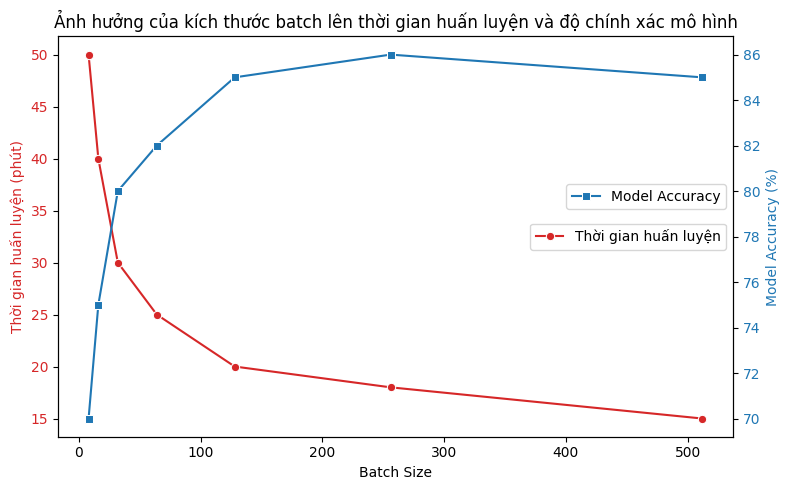

## Giới thiệu
Trong huấn luyện mô hình máy học, việc lựa chọn siêu tham số (hyperparameters) ảnh hưởng trực tiếp đến hiệu suất của mô hình. 
Không giống như tham số học được từ dữ liệu, siêu tham số cần được thiết lập trước khi huấn luyện. 
Hyperparameter Tuning là quá trình tìm kiếm giá trị tối ưu để mô hình hoạt động tốt nhất. 
Việc này giúp cải thiện độ chính xác, tránh overfitting và underfitting.

Trong nội dung bài viết này, mình sẽ giới thiệu về phương pháp cơ bản nhất để tối ưu siêu tham số là GridSearchCV.


## Hyperparameter là gì?

Đầu tiên, chúng ta cần biết định nghĩa Hyperparamter là gì. Theo nghĩa tiếng Việt thì hyperparameter nghĩa là siêu tham số được cài đặt trước khi quá trình huấn luyện mô hình bắt đầu. Khác với các parameter thông thường được học trong quá trình training, hyperparameter cần được thiết lập bởi người lập trình và ảnh hưởng trực tiếp đến hiệu quả của mô hình.
<figure>

<figcaption>Hyperparameter trong DecisionTreeClassifer</figcaption>
</figure>

Một số hyperparameter phổ biến:
- Độ sâu của cây (*max_depth*) trong **DecisionTree**
- Số lượng cây `n_estimators` trong **RandomForest**
- Learning rate (*eta*, *learning_rate*) trong Gradient Descent
- Hệ số regularization như  *alpha* trong **Ridge/Lasso**, *C* trong **SVM**
- Số lớp ẩn (*n_layers*) và số neuron(*hidden_state*) trong mạng neural
- Số lượng dữ liệu trong một batch *batch_size*
- Các chỉ tiêu đánh giá như *criterion* trong DecisionTree
...

## Tại sao cần Hyperparameter Tuning?

### Tránh overfitting và underfitting

**Overfitting** xảy ra khi mô hình học quá khớp với dữ liệu huấn luyện nhưng không tổng quát hóa được với dữ liệu mới. Trong khi **Underfitting** xảy ra khi mô hình quá đơn giản và không nắm bắt được các mẫu trong dữ liệu. Việc tinh chỉnh siêu tham số giúp cân bằng giữa hai vấn đề này, đảm bảo mô hình tổng quát hóa tốt.



Hình trên là hình minh họa Decision Tree với 3 cách lựa chọn siêu tham số *max_depth*
- *max_depth=1*: Underfitting, mô hình quá đơn giản, không bắt được xu hướng dữ liệu.
- *max_depth=10*: Overfitting, mô hình quá phức tạp, khớp chặt với dữ liệu huấn luyện nhưng có thể tổng quát hóa kém.
- *max_depth=4*: Optimal, mô hình cân bằng giữa đơn giản và phức tạp, dự đoán tốt.

### Tối ưu hóa thời gian và tài nguyên
Một số siêu tham số như kích thước batch (batch size) hoặc số lượng epoch ảnh hưởng đến thời gian huấn luyện và tài nguyên tính toán.
Tinh chỉnh giúp tìm ra cấu hình tối ưu để huấn luyện mô hình nhanh hơn mà không làm giảm hiệu suất.


Đây là biểu đồ minh họa ảnh hưởng của kích thước batch (Batch Size) đến thời gian huấn luyện và độ chính xác của mô hình:

- **Đường màu đỏ**: Thời gian huấn luyện giảm khi Batch Size tăng.
- **Đường màu xanh**: Độ chính xác của mô hình tăng đến một mức tối ưu rồi bắt đầu giảm nhẹ.

Biểu đồ này thể hiện rằng việc tối ưu Batch Size giúp giảm thời gian huấn luyện mà vẫn duy trì hiệu suất mô hình tốt.

### Giảm chi phí tính toán

Nếu chúng ta chọn tham số không hợp lý, mô hình có thể mất nhiều thời gian để hội tụ, điều này dẫn đến tăng chi phí tính toán mà không cải thiện được hiệu suất mô hình. 

Ví dụ như **grid search**, chúng ta cần thử tất cả các tổ hợp giá trị trong không gian tìm kiếm, điều này có thể tốn nhiều thời gian và tài nguyên. 

Ngược lại nếu dùng **random search** hoặc **bayesian optimization**, chúng ta có thể giảm được số lần thử nghiệm và tài nguyên tính toán. Do đó, việc tối ưu siêu tham số giúp tiết kiệm chi phí tính toán.

## Các phương pháp Hyperparameter Tuning

### Grid Search

Grid search là phương pháp tối ưu siêu tham số bằng cách thử tất cả các tổ hợp giá trị trong không gian tìm kiếm. 
Ví dụ nếu bạn có 2 siêu tham số

- *max_depth* với các giá trị nguyên trong danh sách [4,5,6]
- *n_estimators* với các giá trị nguyên trong danh sách [10,20,30]

Thì grid search sẽ thử tất cả các tổ hợp giá trị trong không gian tìm kiếm như
- *max_depth=4, n_estimators=10*
- *max_depth=4, n_estimators=20*
- *max_depth=4, n_estimators=30*
- *max_depth=5, n_estimators=10*
- *max_depth=5, n_estimators=20*
- *max_depth=5, n_estimators=30*
- *max_depth=6, n_estimators=10*

Sau đó chọn ra tổ hợp có hiệu suất tốt nhất.

Ưu điểm của phương pháp này là đơn giản và dễ thực hiện tuy nhiên nhược điểm là tốn thời gian với không gian lớn. Giả sử chúng ta có nhiều hơn 2 siêu tham số, ví dụ 3 siêu tham số, mỗi tham số với 5 giá trị khác nhau, thì sẽ có 5^3 = 125 tổ hợp.

Dưới đây là ví dụ code python cho Grid Search đơn giản. Mình sẽ dùng bộ dữ liệu [Phishing Websites](https://archive.ics.uci.edu/dataset/327/phishing+websites). Bộ dữ liệu này chỉ chứa các feature thuộc numerical.


**Chuẩn bị dữ liệu**
```python
from sklearn.model_selection import train_test_split
from ucimlrepo import fetch_ucirepo 
from sklearn.ensemble import RandomForestClassifier
from sklearn.metrics import accuracy_score

# fetch dataset 
phishing_websites = fetch_ucirepo(id=327) 
  
# data (as pandas dataframes) 
X = phishing_websites.data.features 
y = phishing_websites.data.targets


# Chia tập train và test
X_train, X_test, y_train, y_test = train_test_split(X, y, test_size=0.2, random_state=42, stratify=y)

# Chia tập train và valid
X_train, X_valid, y_train, y_valid = train_test_split(X_train, y_train, test_size=0.25, random_state=42, stratify=y_train)

# Kiểm tra kích thước dữ liệu
print(f"Train size: {X_train.shape}, Valid size: {X_valid.shape}, Test size: {X_test.shape}")
```

<pythonoutput>
```
Train size: (6633, 30), Valid size: (2211, 30), Test size: (2211, 30)
```
</pythonoutput>

**Tạo tất cả các tổ hợp tham số có thể có**

```python
import itertools

param_grid = {
    'n_estimators': [50, 100, 200],  
    'max_depth': [3, 5, 10],
}

# Tạo tất cả các tổ hợp tham số có thể có
param_combinations = list(itertools.product(*param_grid.values()))
for param in param_combinations:
    print(f'n_estimators: {param[0]}, \t max_depth: {param[1]}')

```

<pythonoutput>
```
n_estimators: 50, 	 max_depth: 3
n_estimators: 50, 	 max_depth: 5
n_estimators: 50, 	 max_depth: 10
n_estimators: 100, 	 max_depth: 3
n_estimators: 100, 	 max_depth: 5
n_estimators: 100, 	 max_depth: 10
n_estimators: 200, 	 max_depth: 3
n_estimators: 200, 	 max_depth: 5
n_estimators: 200, 	 max_depth: 10
```
</pythonoutput>

**Huấn luyện mô hình với từng tổ hợp tham số**

```python
# Lưu kết quả
best_score = 0
best_params = None
best_model = None

# Thử từng bộ tham số
for params in param_combinations:
    param_dict = dict(zip(param_grid.keys(), params))
    
    # Train model
    model = RandomForestClassifier(**param_dict, random_state=42)
    model.fit(X_train, y_train)
    
    # Dự đoán và đánh giá
    y_pred = model.predict(X_valid)
    accuracy = accuracy_score(y_valid, y_pred)
    
    # Lưu lại bộ tham số tốt nhất
    if accuracy > best_score:
        best_score = accuracy
        best_params = param_dict
        best_model = model

# In kết quả tốt nhất
print("Best Parameters:", best_params)
print("Best Model Accuracy on Valid Set:", best_score)
```
<pythonoutput>
```
Best Parameters: {'n_estimators': 200, 'max_depth': 10}
Best Model Accuracy on Valid Set: 0.9547715965626413
```
</pythonoutput>

**Đánh giá mô hình trên tập test**

```python
# Dự đoán và đánh giá
y_pred = best_model.predict(X_test)
accuracy = accuracy_score(y_test, y_pred)
print(f"Tuned Model Accuracy on Test Set: {accuracy:.4f}")
```
<pythonoutput>
```
Tuned Model Accuracy on Test Set: 0.9557
```
</pythonoutput>

Chúng ta sẽ so sánh với mô hình cơ bản

```python
model = RandomForestClassifier( n_estimators=50, max_depth=5, random_state=42)
model.fit(X_train, y_train)
y_pred_valid = model.predict(X_valid)
accuracy = accuracy_score(y_valid, y_pred_valid)
print(f"Model Accuracy on Valid Set: {accuracy:.4f}")
y_pred = model.predict(X_test)
accuracy = accuracy_score(y_test, y_pred)
print(f"Model Accuracy on Test Set: {accuracy:.4f}")


```
<pythonoutput>
```
Model Accuracy on Valid Set: 0.9326
Model Accuracy on Test Set: 0.9331
```
</pythonoutput>


### GridSearchCV

GridSearchCV là phương pháp GridSearch sử dụng tối ưu dựa trên Cross Validation thay vì chia tập dữ liệu thành train/valid/test như thông thường

| Tiêu chí | **Grid Search (Thủ công)** | **GridSearchCV** |
|----------|------------------|-----------------|
| **Cách hoạt động** | Duyệt qua tất cả các tổ hợp tham số  <br/>trên một tậptrain/test cố định | Duyệt qua tất cả các tổ hợp tham số <br/>và sử dụng Cross-Validation (CV)  để <br/>đánh giá độ chính xác trên nhiều tập con |
| **Cross-Validation (CV)** | ❌ Không dùng CV, chỉ train/test 1 lần | ✅ Dùng CV (k-fold) để kiểm tra độ ổn định |
| **Số lần train mô hình** | 🔹 Bằng số tổ hợp tham số thử nghiệm | 🔹 Bằng số tổ hợp tham số * số lượng fold của CV |
| **Tốc độ** | ⚡ Nhanh hơn, do chỉ train một lần mỗi tổ hợp | 🐢 Chậm hơn, do train nhiều lần trên tập dữ liệu chia nhỏ |
| **Độ tin cậy của mô hình** | 📉 Thấp hơn, vì chỉ đánh giá trên một tập train-test | 📈 Cao hơn, vì đánh giá trên nhiều tập con khác nhau |
| **Nguy cơ overfitting** | ⚠️ Cao hơn, do chỉ test trên một tập dữ liệu | ✅ Giảm thiểu overfitting, vì kiểm tra trên nhiều tập con |
| **Khi nào nên dùng?** | ✅ Khi dữ liệu lớn, cần chạy nhanh ⚡ | ✅ Khi muốn mô hình ổn định hơn, tránh phụ thuộc vào một tập dữ liệu |
| **Thư viện hỗ trợ** | 🔹 Tự triển khai thủ công bằng Python | 🔹 Có sẵn trong `sklearn.model_selection.GridSearchCV` |

Chúng ta nên dùng GridSearchCV hơn là grid search thủ công vì nó giúp tránh overfitting và giúp mô hình tổng quát hơn.

Thư viện sklearn có sẵn GridSearchCV, chúng ta có thể dùng nó để tối ưu siêu tham số.


**Chuẩn bị dữ liệu**

Lần này chúng ta sẽ chia Train và Test, sau đó đưa Train vào CV
```python
from sklearn.model_selection import GridSearchCV
# fetch dataset 
phishing_websites = fetch_ucirepo(id=327) 
  
# data (as pandas dataframes) 
X = phishing_websites.data.features 
y = phishing_websites.data.targets


# Chia tập train và test
X_train, X_test, y_train, y_test = train_test_split(X, y, test_size=0.2, random_state=42, stratify=y)

# Kiểm tra kích thước dữ liệu
print(f"Train size: {X_train.shape}, Test size: {X_test.shape}")

```

<pythonoutput>
```
Train size: (8844, 30), Test size: (2211, 30)
```
</pythonoutput>

**Tạo mô hình và GridSearchCV**

```python
rf = RandomForestClassifier(random_state=42)

# Bộ siêu tham số
param_grid = {
    'n_estimators': [50, 100, 200],  
    'max_depth': [3, 5, 10],  
}

# GridSearchCV (cv=5)
grid_search = GridSearchCV(rf, param_grid, cv=5, scoring='accuracy', n_jobs=-1, verbose=1)
grid_search.fit(X_train, y_train)

# In kết quả tốt nhất
print("Best Parameters:", grid_search.best_params_)
print("Best CV Accuracy:", grid_search.best_score_)
```

<pythonoutput>
```
Best Parameters: {'max_depth': 10, 'n_estimators': 50}
Best CV Accuracy: 0.9538677039716177
```
</pythonoutput>

**Đánh giá mô hình trên tập test**

```python
# Dự đoán và đánh giá
y_pred = grid_search.predict(X_test)
accuracy = accuracy_score(y_test, y_pred)
print(f"Tuned Model Accuracy on Test Set: {accuracy:.4f}")
```

<pythonoutput>
```
Tuned Model Accuracy on Test Set: 0.9548
```
</pythonoutput>


Các bạn có thể thấy đối với GridSearchCV kết quả dự đoán trên tập test có độ chính xác là `0.9548` , kết quả này lại thấp hơn so với kết quả dự đoán trên tập test khi dùng grid search thủ công là `0.9557`.

Điều này có thể do GridSearchCV sử dụng CV để đánh giá độ chính xác trên nhiều tập con, do đó kết quả trên tập test có thể thấp hơn. Tuy nhiên, GridSearchCV giúp mô hình ổn định hơn.


