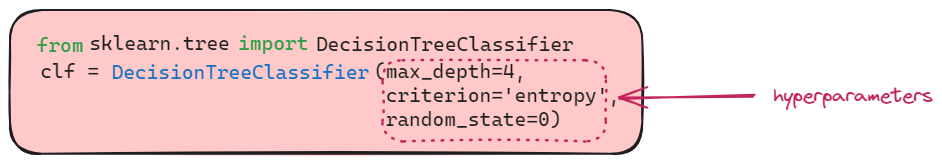
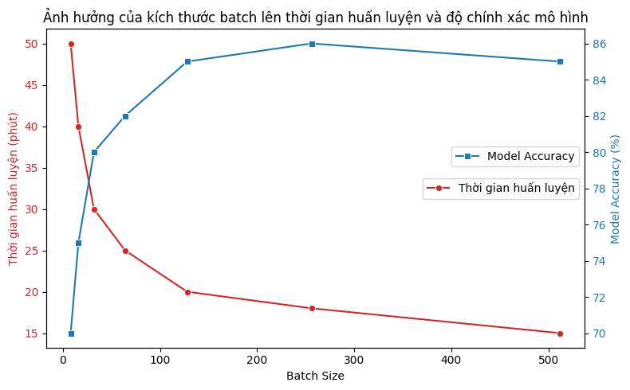

## Giới thiệu
Trong huấn luyện mô hình máy học, việc lựa chọn siêu tham số (hyperparameters) ảnh hưởng trực tiếp đến hiệu suất của mô hình. 
Không giống như tham số học được từ dữ liệu, siêu tham số cần được thiết lập trước khi huấn luyện. 
Hyperparameter Tuning là quá trình tìm kiếm giá trị tối ưu để mô hình hoạt động tốt nhất. 
Việc này giúp cải thiện độ chính xác, tránh overfitting và underfitting.

Trong nội dung bài viết này, mình sẽ giới thiệu về một số phương pháp tuning hyperparameters như Gridsearch, Randomized Search, Bayes Optimization thông qua các thư viện như skicit-learn, optuna, hyperopt và ray tune


## Hyperparameter là gì?

Đầu tiên, chúng ta cần biết định nghĩa Hyperparamter là gì. Theo nghĩa tiếng Việt thì hyperparameter nghĩa là siêu tham số được cài đặt trước khi quá trình huấn luyện mô hình bắt đầu. Khác với các parameter thông thường được học trong quá trình training, hyperparameter cần được thiết lập bởi người lập trình và ảnh hưởng trực tiếp đến hiệu quả của mô hình.
<figure>

<figcaption>Hyperparameter trong DecisionTreeClassifer</figcaption>
</figure>

Một số hyperparameter phổ biến:
- Độ sâu của cây (*max_depth*) trong **DecisionTree**
- Số lượng cây `n_estimators` trong **RandomForest**
- Learning rate (*eta*, *learning_rate*) trong Gradient Descent
- Hệ số regularization như  *alpha* trong **Ridge/Lasso**, *C* trong **SVM**
- Số lớp ẩn (*n_layers*) và số neuron(*hidden_state*) trong mạng neural
- Số lượng dữ liệu trong một batch *batch_size*
- Các chỉ tiêu đánh giá như *criterion* trong DecisionTree
...


## Tại sao cần Hyperparameter Tuning?


### Tránh overfitting và underfitting

**Overfitting** xảy ra khi mô hình học quá khớp với dữ liệu huấn luyện nhưng không tổng quát hóa được với dữ liệu mới. Trong khi **Underfitting** xảy ra khi mô hình quá đơn giản và không nắm bắt được các mẫu trong dữ liệu. Việc tinh chỉnh siêu tham số giúp cân bằng giữa hai vấn đề này, đảm bảo mô hình tổng quát hóa tốt.


Hình trên là hình minh họa Decision Tree với 3 cách lựa chọn siêu tham số *max_depth*
- *max_depth=1*: Underfitting, mô hình quá đơn giản, không bắt được xu hướng dữ liệu.
- *max_depth=10*: Overfitting, mô hình quá phức tạp, khớp chặt với dữ liệu huấn luyện nhưng có thể tổng quát hóa kém.
- *max_depth=4*: Optimal, mô hình cân bằng giữa đơn giản và phức tạp, dự đoán tốt.

### Tối ưu hóa thời gian và tài nguyên
Một số siêu tham số như kích thước batch (batch size) hoặc số lượng epoch ảnh hưởng đến thời gian huấn luyện và tài nguyên tính toán.
Tinh chỉnh giúp tìm ra cấu hình tối ưu để huấn luyện mô hình nhanh hơn mà không làm giảm hiệu suất.


Đây là biểu đồ minh họa ảnh hưởng của kích thước batch (Batch Size) đến thời gian huấn luyện và độ chính xác của mô hình:

- Đường màu đỏ: Thời gian huấn luyện giảm khi Batch Size tăng.
- Đường màu xanh: Độ chính xác của mô hình tăng đến một mức tối ưu rồi bắt đầu giảm nhẹ.
Biểu đồ này thể hiện rằng việc tối ưu Batch Size giúp giảm thời gian huấn luyện mà vẫn duy trì hiệu suất mô hình tốt.

## Các phương pháp Hyperparameter Tuning

### 1. Grid Search

- Thử tất cả các tổ hợp giá trị trong không gian tìm kiếm
- Ưu điểm: đơn giản, dễ thực hiện
- Nhược điểm: tốn thời gian với không gian lớn
Ví dụ với scikit-learn:

```python
from sklearn.tree import DecisionTreeClassifier
clf = DecisionTreeClassifier(max_depth=4, 
                            criterion='entropy',
                            random_state=0)
```