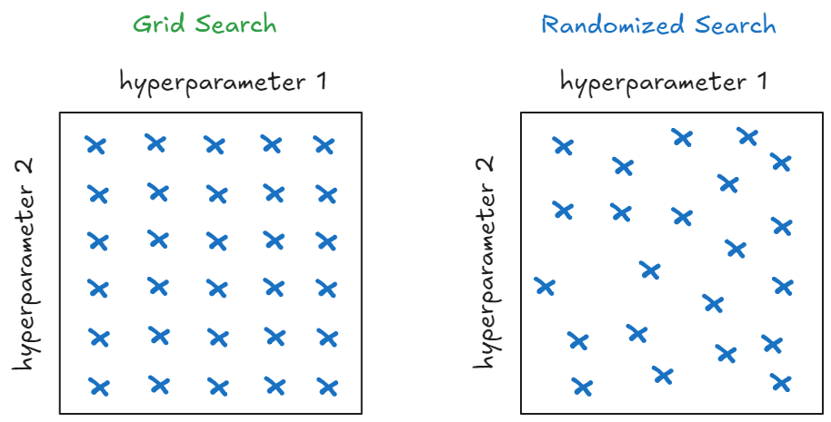

## Giới thiệu
Trong bài viết trước, chúng ta đã tìm hiểu về GridSearchCV - một phương pháp tối ưu siêu tham số bằng cách thử tất cả các tổ hợp có thể. Tuy nhiên, GridSearch có nhược điểm là tốn nhiều thời gian khi không gian tìm kiếm lớn. Trong bài viết này, chúng ta sẽ tìm hiểu về RandomizedSearchCV - một phương pháp hiệu quả hơn để tối ưu siêu tham số.

## Randomized Search là gì?

Randomized Search là phương pháp tối ưu siêu tham số bằng cách chọn ngẫu nhiên các tổ hợp giá trị từ không gian tìm kiếm, thay vì thử tất cả các tổ hợp như GridSearch. 


Vì là phương pháp ngẫu nhiên nên Randomized Search có những ưu điểm so với GridSearch như

- **Giảm thiểu số lần thử nghiệm nhưng vẫn hiệu quả**
    - Giả sử có 3 tham số với mỗi tham số thử 5 lần thì Grid Search phải thử 5 x 5 x 5 = 125 lần
    - Randomized Search có thể thử 50 hoặc 100 lần tùy vào cài đặt

- **Tìm được kết quả tốt hơn với cùng một số lần thử**
    - Vì là ngẫu nhiên niên Randomized Search có thể tìm ra bộ tham số gần tối ưu, trong khi Grid Search có thể lãng phí thử nghiệm vào những vùng không quan trọng.
    - Ví dụ learing rate, Grid có thể bỏ sót các giá trị tốt nếu khoảng cách giữa các giá trị trong lưới quá lớn( Do người dùng phải chọn trước các giá trị cần thử nghiệm )

- **Dễ mở rộng với tài nguyên tính toán hạn chế**: 
    - Nếu bạn có hạn chế về thời gian hoặc tài nguyên, Randomized Search có thể dừng sau một số lần thử cố định (n_iter), trong khi Grid Search phải chạy toàn bộ

Nói đi cũng phải nói lại, vậy khi nào Grid Search vẫn hữu ích: Grid Search vẫn hữu ích khi không gian tham số nhỏ và có thể kiểm tra toàn bộ. Hoặc khi bạn đã có kiến thức rõ ràng về từng siêu tham số, có thể ước lượng được phạm vi tham số tốt nhất. Hoặc nếu như bạn có máy tính với nhiều cores có thể chạy song song và bạn quan tâm tới tối ưu hóa toàn bộ thay vì tìm kiếm một giải pháp nhanh và đủ tốt, bạn có thể lựa chọn Grid Search


## Triển khai Randomized Search

Khác với bài trước [Tối ưu siêu tham số mô hình với GridSearchCV](hyperparameter-tuning-gridsearchCV) chỉ code phần GridSearch từ đầu, trong bài viết này chúng ta sẽ thực hành code Randomized Search CV sau đó so sánh với thư viện Scikitlearn

Dữ liệu lần này vẫn là dữ liệu https://archive.ics.uci.edu/dataset/327/phishing+websites

```python
from sklearn.model_selection import train_test_split, RandomizedSearchCV
from ucimlrepo import fetch_ucirepo 
from sklearn.ensemble import RandomForestClassifier
from sklearn.metrics import accuracy_score
import numpy as np

# fetch dataset 
phishing_websites = fetch_ucirepo(id=327) 
  
# data (as pandas dataframes) 
X = phishing_websites.data.features 
y = phishing_websites.data.targets

# Chia tập train và test
X_train, X_test, y_train, y_test = train_test_split(X, y, test_size=0.2, random_state=42, stratify=y)

print(f"Train size: {X_train.shape}, Test size: {X_test.shape}")
```

<pythonoutput>
```
Train size: (8844, 30), Test size: (2211, 30)
```
</pythonoutput>

Ta sẽ tune 2 siêu tham số `n_estimators` và `max_depth`
```python
from scipy.stats import randint, uniform

param_distributions = {
    'n_estimators': randint(50, 300),
    'max_depth': randint(3, 15)
}
```
ta sẽ viết hàm `sample_params` nhận đầu vào là `param_distributions` và trả ra 1 bộ tham số

```python
def sample_params(param_distributions):
    sampled_params = {}
    for param, dist in param_distributions.items():
        sampled_params[param] = dist.rvs()
    return sampled_params
```
Để lấy ngẫu nhiên 10 bộ tham số ta sử dụng vòng lặp for, ngoài ra ta cần dùng np.random.seed(42) đặt seed cho lấy ngẫu nhiên

```python
import numpy as np
np.random.seed(42)
for i in range(10):
    sampled_params = sample_params(param_distributions)
    print(sampled_params)
```

<pythonoutput>
```
{'n_estimators': 152, 'max_depth': 6}
{'n_estimators': 142, 'max_depth': 13}
{'n_estimators': 121, 'max_depth': 7}
{'n_estimators': 152, 'max_depth': 12}
{'n_estimators': 260, 'max_depth': 9}
{'n_estimators': 124, 'max_depth': 13}
{'n_estimators': 137, 'max_depth': 7}
{'n_estimators': 149, 'max_depth': 10}
{'n_estimators': 201, 'max_depth': 5}
{'n_estimators': 199, 'max_depth': 7}
```
</pythonoutput>


### Tự viết Randomized Search CV

**Tạo class `RandomizedSearchCV_from_scratch`**

```python
class RandomizedSearchCV_from_scratch:
    def __init__(self, estimator, param_distributions, n_iter=10, cv=5, random_state=None):
        self.estimator = estimator  # Mô hình cần tối ưu hóa
        self.param_distributions = param_distributions  # Phân phối tham số
        self.n_iter = n_iter  # Số lần thử nghiệm
        self.cv = cv  # Số fold cho cross-validation
        self.random_state = random_state  # Seed cho tái lập

        # Thiết lập seed nếu cần
        if self.random_state is not None:
            np.random.seed(self.random_state)
    def sample_params(self):
        ## TODO
        """
        Lấy mẫu ngẫu nhiên các tham số từ phân phối đã cho
        """
        
    def cross_val_score(self, X, y, params):
        ## TODO
        """
        Thực hiện cross-validation trả về điểm số trung bình các fold
        """
    def fit(self, X, y):
        ## TODO
        """
        Thực hiện huấn luyện trên từng bộ tham số
        """
 
```

Đầu tiên ta viết method `sample_params`

```python
def sample_params(self):
    """
    Lấy mẫu ngẫu nhiên các tham số từ phân phối đã cho.
    """
    sampled_params = {}
    for param, dist in self.param_distributions.items():
        sampled_params[param] = dist.rvs()
    return sampled_params
```

Tiếp theo ta viết `cross_val_score`, vì trong bài viết này dùng dữ liệu dạng classification nên ta sẽ dùng `StratifiedKfold`.
Đối với dữ liệu `Phising_website` là dữ liệu không bị mất cân bằng nên ta đơn giản dùng `accuracy_score` làm metric đánh giá.

```python
def cross_val_score(self, X, y, params):
    """
    Thực hiện cross-validation (StratifiedKFold) để tính điểm cho mô hình với tham số đã cho.
    """
    skf = StratifiedKFold(n_splits=self.cv, shuffle=True, random_state=self.random_state)
    scores = []

    # Chạy CV
    for train_idx, valid_idx in skf.split(X, y):
        _X_train, _X_valid = X.iloc[train_idx], X.iloc[valid_idx]
        _y_train, _y_valid = y.iloc[train_idx], y.iloc[valid_idx]

        # Huấn luyện mô hình với tham số đã chọn
        self.estimator.set_params(**params)
        self.estimator.fit(_X_train, _y_train)

        # Dự đoán và tính điểm accuracy
        y_pred = self.estimator.predict(_X_valid)
        score = accuracy_score(_y_valid, y_pred)
        scores.append(score)

    return np.mean(scores)  # 
```

sau đó là viết phương thức `fit`

```python
def fit(self, X, y):
    """
    Tiến hành tìm kiếm ngẫu nhiên các tham số và huấn luyện mô hình với Cross-Validation.
    """
    best_score = -np.inf
    best_params = None
    results = []

    for i in range(self.n_iter):
        # Lấy mẫu các tham số
        sampled_params = self.sample_params()

        # Tính điểm cho tham số hiện tại với Cross-Validation
        score = self.cross_val_score(X, y, sampled_params)

        results.append({'params': sampled_params, 'score': score})

        # Cập nhật nếu điểm số hiện tại là tốt nhất
        if score > best_score:
            best_score = score
            best_params = sampled_params

    # Lưu kết quả và trả về tham số tốt nhất
    self.results_ = results
    self.best_score_ = best_score
    self.best_params_ = best_params
```

**Huấn luyện mô hình**

```python
rf = RandomForestClassifier(random_state=42)

search = RandomizedSearchCV_from_scratch(rf, param_distributions, n_iter=10, cv=5, random_state=42)
search.fit(X_train, y_train)
```

Xem kết quả

```python
results = search.results_
results
```

<pythonoutput>
```
[{'params': {'n_estimators': 152, 'max_depth': 6},
  'score': 0.9337398228413425},
 {'params': {'n_estimators': 142, 'max_depth': 13},
  'score': 0.9614432445152692},
 {'params': {'n_estimators': 121, 'max_depth': 7},
  'score': 0.9362274235258307},
 {'params': {'n_estimators': 152, 'max_depth': 12},
  'score': 0.9601992843056255},
 {'params': {'n_estimators': 260, 'max_depth': 9}, 'score': 0.946969937255243},
 {'params': {'n_estimators': 124, 'max_depth': 13},
  'score': 0.9608778254964202},
 {'params': {'n_estimators': 137, 'max_depth': 7},
  'score': 0.9369059007696656},
 {'params': {'n_estimators': 149, 'max_depth': 10},
  'score': 0.9514931615121155},
 {'params': {'n_estimators': 201, 'max_depth': 5},
  'score': 0.9306874426076035},
 {'params': {'n_estimators': 199, 'max_depth': 7},
  'score': 0.9378106223573919}]
```
</pythonoutput>

Để xem đẹp hơn :D

```python
results = search.results_
# Tạo DataFrame từ list các kết quả
import pandas as pd
df = pd.DataFrame(results)
params_df = pd.DataFrame(df['params'].tolist())
final_df = pd.concat([params_df, df['score']], axis=1).sort_values(by='score', ascending=False)
final_df
```

<pythonoutput>
```
n_estimators  max_depth     score
1           142         13  0.961443
5           124         13  0.960878
3           152         12  0.960199
7           149         10  0.951493
4           260          9  0.946970
9           199          7  0.937811
6           137          7  0.936906
2           121          7  0.936227
0           152          6  0.933740
8           201          5  0.930687
```
</pythonoutput>

Xem best_params_ và best_score_

```python
print(search.best_params_)
print(search.best_score_)
```

<pythonoutput>
```
{'n_estimators': 142, 'max_depth': 13}
0.9614432445152692
```
</pythonoutput>

### Sử dụng RandomsearchCV của scikitlearn
## Kết hợp Randomized Search và GridSearch

Một chiến lược hiệu quả là kết hợp cả hai phương pháp:
1. Dùng Randomized Search để khám phá nhanh không gian tham số rộng
2. Sau đó dùng GridSearch để tìm kiếm chi tiết xung quanh các giá trị tốt nhất từ Randomized Search

### Ví dụ triển khai

```python
from sklearn.model_selection import RandomizedSearchCV, GridSearchCV

# Bước 1: Randomized Search với không gian tham số rộng
param_distributions = {
    'n_estimators': randint(50, 300),
    'max_depth': randint(3, 15),
    'min_samples_split': randint(2, 20),
    'min_samples_leaf': randint(1, 10),
    'max_features': uniform(0.1, 0.9)
}

# Randomized Search đầu tiên
random_search = RandomizedSearchCV(
    RandomForestClassifier(random_state=42),
    param_distributions=param_distributions,
    n_iter=100,
    cv=5,
    random_state=42,
    n_jobs=-1
)

random_search.fit(X_train, y_train)
print("Best parameters from Randomized Search:", random_search.best_params_)

# Bước 2: GridSearch xung quanh kết quả tốt nhất của Randomized Search
# Tạo không gian tham số hẹp hơn xung quanh giá trị tốt nhất
best_params = random_search.best_params_
fine_tune_params = {
    'n_estimators': [best_params['n_estimators'] - 20, 
                    best_params['n_estimators'],
                    best_params['n_estimators'] + 20],
    'max_depth': [best_params['max_depth'] - 1,
                 best_params['max_depth'],
                 best_params['max_depth'] + 1],
    'min_samples_split': [best_params['min_samples_split'] - 1,
                         best_params['min_samples_split'],
                         best_params['min_samples_split'] + 1],
    'min_samples_leaf': [best_params['min_samples_leaf'] - 1,
                        best_params['min_samples_leaf'],
                        best_params['min_samples_leaf'] + 1],
    'max_features': [max(0.1, best_params['max_features'] - 0.1),
                    best_params['max_features'],
                    min(0.9, best_params['max_features'] + 0.1)]
}

# GridSearch để tinh chỉnh
grid_search = GridSearchCV(
    RandomForestClassifier(random_state=42),
    fine_tune_params,
    cv=5,
    n_jobs=-1
)

grid_search.fit(X_train, y_train)
print("\nBest parameters after fine-tuning:", grid_search.best_params_)

# Đánh giá mô hình cuối cùng
final_accuracy = accuracy_score(y_test, grid_search.predict(X_test))
print(f"\nFinal Model Accuracy on Test Set: {final_accuracy:.4f}")
```

### Ưu điểm của phương pháp kết hợp

1. **Hiệu quả về thời gian**: 
   - Randomized Search giúp khám phá nhanh không gian tham số rộng
   - GridSearch chỉ tập trung vào vùng hẹp có triển vọng

2. **Độ chính xác cao**: 
   - Tận dụng được ưu điểm của cả hai phương pháp
   - GridSearch giúp tinh chỉnh chi tiết các tham số tốt nhất

3. **Cân bằng giữa khám phá và khai thác**:
   - Randomized Search đảm nhiệm vai trò khám phá (exploration)
   - GridSearch đảm nhiệm vai trò khai thác (exploitation)

### Khi nào nên dùng phương pháp kết hợp?

- Khi có nhiều tài nguyên tính toán
- Khi cần độ chính xác cao
- Khi không gian tham số rộng và phức tạp
- Khi có đủ thời gian để thực hiện cả hai phương pháp

### Lưu ý khi triển khai

1. Đảm bảo không gian tham số trong GridSearch không quá rộng
2. Chọn số lượng thử nghiệm (n_iter) phù hợp trong Randomized Search
3. Có thể điều chỉnh phạm vi tìm kiếm trong GridSearch tùy theo kết quả Randomized Search
4. Nên lưu lại kết quả của cả hai giai đoạn để so sánh

## Kết luận

Randomized SearchCV là một phương pháp hiệu quả để tối ưu siêu tham số, đặc biệt khi:
- Có nhiều tham số cần tối ưu
- Thời gian và tài nguyên tính toán hạn chế
- Muốn linh hoạt trong việc định nghĩa không gian tìm kiếm

Tuy nhiên, không có phương pháp nào là hoàn hảo. Việc lựa chọn giữa GridSearch và Randomized Search phụ thuộc vào bài toán cụ thể, tài nguyên có sẵn và yêu cầu về độ chính xác.