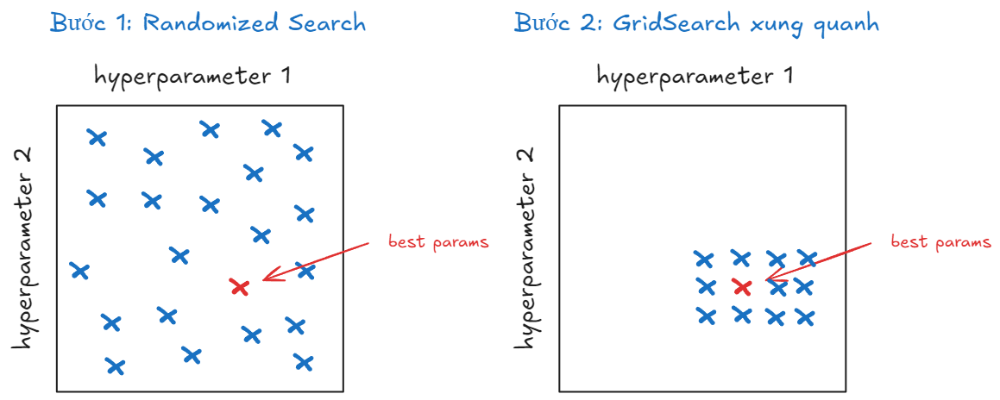

# Tối ưu siêu tham số mô hình với RandomizedSearchCV


## Giới thiệu
Ở bài viết trước, GridSearchCV đã được giới thiệu như một công cụ tối ưu siêu tham số bằng cách duyệt qua toàn bộ tổ hợp có thể. Tuy nhiên, khi không gian tìm kiếm trở nên quá rộng, phương pháp này nhanh chóng bộc lộ điểm yếu: tốn thời gian, tốn tài nguyên và đôi khi… không hiệu quả.

Trong bài viết này, ta sẽ tiếp cận một phương pháp khác — RandomizedSearchCV — linh hoạt hơn, nhanh hơn và đặc biệt phù hợp với những tình huống thực tế nơi thời gian và hiệu năng là yếu tố quan trọng.

## Randomized Search là gì?

Thay vì "lần lượt thử hết như GridSearch, Randomized Search chọn ngẫu nhiên một số tổ hợp siêu tham số trong không gian tìm kiếm. Điều này nghe có vẻ đơn giản, nhưng lại mang đến nhiều lợi ích bất ngờ


**Ngẫu nhiên nhưng hiệu quả – vì sao nên thử Randomized Search?**

So với GridSearch, Randomized Search mang lại hiệu quả cao hơn với chi phí tính toán thấp hơn đáng kể. Hãy hình dung: nếu cần tối ưu 3 siêu tham số, mỗi tham số có 5 giá trị, GridSearch sẽ phải thử toàn bộ 125 tổ hợp. Trong khi đó, Randomized Search chỉ cần chạy khoảng 50 đến 100 lượt là đã có thể tiếp cận kết quả tối ưu — tiết kiệm thời gian mà vẫn đạt được hiệu quả tương đương.

Không dừng lại ở đó, việc lựa chọn tổ hợp tham số một cách ngẫu nhiên giúp Randomized Search có khả năng “chạm vào” những vùng tối ưu mà GridSearch dễ bỏ lỡ, nhất là khi khoảng cách giữa các giá trị trong Grid không đủ nhỏ để bao phủ toàn diện không gian tham số.

Thêm vào đó, Randomized Search đặc biệt phù hợp trong môi trường có giới hạn về tài nguyên — từ thời gian đến khả năng xử lý của phần cứng. Thay vì phải hoàn tất toàn bộ phép thử như GridSearch, ta có thể chủ động cấu hình số lần thử (`n_iter`) để kiểm soát quá trình tìm kiếm theo thời gian hoặc năng lực tính toán sẵn có.


**Khi nào GridSearch vẫn hữu ích?**

Dù Randomized Search mang lại nhiều lợi thế, GridSearch không hẳn đã lỗi thời. Phương pháp này vẫn tỏ ra hữu dụng trong một số tình huống cụ thể: chẳng hạn khi không gian tham số nhỏ và có thể kiểm tra toàn diện, hoặc khi đã hiểu rõ từng siêu tham số và có khả năng xác định phạm vi tối ưu tương đối chính xác. Ngoài ra, nếu có trong tay hệ thống máy tính mạnh mẽ, hỗ trợ xử lý song song, và mục tiêu là tìm lời giải tối ưu toàn cục, GridSearch vẫn là một lựa chọn đáng cân nhắc.

## Triển khai Randomized Search

Nếu ở bài viết trước các bạn đã quen với [Tối ưu siêu tham số mô hình với GridSearchCV](hyperparameter-tuning-gridsearchCV)  lần này ta sẽ cùng nhau triển khai Randomized Search từ đầu (from scratch) để hiểu rõ cách hoạt động bên trong của nó — cách chọn tổ hợp tham số ngẫu nhiên, cách tính điểm đánh giá và cách tìm ra bộ tham số tốt nhất.

Sau khi nắm được nguyên lý, ta sẽ chuyển sang phần thứ hai: sử dụng `RandomizedSearchCV` từ thư viện scikit-learn để tận dụng các tiện ích có sẵn, đánh giá hiệu quả và so sánh kết quả với phiên bản tự viết.

Bộ dữ liệu là [Phising Websites Dataset](https://archive.ics.uci.edu/dataset/327/phishing+websites) từ UCI — quen thuộc nhưng vẫn đủ thách thức để thử nghiệm các kỹ thuật tinh chỉnh mô hình

```python
from sklearn.model_selection import train_test_split, RandomizedSearchCV
from ucimlrepo import fetch_ucirepo 
from sklearn.ensemble import RandomForestClassifier
from sklearn.metrics import accuracy_score
import numpy as np

# fetch dataset 
phishing_websites = fetch_ucirepo(id=327) 
  
# data (as pandas dataframes) 
X = phishing_websites.data.features 
y = phishing_websites.data.targets

# Chia tập train và test
X_train, X_test, y_train, y_test = train_test_split(X, y, test_size=0.2, random_state=42, stratify=y)

print(f"Train size: {X_train.shape}, Test size: {X_test.shape}")
```

<pythonoutput>
```
Train size: (8844, 30), Test size: (2211, 30)
```
</pythonoutput>

Ta sẽ tune 2 siêu tham số `n_estimators` và `max_depth`
```python
from scipy.stats import randint, uniform

param_distributions = {
    'n_estimators': randint(50, 300),
    'max_depth': randint(3, 15)
}
```

Dưới đây là hàm `sample_params dùng` để lấy ngẫu nhiên một bộ tham số từ `param_distributions` theo đúng kiểu phân phối của `scipy.stats` như randint, uniform, v.v.:

```python
def sample_params(param_distributions):
    sampled_params = {}
    for param, dist in param_distributions.items():
        sampled_params[param] = dist.rvs()
    return sampled_params
```

Để tái lập kết quả và đảm bảo tính nhất quán trong thử nghiệm, có thể đặt seed trước bằng `np.random.seed(42)`

```python
import numpy as np
np.random.seed(42)
for _ in range(10):
    sampled_params = sample_params(param_distributions)
    print(sampled_params)
```

<pythonoutput>
```
{'n_estimators': 152, 'max_depth': 6}
{'n_estimators': 142, 'max_depth': 13}
{'n_estimators': 121, 'max_depth': 7}
{'n_estimators': 152, 'max_depth': 12}
{'n_estimators': 260, 'max_depth': 9}
{'n_estimators': 124, 'max_depth': 13}
{'n_estimators': 137, 'max_depth': 7}
{'n_estimators': 149, 'max_depth': 10}
{'n_estimators': 201, 'max_depth': 5}
{'n_estimators': 199, 'max_depth': 7}
```
</pythonoutput>

Như vậy, ta vừa tạo ra 10 bộ siêu tham số hoàn toàn ngẫu nhiên. Các bước tiếp theo sẽ bao gồm huấn luyện mô hình với từng bộ, đánh giá bằng cross-validation và chọn ra bộ tốt nhất — cũng sẽ được viết thủ công trước khi chuyển sang dùng RandomizedSearchCV trong thư viện scikit-learn để so sánh hiệu quả.

### Tự xây dựng phiên bản Randomized SearchCV

Thay vì chỉ gọi `RandomizedSearchCV` từ `scikit-learn`, ta sẽ bắt đầu từ con số 0: tạo một class tự định nghĩa để mô phỏng lại toàn bộ quy trình tìm kiếm ngẫu nhiên. Cách tiếp cận này không chỉ giúp bạn hiểu sâu hơn về cơ chế hoạt động, mà còn mở ra khả năng tùy chỉnh theo nhu cầu riêng sau này.

**Tạo class `RandomizedSearchCV_from_scratch`**

```python
class RandomizedSearchCV_from_scratch:
    def __init__(self, estimator, param_distributions, n_iter=10, cv=5, random_state=None):
        self.estimator = estimator  # Mô hình cần tối ưu hóa
        self.param_distributions = param_distributions  # Phân phối tham số
        self.n_iter = n_iter  # Số lần thử nghiệm
        self.cv = cv  # Số fold cho cross-validation
        self.random_state = random_state  # Seed cho tái lập

        # Thiết lập seed nếu cần
        if self.random_state is not None:
            np.random.seed(self.random_state)
    def sample_params(self):
        ## TODO
        """
        Lấy mẫu ngẫu nhiên các tham số từ phân phối đã cho
        """
        
    def cross_val_score(self, X, y, params):
        ## TODO
        """
        Thực hiện cross-validation trả về điểm số trung bình các fold
        """
    def fit(self, X, y):
        ## TODO
        """
        Thực hiện huấn luyện trên từng bộ tham số
        """
 
```

Đầu tiên ta viết method `sample_params`

```python
def sample_params(self):
    """
    Lấy mẫu ngẫu nhiên các tham số từ phân phối đã cho.
    """
    sampled_params = {}
    for param, dist in self.param_distributions.items():
        sampled_params[param] = dist.rvs()
    return sampled_params
```

Tiếp theo ta viết `cross_val_score`, vì trong bài viết này dùng dữ liệu dạng classification nên ta sẽ dùng `StratifiedKfold`.
Đối với dữ liệu `Phising_website` là dữ liệu không bị mất cân bằng nên ta đơn giản dùng `accuracy_score` làm metric đánh giá.

```python
def cross_val_score(self, X, y, params):
    """
    Thực hiện cross-validation (StratifiedKFold) để tính điểm cho mô hình với tham số đã cho.
    """
    skf = StratifiedKFold(n_splits=self.cv, shuffle=True, random_state=self.random_state)
    scores = []

    # Chạy CV
    for train_idx, valid_idx in skf.split(X, y):
        _X_train, _X_valid = X.iloc[train_idx], X.iloc[valid_idx]
        _y_train, _y_valid = y.iloc[train_idx], y.iloc[valid_idx]

        # Huấn luyện mô hình với tham số đã chọn
        self.estimator.set_params(**params)
        self.estimator.fit(_X_train, _y_train)

        # Dự đoán và tính điểm accuracy
        y_pred = self.estimator.predict(_X_valid)
        score = accuracy_score(_y_valid, y_pred)
        scores.append(score)

    return np.mean(scores), np.std(scores)  # 
```

sau đó là viết phương thức `fit`

```python
def fit(self, X, y):
        """
        Tiến hành tìm kiếm ngẫu nhiên các tham số và huấn luyện mô hình với Cross-Validation.
        """
        best_score = -np.inf
        best_params = None
        results = []

        for i in range(self.n_iter):
            # Lấy mẫu các tham số
            sampled_params = self.sample_params()

            # Tính điểm cho tham số hiện tại với Cross-Validation
            mean_score, std_score = self.cross_val_score(X, y, sampled_params)

            results.append({'params': sampled_params, 'mean_score': mean_score, 'std_score': std_score})

            # Cập nhật nếu điểm số hiện tại là tốt nhất
            if mean_score > best_score:
                best_score = mean_score
                best_params = sampled_params

        # Lưu kết quả và trả về tham số tốt nhất
        self.results_ = results
        self.best_score_ = best_score
        self.best_params_ = best_params
```

**Huấn luyện mô hình**

Sau khi đã định nghĩa class, ta có thể sử dụng giống như `RandomizedSearchCV` trong scikit-learn, nhưng tất nhiên là phiên bản đơn giản do ta tự tay xây dựng:

```python
rf = RandomForestClassifier(random_state=42)

search = RandomizedSearchCV_from_scratch(rf, param_distributions, n_iter=10, cv=5, random_state=42)
search.fit(X_train, y_train)
```

**Phân tích kết quả tìm kiếm**

Sau khi chạy search.fit(X_train, y_train), toàn bộ kết quả được lưu trong `search.results_`. Mỗi phần tử trong danh sách chứa:

- `params`: bộ siêu tham số đã thử

- `mean_score`: điểm trung bình của mô hình trên 5-fold cross-validation

- `std_score`: độ lệch chuẩn giữa các fold

```python
results = search.results_
results
```

<pythonoutput>
```
[{'params': {'n_estimators': 152, 'max_depth': 6},
  'mean_score': np.float64(0.9337398228413425),
  'std_score': np.float64(0.005562064595556827)},
 {'params': {'n_estimators': 142, 'max_depth': 13},
  'mean_score': np.float64(0.9614432445152692),
  'std_score': np.float64(0.0032797031601484255)},
 {'params': {'n_estimators': 121, 'max_depth': 7},
  'mean_score': np.float64(0.9362274235258307),
  'std_score': np.float64(0.0032954692818318917)},
 {'params': {'n_estimators': 152, 'max_depth': 12},
  'mean_score': np.float64(0.9601992843056255),
  'std_score': np.float64(0.003000547059202927)},
 {'params': {'n_estimators': 260, 'max_depth': 9},
  'mean_score': np.float64(0.946969937255243),
  'std_score': np.float64(0.003280785232637579)},
 {'params': {'n_estimators': 124, 'max_depth': 13},
  'mean_score': np.float64(0.9608778254964202),
  'std_score': np.float64(0.002995073924076509)},
 {'params': {'n_estimators': 137, 'max_depth': 7},
  'mean_score': np.float64(0.9369059007696656),
  'std_score': np.float64(0.0031595655596408823)},
 {'params': {'n_estimators': 149, 'max_depth': 10},
  'mean_score': np.float64(0.9514931615121155),
  'std_score': np.float64(0.00452203888505248)},
 {'params': {'n_estimators': 201, 'max_depth': 5},
  'mean_score': np.float64(0.9306874426076035),
  'std_score': np.float64(0.004488707183069916)},
 {'params': {'n_estimators': 199, 'max_depth': 7},
  'mean_score': np.float64(0.9378106223573919),
  'std_score': np.float64(0.0033790400495528968)}]
```
</pythonoutput>

**Hiển thị kết quả đầy đủ**

Để xem kết quả một cách trực quan hơn, ta có thể đưa chúng vào một `DataFrame` và sắp xếp theo `mean_score` giảm dần:


```python
results = search.results_
# Tạo DataFrame từ list các kết quả
import pandas as pd
df = pd.DataFrame(results)
params_df = pd.DataFrame(df['params'].tolist())
final_df = pd.concat([params_df, df[['mean_score','std_score']]], axis=1).sort_values(by='mean_score', ascending=False)
final_df.reset_index(drop=True, inplace=True)
final_df
```

<pythonoutput>
```
   n_estimators  max_depth  mean_score  std_score
0           142         13    0.961443   0.003280
1           124         13    0.960878   0.002995
2           152         12    0.960199   0.003001
3           149         10    0.951493   0.004522
4           260          9    0.946970   0.003281
5           199          7    0.937811   0.003379
6           137          7    0.936906   0.003160
7           121          7    0.936227   0.003295
8           152          6    0.933740   0.005562
9           201          5    0.930687   0.004489
```
</pythonoutput>
Từ bảng trên, có thể thấy mô hình đạt hiệu suất cao nhất với `n_estimators=142` và `max_depth=13`, với độ chính xác trung bình khoảng `96.14%`.


**Tham số tối ưu và điểm số cao nhất
**
```python
print("Best Parameters:", search.best_params_)
print("Best Cross-Val Score:", search.best_score_)
```

<pythonoutput>
```
Best Parameters: {'n_estimators': 142, 'max_depth': 13}
Best Cross-Val Score: 0.9614432445152692
```
</pythonoutput>

**Đánh giá trên tập test**

Sau khi đã có bộ tham số tối ưu, ta huấn luyện lại mô hình trên toàn bộ `X_train` và đánh giá trên `X_test`

```python
rf = RandomForestClassifier(random_state=42)
rf.set_params(**search.best_params_)
rf.fit(X_train, y_train)
y_pred = rf.predict(X_test)
print("Test accuracy", accuracy_score(y_test, y_pred))
```

<pythonoutput>
```
Test accuracy 0.9638172772501131
```
</pythonoutput>

Với độ chính xác gần 96.4% trên tập test, ta có thể khẳng định phương pháp Randomized Search không chỉ nhanh hơn mà còn mang lại kết quả gần như tương đương (thậm chí tốt hơn) so với Grid Search trong nhiều trường hợp thực tế.

Sau khi hiểu cơ chế hoạt động từ bên trong, ta chuyển sang cách dùng thư viện scikit-learn để tận dụng hiệu suất tối ưu và độ tin cậy cao trong thực tế.


### Sử dụng `RandomizedsearchCV` của `scikit-learn`

Ở phần trước, ta đã tự xây dựng một phiên bản thu nhỏ của Randomized Search để hiểu rõ từng bước hoạt động. Giờ đây, hãy chuyển sang cách dùng công cụ chính thống trong thư viện scikit-learn — nhanh chóng, đáng tin cậy và rất phù hợp khi áp dụng vào dự án thực tế.

Chúng ta có thể sử dụng `RandomizedSearchCV` của  `scikit-learn` như sau
```python
from sklearn.ensemble import RandomForestClassifier

rf = RandomForestClassifier(random_state=42)
cv_strategy = StratifiedKFold(n_splits=5, shuffle=True, random_state=42)
np.random.seed(43)
clf = RandomizedSearchCV(rf, param_distributions=param_distributions, random_state=42,  scoring='accuracy',cv=cv_strategy, n_iter=10)
sklearn_rdsearch = clf.fit(X_train, y_train)
print(sklearn_rdsearch.best_params_)
```

<pythonoutput>
```
{'max_depth': 13, 'n_estimators': 137}
```
</pythonoutput>
Để xem toàn bộ kết quả ta gõ lệnh như sau

```python
pd.DataFrame(sklearn_rdsearch.cv_results_)
```

**Đánh giá trên tập test**

```python
rf = RandomForestClassifier(random_state=42)
rf.set_params(**sklearn_rdsearch.best_params_)
rf.fit(X_train, y_train)
y_pred = rf.predict(X_test)
print("Test accuracy", accuracy_score(y_test, y_pred))
```

<pythonoutput>
```
Test accuracy 0.9633649932157394
```
</pythonoutput>
## Kết hợp RandomizedSearch và GridSearch

Trong thực tế, kết hợp hai phương pháp này sẽ giúp ta tận dụng ưu điểm của cả hai: Randomized Search giúp khám phá nhanh, GridSearch giúp tinh chỉnh sâu. Các bước kết hợp cả hai phương pháp như sau:

**:one:** Dùng Randomized Search để khám phá nhanh không gian tham số rộng

**:two:** Sau đó dùng GridSearch để tìm kiếm chi tiết xung quanh các giá trị tốt nhất từ Randomized Search


### Ví dụ triển khai

Khởi tạo `param_distributions`
```python
from sklearn.model_selection import RandomizedSearchCV, GridSearchCV

# Bước 1: Randomized Search với không gian tham số rộng
param_distributions = {
    'n_estimators': randint(50, 300),
    'max_depth': randint(3, 15)
}
```

**Bước 1**: Sử dụng `RandomizedSearchCV` đầu tiên để tìm best_params

```python
rf = RandomForestClassifier(random_state=42)
cv_strategy = StratifiedKFold(n_splits=5, shuffle=True, random_state=42)
random_search = RandomizedSearchCV(
    RandomForestClassifier(random_state=42),
    param_distributions=param_distributions,
    n_iter=10,
    cv=cv_strategy,
    scoring='accuracy',
    random_state=42,
    n_jobs=-1
)

random_search.fit(X_train, y_train)
print("Best parameters from Randomized Search:", random_search.best_params_)
print("Best_score",random_search.best_score_)
```

<pythonoutput>
```
Best parameters from Randomized Search: {'max_depth': 13, 'n_estimators': 137}
Best_score 0.9613301223433235
```
</pythonoutput>

**Bước 2**: `GridSearch` xung quanh kết quả tốt nhất của `RandomizedSearch`

Tạo không gian tham số hẹp hơn xung quanh giá trị tốt nhất

```python
best_params = random_search.best_params_
fine_tune_params = {
    'n_estimators': np.arange(
        max(100, best_params['n_estimators'] - 5),  # Giảm 5 nhưng không nhỏ hơn 100
        best_params['n_estimators'] + 6,  # Tăng tối đa 5
        step=2  # Khoảng cách giữa các giá trị
    ).tolist(),
    
    'max_depth': np.arange(
        max(4, best_params['max_depth'] - 3),  # Giảm tối đa 3 nhưng không nhỏ hơn 4
        best_params['max_depth'] + 4,  # Tăng tối đa 3
        step=1
    ).tolist()}
```

Sử dụng GridSearchCV

```python
grid_search = GridSearchCV(
    RandomForestClassifier(random_state=42),
    fine_tune_params,
    cv=5,
    n_jobs=-1
)
grid_search.fit(X_train, y_train)
print("\nBest parameters after fine-tuning:", grid_search.best_params_)
```

<pythonoutput>
```
Best parameters after fine-tuning: {'max_depth': 16, 'n_estimators': 132}
```
</pythonoutput>

**Đánh giá trên tập test**

```python
rf = RandomForestClassifier(random_state=42)
rf.set_params(**grid_search.best_params_)
rf.fit(X_train, y_train)
y_pred = rf.predict(X_test)
print("Test accuracy", accuracy_score(y_test, y_pred))
```

<pythonoutput>
```
Test accuracy 0.9751243781094527
```
</pythonoutput>

Kết quả này cao hơn phương pháp chỉ sử dụng mỗi `RandomizedSearchCV`

## Kết luận

Randomized SearchCV là một phương pháp hiệu quả để tối ưu siêu tham số, đặc biệt khi:
- Có nhiều tham số cần tối ưu
- Thời gian và tài nguyên tính toán hạn chế
- Muốn linh hoạt trong việc định nghĩa không gian tìm kiếm

Tuy nhiên, không có phương pháp nào là hoàn hảo. Việc lựa chọn giữa GridSearch và Randomized Search phụ thuộc vào bài toán cụ thể, tài nguyên có sẵn và yêu cầu về độ chính xác.