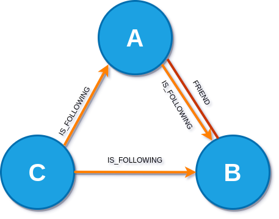
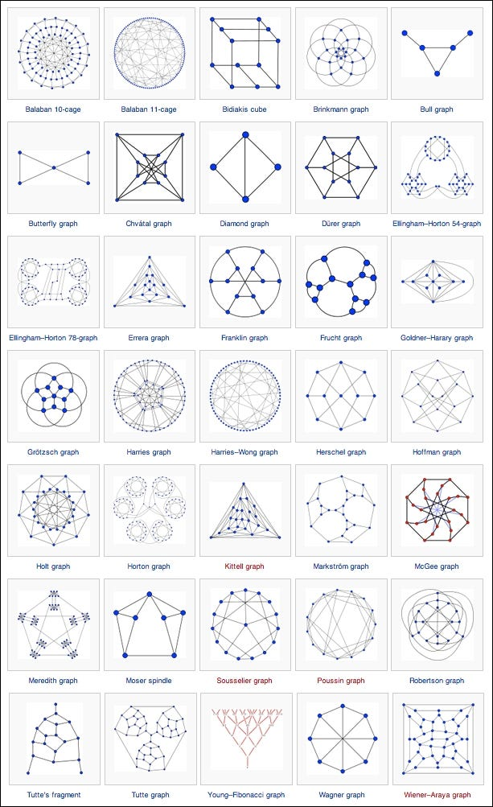
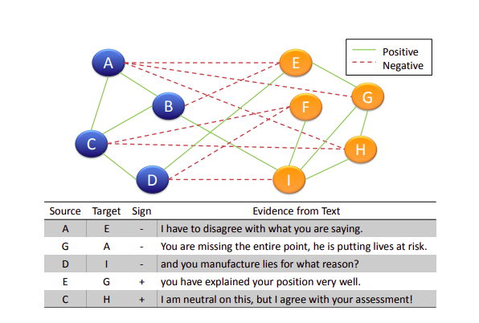
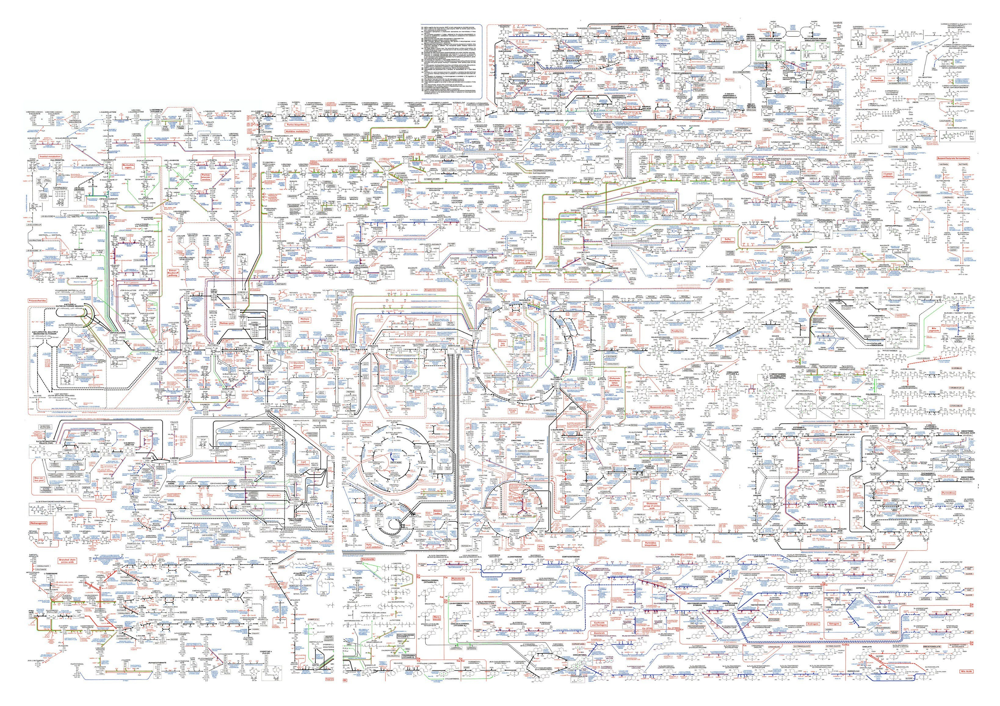
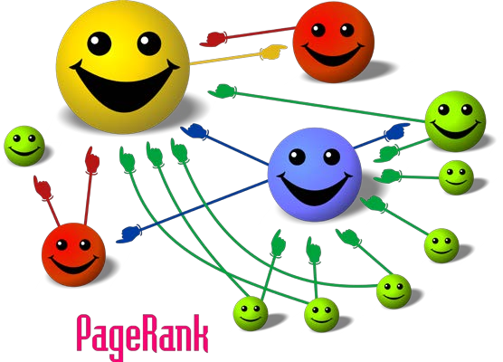
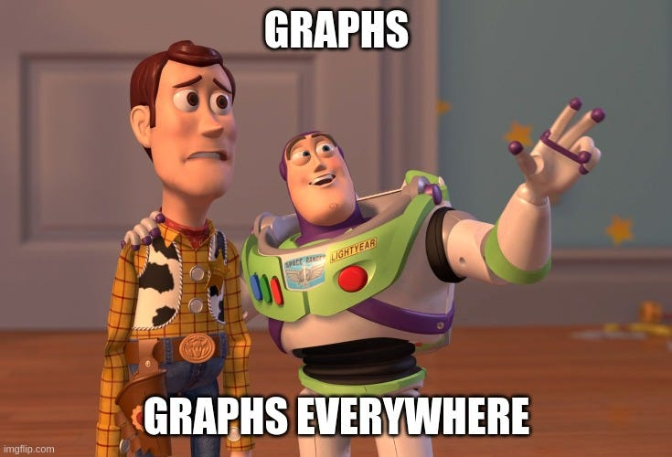
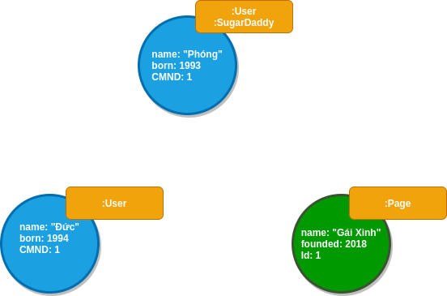
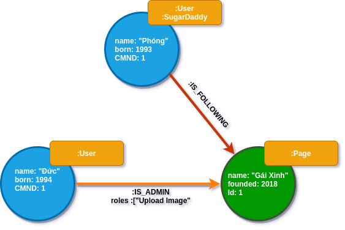

## Giới thiệu

**Graph là gì**

Đồ thị (Graph) là tập hợp các đỉnh (Vertices) và cạnh (Edges), hay là tập hợp giữa các nút(Node) và mối quan hệ (Relationship) giữa các nút với nhau. Mối quan hệ có thể là một chiều hay hai chiều.

Ví dụ: A và B có mối quan hệ "FRIEND" với nhau nhưng chỉ có A là "FOLLOW" B.

**Cấu trúc dữ liệu**

Có nhiều cách biểu diễn cấu trúc dữ liệu của Đồ thị như Danh sách cạnh, Danh sách kề, Ma trận kề, Ma trận liên thuộc.

Với Danh sách cạnh ta có thể biểu diễn dưới dạng list với mỗi phần tử là 1 Tuple(Node, Node, Relationship)

```python
(A, B, Friend)
(B, A, Friend)
(A, B, Follow)
(C, A, Follow)
(C, B, Follow)
```

Trong khi đó với Ma trận Kề ta phải biểu diễn 2 ma trận khác nhau, mỗi ma trận có kích thước N x N với N là số Node và giá trị tại (X, Y) thể hiện 1 mối quan hệ từ X -> Y

```python
FRIEND
X | A | B | C |
A | 0 | 1 | 0 |
B | 1 | 0 | 0 |
C | 0 | 0 | 0 |
FOLLOW
X | A | B | C |
A | 0 | 1 | 0 |
B | 0 | 0 | 0 |
C | 1 | 1 | 0 |
```

Có rất nhiều dạng đồ thị khác nhau, dưới đây là một số dạng

<figure>

<figcaption>Learning Neo4j</figcaption>
</figure>

## Ứng dụng của đồ thị

**Khoa học xã hội**

Như minh họa ở hình đầu tiên của bài viết, sự tương tác giữa người và người hình thành nên một mạng xã hội(social network). Facebook và Twitter là 2 mạng xã hội lớn mà chúng ta có thể hình dung được ứng dụng của đồ thị trong khoa học xã hội.

Ví dụ: Để tìm những người Nổi tiếng X trong mạng xã hội, chúng ta có thể thống kê số lượng Follow của X và đưa ra những người có số lượng Follow cao nhất. Nói theo cách toán học thì ta tìm bậc của đỉnh hay số lượng cạnh nối với đỉnh đó (X) và tìm ra những đỉnh có bậc cao nhất.

Trong diễn đàn, dựa vào những bình luận của người dùng ta có thể phân chia nhóm người dùng có cùng ý kiến với nhau.

 
<figure>

<figcaption>Detecting Subgroups in Online Discussions by Modeling Positive and Negative Relations among Participants</figcaption>
</figure>


**Nghiên cứu sinh học**

Các thành phần sinh học(protein, phân tử, gen) và các tương tác của chúng cũng tạo nên một đồ thị sinh học. Dựa vào đó người ta có thể tìm hiểu được quá trình trao đổi chất trong cơ thể, sự tương tác giữa các bộ phận khác nhau trên cơ thể.

<figure>

<figcaption>Learning Neo4j</figcaption>
</figure>

**Bài toán tìm đường đi**

**Websearch**

Pagerank là thuật toán phân tích các liên kết được dùng trong Google Search để xếp hạng các trang web.

<figure>

<figcaption>Pagerank</figcaption>
</figure>

Tóm lại, Đồ thị hiện diện ở khắp mọi nơi miễn có Đối tượng(Node) và Các tương tác giữa các Đối tượng (Relationship) đều có thể tạo nên Đồ thị.

<figure>

<figcaption></figcaption>
</figure>

## Graph Databases

Một hệ thống quản lý cơ sở dữ liệu đồ thị (graph database management system) là một hệ thống có thể Create, Read, Update và Delete (CRUD) . Graph Databases thường được xây dựng để áp dụng vào các hệ thống OLTP.

Có 2 đặc điểm mà chúng ta cần phải để ý khi nghiên cứu về Graph Database

- Cách thức lưu trữ cơ bản: Một số Graph Database sử dụng native graph storage (Neo4J)(hiểu nôm na là gồm đỉnh và cạnh) và một số Graph Database sử dụng cơ sở dữ liệu quan hệ (relational database) (FlockDB)và cơ sở dữ liệu đối tượng (object-oriented database)(Sones GraphDB).
- Processing Engine: sử dụng index-free adjacency.

## Neo4J

### Data Modeling

**Nodes**

Node thường dùng để biểu diễn thông tin của một thực thể. Đồ thị đơn giản nhất là đồ thị mà trong đó chỉ có một Node.


**Labels**

Label thường dùng để định hình một nhóm các Node có cùng một miền với nhau, việc gán nhãn giúp chia Đồ thị thành nhiều đồ thị con và tiện cho việc tính toán. Ví dụ những Node biểu diện thông tin cho User có thể được gán nhãn :User .

Một Node có thể không có hoặc có nhiều nhãn.



**Relationships**

Relationship thể hiện mối quan hệ hay các kết nối giữa các Node với nhau. Các Relationships giúp tổ chức các Node thành một cấu trúc, Biến đồ thị thành một cấu trúc như dạng list, map hay những cấu trúc phức tạp hơn.

Trong Neo4j, mỗi Relationship là một Cạnh có hướng nối Node nguồn và Node đích. Một Node có thể có Cạnh nối với chính nó.



**Relationship Types**

Mỗi Relationship chỉ có duy nhất một Relationship Types. Như ví dụ trên, chúng ta có các Relationship :IS_FOLLOWING, :IS_ADMIN , Relationship Type giúp ta biết được mối quan hệ giữa các Node là gì. Việc đặt type cho Relationship giúp chúng ta dễ hình dung được Node nào là Node nguồn và Node nào là Node đích.

**Properties**

Properties là một cặp key-value thể hiện các thuộc tính của Node hoặc Relationship. Trong ví dụ về đồ thị , Node :User có thuộc tính là "name", "born" và Relationship :IS_ADMIN có thuộc tính "roles".

Các value có thể có các kiểu dữ liệu như number, string, boolean hoặc list.

**Traversals và paths**

Traversal là cách mà chúng ta truy vấn dữ liệu để trả lời cho một câu hỏi Ví dụ như "Những page nào mà anh Phóng theo dõi nhưng anh X chưa theo dõi". Travesaling một đồ thị nghĩa là chúng ta bắt đầu từ một Node và lần theo các Relationship theo các quy tác nào đó. Hầu như chúng ta chỉ cần lần theo Đồ thị con của Đồ thị (dựa vào các Label, các Relationship Type).

Kết quả của traversal có thể trả về là một đường đi (path) từ Node này đến Node kia. Như ví dụ Đồ thị mà chúng ta có, Kết quả trả về cho câu hỏi " Anh Phóng đang theo dõi những Page nào" là một đường đi từ Node có name:"Phóng" đi qua cạnh :IS_FOLLOWING và đến Node có name:"Gái Xinh" .

Path ngắn nhất có độ dài là 0 với 1 Node và không có Relationship.

**Schema**

Schema trong Neo4j bao gồm Indexes và Constraints.

- Indexes được sử dụng để tăng hiệu suất cho câu truy vấn, lý do chính cho việc sử dụng Indexes là khi truy vấn dữ liệu trên đồ thị, chúng ta bắt đầu bằng một Node và đi qua các Node, việc index giúp cho tìm kiếm các Node một cách nhanh chóng. Có thể đánh index trong bất cứ thời điểm nào, tuy nhiên khi có dữ liệu, việc đánh index sẽ tốn nhiều thời gian hơn.
- Constraints được sử dụng để chắc chắn rằng các thuộc tính tuân thủ các luật nào đó. Ví dụ như số CMND của :User là duy nhất.

**Cypher**

Cypher là ngôn ngữ truy vấn trong Neo4J. Các câu query là tập hợp các mệnh đề được liên kết với nhau. Dưới đây là một số mệnh đề thường dùng:

**Patterns**

- Node

```
()
(p)
(:User)
(p:User)
(p:User {name: "Phóng"}) 
```

- Relationship

```
-->
-[r]->
-[:IS_ADMIN]->
-[r:IS_ADMIN]->
-[r:IS_ADMIN {roles: ["Upload Image"]}]->
```
- Path

```
(p:User{CMND:12})-[r:IS_FOLLOWING]->(p:Page{Id:1})
```
- Path variables

```
path = (p:User{CMND:12})-[r:IS_FOLLOWING]->(p:Page{Id:1})
```

- Clauses

    - MATCH: tìm kiếm theo pattern. OPTIONAL MATCH tương tự MATCH nhưng sẽ trả về kết quả Null nếu có missing trong pattern.
    - MERGE: đảm bảo pattern luôn tồn tại trong đồ thị, nếu không tồn tại, MERGE sẽ giúp tạo pattern đó.
    - WITH: thực hiện các thao tác với các output trước khi sang các mệnh đề khác.
    - WHERE: Thêm các ràng buộc cho pattern
    - RETURN: Định nghĩa kết quả trả về
    - CREATE: Tạo Node, Relationship hoặc một Path.
    - DELETE: Xóa Node, Relationship
    - SET: Dùng để cập nhật Labels, Properties
    - LIMIT, ORDER BY : tương tự như SQL.


## Tài liệu tham khảo

- [Learning Neo4j - https://www.packtpub.com/product/learning-neo4j-3x-second-edition/9781786466143](https://www.packtpub.com/product/learning-neo4j-3x-second-edition/9781786466143)

- [Graph Database- https://www.oreilly.com/library/view/graph-databases-2nd/9781491930885/](https://www.oreilly.com/library/view/graph-databases-2nd/9781491930885/)