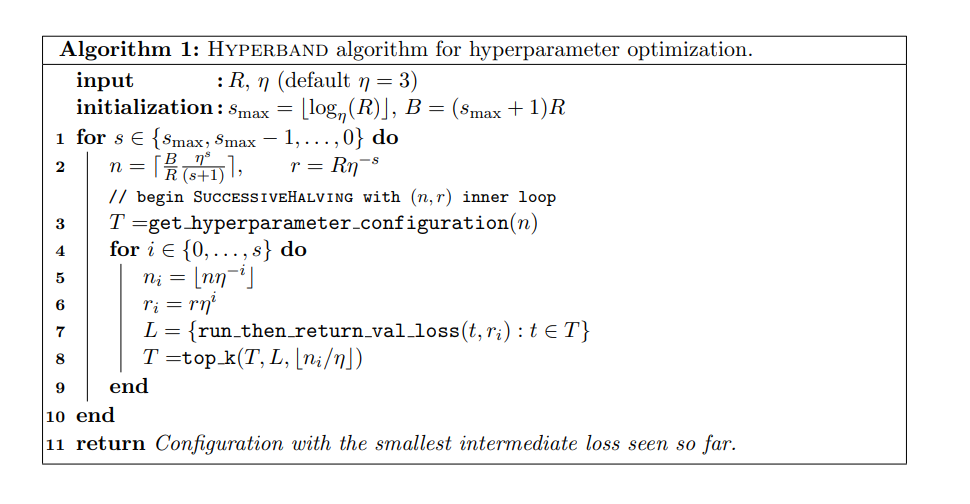

# Tối ưu siêu tham số mô hình với Hyperband


## Giới thiệu

Trong bài viết trước, chúng ta đã tìm hiểu về [RandomizedSearchCV](https://datasciencedances.com/blog/2025/03/hyperparameter-tuning-RandomizedSearchCV) - một phương pháp tối ưu siêu tham số hiệu quả bằng cách lấy mẫu ngẫu nhiên từ không gian tham số. Tuy nhiên, phương pháp này vẫn có một hạn chế: nó phải chạy toàn bộ quá trình huấn luyện cho mỗi bộ tham số được chọn, ngay cả khi chúng ta có thể dự đoán sớm rằng một số bộ tham số sẽ không cho kết quả tốt.

Trong bài viết này, chúng ta sẽ tìm hiểu về Hyperband - một phương pháp tối ưu siêu tham số thông minh hơn, kết hợp giữa Randomized Search và Early Stopping để loại bỏ các bộ tham số không triển vọng sớm hơn, từ đó tiết kiệm thời gian và tài nguyên tính toán.

## Hyperband là gì?

Hyperband là một thuật toán tối ưu siêu tham số được phát triển bởi Li và cộng sự vào năm 2017. Nó kết hợp hai ý tưởng chính:

- **Randomized Search**: Lấy mẫu ngẫu nhiên các bộ tham số từ không gian tìm kiếm
- **Early Stopping**: Dừng sớm việc huấn luyện các bộ tham số không triển vọng

<!--  -->

**Tại sao nên sử dụng Hyperband?**
Bằng cách dừng sớm các thử nghiệm không triển vọng, Hyperband có thể tiết kiệm đáng kể thời gian tính toán. Do đó chúng ta có thể thử nhiều bộ tham số hơn. Ngoài ra Hypberband còn giúp điều chỉnh số lượng tài nguyên dành cho mỗi bộ tham số dựa trên hiệu suất ban đầu.

## Cách hoạt động của Hyperband

Hyperband hoạt động thông qua một quy trình lặp lại gồm hai giai đoạn chính:

### 1. Successive Halving (SH)

Successive Halving là cốt lõi của Hyperband. Nó hoạt động như sau:

- Bắt đầu với n bộ tham số ngẫu nhiên
- Huấn luyện mỗi bộ tham số với tài nguyên nhỏ (số vòng lặp, số cây)
- Chọn một nửa số bộ tham số có hiệu suất tốt nhất 
- Tiếp tục huấn luyện các bộ tham số được chọn với tài nguyên dài hơn
- Lặp lại quá trình cho đến khi chỉ còn một bộ tham số

<!--  -->

### 2. Hyperband

Hyperband mở rộng Successive Halving bằng cách:

- Thử nhiều cấu hình khác nhau của SH (với các giá trị n khác nhau)
- Tự động điều chỉnh ngân sách thời gian cho mỗi cấu hình
- Chọn cấu hình tốt nhất dựa trên kết quả

## Triển khai Hyperband

Chúng ta sẽ triển khai Hyperband từ đầu để hiểu rõ cách hoạt động của nó. Trong nội dung bài viết này, chúng ta lựa chọn tài nguyên giới hạn là số lượng cây `n_estimators`

Thuật toán Hyberband



Hyperband nhận đầu vào là các tham số 
- $R$ : Lượng tài nguyên tối đa (ở đây có thể là số vòng lặp, số cây, tỉ lệ phần trăm dữ liệu)
- $\eta$: đầu vào kiểm soát số lượng bộ hyperameters bị loại bỏ trong mỗi vòng của SuccessiveHalving
- $s_{max}$ là số lượng lần thực hiện `sucessivehalving`, hay cũng chính là số lần sinh ra các tập hyperparameters ngẫu nhiên.
- $B$: Phần tài nguyên ước lượng cho mỗi lần thực hiện `sucessivehalving`
- $n$: Số lượng bộ hyperparameters được sinh ra trong mỗi lần thực hiện `sucessivehalving`
- $r$: nguồn tài nguyên tối đa có thể sử dụng

Các tham số còn lại sẽ được giải thích chi tiết bên dưới trong method `sucessivehalving`


### Triển khai từ đầu


```python
import numpy as np
from sklearn.model_selection import train_test_split, cross_val_score, RandomizedSearchCV, StratifiedKFold
from sklearn.metrics import accuracy_score
import pandas as pd
import math
import time
# Tải dữ liệu
from ucimlrepo import fetch_ucirepo
phishing_websites = fetch_ucirepo(id=327)
X = phishing_websites.data.features
y = phishing_websites.data.targets

# Chia tập train và test
X_train, X_test, y_train, y_test = train_test_split(X, y['result'], test_size=0.2, random_state=42, stratify=y)
```

Định nghĩa class Hyperband 


```python
class Hyperband:
    def __init__(self, estimator, param_distributions, max_iter=81, eta=3, random_state=None):
        """ArithmeticError
        Khởi tạo Hyperband
        estimator: Mô hình
        param_distributions: Phân phối tham số
        max_iter: Số lần lặp tối đa
        eta: Hệ số giảm
        random_state: Ngẫu nhiên
        """
        self.estimator = estimator
        self.param_distributions = param_distributions
        self.max_iter = max_iter  # Số lần lặp tối đa
        self.random_state = random_state # Lấy ngẫu nhiên
        self.eta = eta  # Hệ số giảm
        self.s_max = int(np.log(self.max_iter) / np.log(self.eta)) # Init s_max = log(max_iter)/log(eta)        
        self.B = (self.s_max + 1) * self.max_iter # Init B = (s_max + 1) * max_iter
        self.cv = StratifiedKFold(n_splits=5, shuffle=True, random_state=self.random_state) # Init cv = StratifiedKFold
        self.results = [] # Lưu các lần chạy
        self.total_runs = 0 # Đếm tổng số lần chạy
        if self.random_state is not None:
            np.random.seed(self.random_state)
    
    def sample_params(self):
        """
        Lấy mẫu tham số từ các phân phối hoặc danh sách giá trị.
        Hỗ trợ:
            - scipy.stats distributions (randint, uniform,...)
            - list giá trị rời rạc
        """
        sampled_params = {}
        for param, dist in self.param_distributions.items():
            sampled_params[param] = dist.rvs()
        return sampled_params
    
    def try_params_and_return_score(self, params, X, y):
        ## TODO
        """
        Chạy cross validation với bộ tham số và trả về điểm số
        """
    
    def sucessive_halving(self, s, n, r, X, y):
        ## TODO
        """
        Thực hiện sucessive halving
        s: số lần lặp
        n: Số bộ tham số
        r: Số n_estimators tối đa
        X: tập dữ liệu
        y: tập dữ liệu

        Kết quả trả ra là
        final_params: bộ thàm số tối ưu
        final_score: điểm số tối ưu
        """    
    def fit(self, X, y):
        ## TODO
        """Thực hiện tối ưu hóa siêu tham số với Hyperband"""
```

**method `sample_params`**


Cách viết method này tương tự các bài trước


```python
    def sample_params(self):
        """
        Lấy mẫu tham số từ các phân phối hoặc danh sách giá trị.
        Hỗ trợ:
            - scipy.stats distributions (randint, uniform,...)
            - list giá trị rời rạc
        """
        sampled_params = {}
        for param, dist in self.param_distributions.items():
            sampled_params[param] = dist.rvs()
        return sampled_params
```

**method `try_params_and_return_score`**

method này thực hiện nhận hyperparameter và dùng `cross_validate_score` trên tập dữ liệu huấn luyện.

```python
    def try_params_and_return_score(self, params, X, y):
        """
        Chạy cross validation với bộ tham số và trả về điểm số
        """
        self.estimator.set_params(**params)
        score = cross_val_score(estimator=self.estimator, X=X, y=y, cv=self.cv, scoring='accuracy', n_jobs=-1).mean()
        return score
```

Trong bài viết này, mình chọn scoring là `accuracy`, chúng ta có thể chọn các metric khác như f1, log_loss hoặc auc. Ngoài ra mình còn dùng StratifiedKFold để làm cross validation, method này được khởi tạo ở thuộc tính `self.cv` trong phần `__init__`

**Viết phương thức sucessive_halving**

```python
    def sucessive_halving(self, s, n, r, X, y):
        """
        Thực hiện sucessive halving
        s: số lần lặp
        n: Số bộ tham số
        r: Số n_estimators tối đa
        X: tập dữ liệu
        y: tập dữ liệu
        """
        self.param_id_map = {}
        self.param_id = 0

        T = [self.sample_params() for _ in range(n)]
        param_id = [str(s) + '_'+ str(pid) for pid in list(range(n))]
        remaining_params = T.copy()
        remaining_params_id = param_id.copy()
        for i in range(s + 1):
            n_i = math.floor(n * self.eta ** (-i))
            r_i = int(r * self.eta ** i)
            print(i,n_i, r_i)
            scores = []
            for t, pid in zip(remaining_params,remaining_params_id):
                params = t.copy() # Dùng copy để tránh làm thay đổi các tham số của t
                # Tạo n_estimators dựa trên cấu hình hyperband
                params['n_estimators'] =  min(r_i, t['n_estimators'])
                # Chạy cross validation và trả về điểm số
                score = self.try_params_and_return_score(params, X, y)
                # Lưu kết quả
                scores.append(score)
                result = { 'param_id' : pid, 'params': t, 'score': score, 's': s, 'i': i, 'n_i': n_i, 'r_i': r_i}
                self.results.append(result)
                # Đếm tổng số lần chạy
                self.total_runs += 1

            # Chọn top k bộ tham số
            k = math.floor(n_i / n)
            top_k_indices = np.argsort(scores)[-k:][::-1]
            remaining_params = [remaining_params[i] for i in top_k_indices]
            remaining_params_id = [remaining_params_id[i] for i in top_k_indices]
        
        # Huấn luyện mô hình với tập tham số tốt nhất
        final_params = remaining_params[0]
        self.estimator.set_params(**final_params)
        final_score = self.try_params_and_return_score(final_params, X, y)
        return final_params,final_score
```


**Viết phương thức fit**

```python
    def fit(self, X, y):
        """Thực hiện tối ưu hóa siêu tham số với Hyperband"""
        best_score = -np.inf
        best_params = None
        params_count = 0
        for s in reversed(range(self.s_max +1)):
            # Tính toán số lượng bộ tham số     
            n = math.ceil(self.B / self.max_iter * self.eta ** s / (s + 1))
            params_count += n
            # Tính toán số lượng n_estimators
            r = self.max_iter * self.eta ** (-s)
            # Thực hiện sucessive halving
            params, score = self.sucessive_halving(s, n, r, X, y)
            # Cập nhật tham số tốt nhất
            if score > best_score:
                best_score = score
                best_params = params
        self.best_params_ = best_params
        self.best_score_ = best_score
        self.params_count = params_count
```

**Code đầy đủ**

```python
class Hyperband:
    def __init__(self, estimator, param_distributions, max_iter=81, eta=3, random_state=None):
        """ArithmeticError
        Khởi tạo Hyperband
        estimator: Mô hình
        param_distributions: Phân phối tham số
        max_iter: Số lần lặp tối đa
        eta: Hệ số giảm
        random_state: Ngẫu nhiên
        """
        self.estimator = estimator
        self.param_distributions = param_distributions
        self.max_iter = max_iter  # Số lần lặp tối đa
        self.random_state = random_state # Lấy ngẫu nhiên
        self.eta = eta  # Hệ số giảm
        self.s_max = int(np.log(self.max_iter) / np.log(self.eta)) # Init s_max = log(max_iter)/log(eta)        
        self.B = (self.s_max + 1) * self.max_iter # Init B = (s_max + 1) * max_iter
        self.cv = StratifiedKFold(n_splits=5, shuffle=True, random_state=self.random_state) # Init cv = StratifiedKFold
        self.results = [] # Lưu các lần chạy
        self.total_runs = 0 # Đếm tổng số lần chạy
        if self.random_state is not None:
            np.random.seed(self.random_state)
    
    def sample_params(self):
        """
        Lấy mẫu tham số từ các phân phối hoặc danh sách giá trị.
        Hỗ trợ:
            - scipy.stats distributions (randint, uniform,...)
            - list giá trị rời rạc
        """
        sampled_params = {}
        for param, dist in self.param_distributions.items():
            sampled_params[param] = dist.rvs()
        return sampled_params
    
    def try_params_and_return_score(self, params, X, y):
        """
        Chạy cross validation với bộ tham số và trả về điểm số
        """
        self.estimator.set_params(**params)
        score = cross_val_score(estimator=self.estimator, X=X, y=y, cv=self.cv, scoring='accuracy', n_jobs=-1).mean()
        return score
    
    def sucessive_halving(self, s, n, r, X, y):
        """
        Thực hiện sucessive halving
        s: số lần lặp
        n: Số bộ tham số
        r: Số n_estimators tối đa
        X: tập dữ liệu
        y: tập dữ liệu
        """

        T = [self.sample_params() for _ in range(n)]
        param_id = [str(s) + '_'+ str(pid) for pid in list(range(n))]
        remaining_params = T.copy()
        remaining_params_id = param_id.copy()
        for i in range(s + 1):
            n_i = math.floor(n * self.eta ** (-i))
            r_i = int(r * self.eta ** i)
            print(i,n_i, r_i)
            scores = []
            for t, pid in zip(remaining_params,remaining_params_id):
                params = t.copy() # Dùng copy để tránh làm thay đổi các tham số của t
                # Tạo n_estimators dựa trên cấu hình hyperband
                params['n_estimators'] =  min(r_i, t['n_estimators'])
                # Chạy cross validation và trả về điểm số
                score = self.try_params_and_return_score(params, X, y)
                # Lưu kết quả
                scores.append(score)
                result = { 'param_id' : pid, 'params': t, 'score': score, 's': s, 'i': i, 'n_i': n_i, 'r_i': r_i}
                self.results.append(result)
                # Đếm tổng số lần chạy
                self.total_runs += 1

            # Chọn top k bộ tham số
            k = math.floor(n_i / n)
            top_k_indices = np.argsort(scores)[-k:][::-1]
            remaining_params = [remaining_params[i] for i in top_k_indices]
            remaining_params_id = [remaining_params_id[i] for i in top_k_indices]
        
        # Huấn luyện mô hình với tập tham số tốt nhất
        final_params = remaining_params[0]
        self.estimator.set_params(**final_params)
        final_score = self.try_params_and_return_score(final_params, X, y)
        return final_params,final_score
    
    def fit(self, X, y):
        """Thực hiện tối ưu hóa siêu tham số với Hyperband"""
        best_score = -np.inf
        best_params = None
        params_count = 0
        for s in reversed(range(self.s_max +1)):
            # Tính toán số lượng bộ tham số     
            n = math.ceil(self.B / self.max_iter * self.eta ** s / (s + 1))
            params_count += n
            # Tính toán số lượng n_estimators
            r = self.max_iter * self.eta ** (-s)
            # Thực hiện sucessive halving
            params, score = self.sucessive_halving(s, n, r, X, y)
            # Cập nhật tham số tốt nhất
            if score > best_score:
                best_score = score
                best_params = params
        self.best_params_ = best_params
        self.best_score_ = best_score
        self.params_count = params_count
```

### Sử dụng Hyperband với LightGBM


Tạo bộ khởi tạo hyperparameters

```python
from scipy.stats import randint, uniform

# Định nghĩa không gian tham số rộng hơn cho LightGBM
param_distributions = {
    'num_leaves': randint(20, 100),  # Số lá trong cây
    'max_depth': randint(3, 12),     # Độ sâu tối đa
    'learning_rate': uniform(0.01, 0.3),  # Tốc độ học
    'n_estimators': randint(50, 243+1),
    'min_child_samples': randint(10, 50),  # Số mẫu tối thiểu trong mỗi lá
    'subsample': uniform(0.6, 0.4),   # Tỷ lệ mẫu sử dụng cho mỗi cây
    'colsample_bytree': uniform(0.6, 0.4),  # Tỷ lệ features sử dụng cho mỗi cây
    'reg_alpha': uniform(0, 1),       # L1 regularization
    'reg_lambda': uniform(0, 1),      # L2 regularization
    'min_child_weight': uniform(0, 1)  # Trọng số tối thiểu cho mỗi lá
}
```

Khởi tạo và chạy Hyperband
```python
hb = Hyperband(
    estimator=lgb.LGBMClassifier(random_state=42),
    param_space=param_space,
    max_iter=81,
    eta=3,
    random_state=42
)

hb.fit(X_train, y_train)

print("Best parameters:", hb.best_params_)
print("Best score:", hb.best_score_)
```

<pythonoutput>
```
Best parameters: {'num_leaves': 69, 'max_depth': 9, 'learning_rate': 0.2076771825730454, 'n_estimators': 114, 'min_child_samples': 12, 'subsample': 0.6924299186352285, 'colsample_bytree': 0.8687570974394914, 'reg_alpha': 0.019710537754364155, 'reg_lambda': 0.10410858198457384, 'min_child_weight': 0.7999160853731894}
Best score: 0.9695839482899304
```
</pythonoutput>


## Kết luận

Hyperband là một phương pháp tối ưu siêu tham số hiệu quả, đặc biệt phù hợp khi:

- Có nhiều tham số cần tối ưu
- Thời gian và tài nguyên tính toán hạn chế
- Cần tự động điều chỉnh ngân sách thời gian cho mỗi bộ tham số

Tuy nhiên, cũng như các phương pháp khác, Hyperband không phải là giải pháp hoàn hảo cho mọi trường hợp. Việc lựa chọn phương pháp tối ưu siêu tham số phụ thuộc vào:

- Kích thước và độ phức tạp của dữ liệu
- Số lượng và loại siêu tham số cần tối ưu
- Tài nguyên tính toán có sẵn
- Yêu cầu về độ chính xác và thời gian

Trong thực tế, việc kết hợp nhiều phương pháp (như đã thấy trong bài viết trước về việc kết hợp RandomizedSearch và GridSearch) thường mang lại kết quả tốt nhất.

## Tài liệu tham khảo
[Hyperband: A Novel Bandit-Based Approach to Hyperparameter Optimization
](https://arxiv.org/abs/1603.06560)