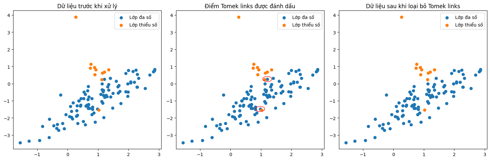

Trong hành trình phát triển các mô hình machine learning, dữ liệu mất cân bằng là một thách thức phổ biến mà hầu hết các kỹ sư đều gặp phải. Bài viết này sẽ đi sâu vào Tomek's Link - một kỹ thuật undersampling hiệu quả để xử lý vấn đề này, cùng với các ví dụ thực tế và hướng dẫn chi tiết về cách áp dụng.

## Tổng quan về dữ liệu mất cân bằng

###  Định nghĩa và đặc điểm

Dữ liệu mất cân bằng xảy ra khi tỷ lệ mẫu giữa các lớp trong tập dữ liệu chênh lệch đáng kể. Hiện tượng này thường xuất hiện trong nhiều bài toán thực tế như:

- Phát hiện gian lận tín dụng (1% giao dịch gian lận, 99% giao dịch bình thường)
- Chẩn đoán bệnh hiếm (0.1% ca bệnh, 99.9% ca khỏe mạnh)
- Phát hiện spam email (20% spam, 80% email thông thường)

### Tác động đến mô hình học máy

Dữ liệu mất cân bằng gây ra nhiều vấn đề nghiêm trọng:

**:one:** **Thiên lệch trong dự đoán**: Mô hình có xu hướng thiên về dự đoán lớp đa số \
**:two:** **Đánh giá không chính xác**: Độ chính xác tổng thể cao nhưng hiệu suất thực tế kém \
**:three:** **Khó khăn trong học tập**: Mô hình khó học được các đặc trưng của lớp thiểu số

### Các phương pháp xử lý phổ biến

Có ba hướng tiếp cận chính:

**:one:**  **Oversampling**: Tăng số lượng mẫu lớp thiểu số \
**:two:** **Undersampling**: Giảm số lượng mẫu lớp đa số \
**:three:** **Hybrid**: Kết hợp cả hai phương pháp trên

## Tomek's Link: Nguyên lý và cách hoạt động

### Định nghĩa toán học

Tomek's Link là một cặp điểm dữ liệu $(x_i, x_j)$ thỏa mãn các điều kiện sau:

- $x_i$ và $x_j$ thuộc hai lớp khác nhau 
- Với mọi điểm $x_k$ trong tập dữ liệu:
   - $d(x_i, x_j) < d(x_i, x_k)$
   - $d(x_i, x_j) < d(x_j, x_k)$

Trong đó:
- $d()$ là hàm khoảng cách (thường là khoảng cách Euclidean)
- $x_k$ là bất kỳ điểm nào khác trong tập dữ liệu

### Quy trình hoạt động

- **Bước 1**: Tính toán ma trận khoảng cách giữa các điểm dữ liệu
- **Bước 2**: Xác định các cặp điểm thuộc hai lớp khác nhau
- **Bước 3**: Kiểm tra điều kiện Tomek's Link cho từng cặp
- **Bước 4**: Loại bỏ một trong hai điểm của mỗi Tomek's Link

### Ví dụ minh họa

Xét một tập dữ liệu 2 chiều đơn giản:

```python
import numpy as np
import matplotlib.pyplot as plt
from sklearn.datasets import make_classification
from imblearn.under_sampling import TomekLinks

# Tạo dữ liệu mẫu không cân bằng
X, y = make_classification(
    n_samples=110,
    n_features=2,
    n_classes=2,
    n_clusters_per_class=1,
    n_informative=2,
    n_redundant=0,
    n_repeated=0,
    weights=[0.9, 0.1],  # 90% lớp đa số, 10% lớp thiểu số
    random_state=42
)


# Áp dụng Tomek's Link
tl = TomekLinks()
X_res, y_res = tl.fit_resample(X, y)

# Tìm các điểm Tomek links và các cặp điểm tương ứng
removed_indices = np.where(~np.isin(range(len(X)), tl.sample_indices_))[0]
removed_points = X[removed_indices]

# Vẽ đồ thị kết quả
plt.figure(figsize=(15, 5))

# Ảnh 1: Dữ liệu gốc
plt.subplot(1, 3, 1)
plt.scatter(X[y==0][:, 0], X[y==0][:, 1], label='Lớp đa số')
plt.scatter(X[y==1][:, 0], X[y==1][:, 1], label='Lớp thiểu số')
plt.title('Dữ liệu trước khi xử lý')
plt.legend()

# Ảnh 2: Đánh dấu các điểm Tomek links
plt.subplot(1, 3, 2)
plt.scatter(X[y==0][:, 0], X[y==0][:, 1], label='Lớp đa số')
plt.scatter(X[y==1][:, 0], X[y==1][:, 1], label='Lớp thiểu số')
for point in removed_points:
    circle = plt.Circle((point[0], point[1]), 0.15, fill=False, color='red')
    plt.gca().add_patch(circle)
plt.title('Điểm Tomek links được đánh dấu')
plt.legend()

# Ảnh 3: Dữ liệu sau khi loại bỏ Tomek links
plt.subplot(1, 3, 3)
# Chỉ vẽ các điểm không phải là Tomek links
plt.scatter(X_res[y_res==0][:, 0], X_res[y_res==0][:, 1], label='Lớp đa số')
plt.scatter(X_res[y_res==1][:, 0], X_res[y_res==1][:, 1], label='Lớp thiểu số')
plt.title('Dữ liệu sau khi loại bỏ Tomek links')
plt.legend()


plt.legend()

plt.tight_layout()
plt.show()

# In số lượng mẫu trước và sau khi xử lý
print("Số lượng mẫu trước khi xử lý:", len(X))
print("Số lượng mẫu sau khi xử lý:", len(X_res))
print("Số điểm Tomek links được tìm thấy:", len(removed_points))
```

## Triển khai chi tiết với Python

### Cài đặt và chuẩn bị

```python
# Cài đặt thư viện cần thiết
!pip install imbalanced-learn
!pip install scikit-learn pandas numpy matplotlib

# Import các thư viện
import numpy as np
import pandas as pd
from sklearn.datasets import make_classification
from sklearn.model_selection import train_test_split
from sklearn.metrics import classification_report
from imblearn.under_sampling import TomekLinks
from sklearn.ensemble import RandomForestClassifier
```

### Xử lý dữ liệu hoàn chỉnh

```python
# Tạo pipeline xử lý dữ liệu
from imblearn.pipeline import Pipeline

# Tạo dữ liệu mẫu
X, y = make_classification(
    n_samples=10000,
    n_features=10,
    n_classes=2,
    weights=[0.9, 0.1],
    random_state=42
)

# Chia tập train/test
X_train, X_test, y_train, y_test = train_test_split(
    X, y, test_size=0.2, random_state=42
)

# Tạo pipeline
pipeline = Pipeline([
    ('tomek', TomekLinks()),
    ('classifier', RandomForestClassifier())
])

# Huấn luyện mô hình
pipeline.fit(X_train, y_train)

# Đánh giá kết quả
y_pred = pipeline.predict(X_test)
print(classification_report(y_test, y_pred))
```

### Tùy chỉnh nâng cao

```python
# Tùy chỉnh tham số cho Tomek's Link
from imblearn.under_sampling import TomekLinks
from sklearn.neighbors import NearestNeighbors

class CustomTomekLinks(TomekLinks):
    def __init__(self, sampling_strategy='auto', n_jobs=None):
        super().__init__(
            sampling_strategy=sampling_strategy,
            n_jobs=n_jobs
        )
        
    def _find_tomek_links(self, X, y):
        # Tùy chỉnh logic tìm Tomek's Link
        nn = NearestNeighbors(n_neighbors=2)
        return self._validate_pairs(X, y, nn)
```

## Kết hợp với các phương pháp khác

### SMOTE-Tomek

```python
from imblearn.combine import SMOTETomek

# Khởi tạo SMOTE-Tomek
smt = SMOTETomek(random_state=42)

# Áp dụng kết hợp
X_resampled, y_resampled = smt.fit_resample(X, y)

# So sánh phân phối
print("Phân phối ban đầu:", np.bincount(y))
print("Phân phối sau xử lý:", np.bincount(y_resampled))
```

### 4.2 ENN-Tomek

```python
from imblearn.combine import Pipeline
from imblearn.under_sampling import EditedNearestNeighbours

# Tạo pipeline kết hợp
pipeline = Pipeline([
    ('enn', EditedNearestNeighbours()),
    ('tomek', TomekLinks())
])

# Áp dụng
X_resampled, y_resampled = pipeline.fit_resample(X, y)
```

## Đánh giá hiệu quả

### Các metric đánh giá

**Precision-Recall**
```python
from sklearn.metrics import precision_recall_curve
import matplotlib.pyplot as plt

# Vẽ đường Precision-Recall
precision, recall, _ = precision_recall_curve(y_test, pipeline.predict_proba(X_test)[:,1])
plt.plot(recall, precision)
plt.xlabel('Recall')
plt.ylabel('Precision')
plt.title('Precision-Recall curve')
plt.show()
```

**ROC Curve**
```python
from sklearn.metrics import roc_curve, auc

# Vẽ đường ROC
fpr, tpr, _ = roc_curve(y_test, pipeline.predict_proba(X_test)[:,1])
roc_auc = auc(fpr, tpr)
plt.plot(fpr, tpr, label=f'ROC curve (AUC = {roc_auc:.2f})')
plt.xlabel('False Positive Rate')
plt.ylabel('True Positive Rate')
plt.title('ROC curve')
plt.legend()
plt.show()
```

### So sánh với các phương pháp khác

```python
from imblearn.under_sampling import RandomUnderSampler
from imblearn.over_sampling import SMOTE

methods = {
    'Tomek Links': TomekLinks(),
    'Random Under-sampling': RandomUnderSampler(),
    'SMOTE': SMOTE(),
    'SMOTE-Tomek': SMOTETomek()
}

results = {}
for name, method in methods.items():
    X_res, y_res = method.fit_resample(X_train, y_train)
    clf = RandomForestClassifier()
    clf.fit(X_res, y_res)
    y_pred = clf.predict(X_test)
    results[name] = classification_report(y_test, y_pred, output_dict=True)

# In kết quả so sánh
for name, result in results.items():
    print(f"\n{name}:")
    print(f"F1-score: {result['weighted avg']['f1-score']:.3f}")
```

## Các trường hợp sử dụng thực tế

### Phát hiện gian lận

```python
# Giả lập dữ liệu gian lận
fraud_data = pd.DataFrame({
    'amount': np.random.normal(100, 50, 10000),
    'time': np.random.randint(0, 24, 10000),
    'is_fraud': np.random.choice([0, 1], 10000, p=[0.99, 0.01])
})

# Áp dụng Tomek's Link
X = fraud_data[['amount', 'time']]
y = fraud_data['is_fraud']

tl = TomekLinks()
X_res, y_res = tl.fit_resample(X, y)
```

### Chẩn đoán y tế

```python
# Giả lập dữ liệu y tế
medical_data = pd.DataFrame({
    'age': np.random.normal(50, 15, 10000),
    'blood_pressure': np.random.normal(120, 20, 10000),
    'cholesterol': np.random.normal(200, 30, 10000),
    'has_disease': np.random.choice([0, 1], 10000, p=[0.95, 0.05])
})

# Áp dụng xử lý
X = medical_data[['age', 'blood_pressure', 'cholesterol']]
y = medical_data['has_disease']

pipeline = Pipeline([
    ('tomek', TomekLinks()),
    ('classifier', RandomForestClassifier())
])

pipeline.fit(X, y)
```

## Những lưu ý khi sử dụng

### Khi nào nên dùng

- Dữ liệu có nhiều nhiễu ở ranh giới quyết định
- Cần làm rõ ranh giới giữa các lớp
- Muốn giảm kích thước dữ liệu mà vẫn giữ được thông tin quan trọng

### Khi nào không nên dùng

- Dữ liệu quá nhỏ
- Mất cân bằng quá nghiêm trọng (tỷ lệ < 1:1000)
- Cần bảo toàn toàn bộ thông tin gốc

## Kết luận và khuyến nghị

Tomek's Link là một công cụ mạnh mẽ trong xử lý dữ liệu mất cân bằng, nhưng để đạt hiệu quả tối ưu, bạn nên:

**:one:** **Phân tích kỹ dữ liệu** trước khi áp dụng \
**:two:** **Kết hợp với các phương pháp khác** như SMOTE \
**:three:** **Theo dõi các metric phù hợp** như F1-score, ROC-AUC \
**:four:** **Tùy chỉnh tham số** cho phù hợp với bài toán cụ thể

## Tài liệu tham khảo

**:one:** Tomek, I. (1976). "Two modifications of CNN" \
**:two:** [Imbalanced-learn Documentation](https://imbalanced-learn.org/) \
**:three:** He, H., & Garcia, E. A. (2009). "Learning from Imbalanced Data" \
**:four:** Chawla, N. V. (2002). "SMOTE: Synthetic Minority Over-sampling Technique" \
**:five:** Batista, G. E., et al. (2004). "A study of the behavior of several methods for balancing machine learning training data"