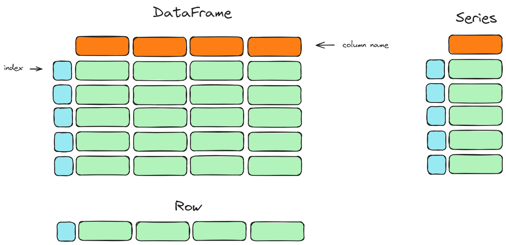

# Giới thiệu

Mục tiêu của chương này nhằm giới thiệu về các cấu trúc cơ bản trong Pandas là `Series` và `DataFrame`. 
Trong chương này, bạn sẽ học cách khởi tạo các cấu trúc này cũng như một số thao tác cơ bản trên `Series`. 
Bạn cũng sẽ được biết về một số kiểu dữ liệu thường gặp trong pandas và cách để giảm thiểu bộ nhớ sử dụng khi khởi tạo dữ liệu.

## Các mục trong chương này
- [**Series**](./Series)
- [**DataFrame**](./DataFrame)
- [**DataType**](./DataType)