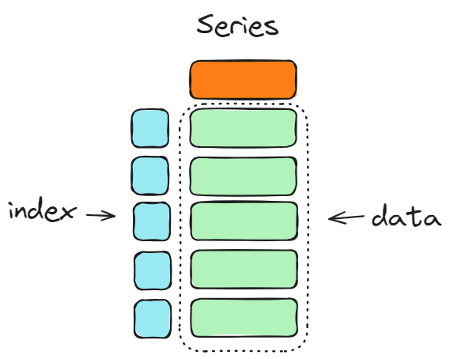
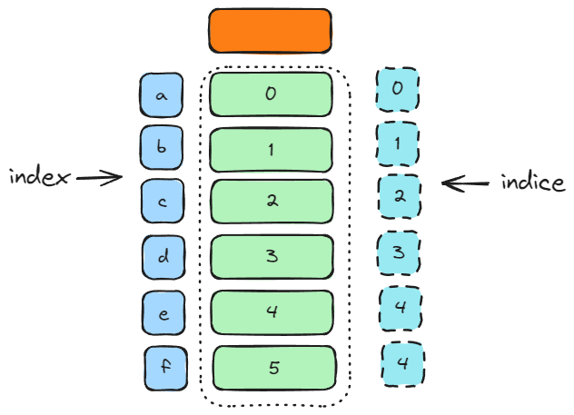

import Tabs from '@theme/Tabs';
import TabItem from '@theme/TabItem';

# Series

## Giới thiệu 
Trong Pandas, `Series` là mảng 1 chiều bao gồm một danh sách giá trị, và một mảng chứa index 
của các giá trị. Trong dữ liệu dảng bảng, mỗi Series được xem như là một cột của bảng đó. 
Cách đơn giản để tạo Series như sau


```python
s = pd.Series(data, index=None, name=None)
```

Trong đó `data` có thể  có dạng:

- dạng List của Python hoặc dạng `numpy.array`

- dictionary của Python

- là một hằng số duy nhất

`index` có thể truyền hoặc không, tùy vào dạng của `data` mà `index` sẽ được định nghĩa khác nhau. 
`name` là tên của `Series`, giá trị này cũng không nhất thiết phải truyền vào.

## Các cách khởi tạo

### Khởi tạo Series bằng một giá trị duy nhất 

Đây là cách khởi tạo đơn giản nhất, dữ liệu truyền vào chỉ là một giá trị duy nhất
```python
pd.Series(data=1)
```

<pythonoutput>
```
0    1
dtype: int64
```
</pythonoutput>
Bạn cũng có thể khởi tạo Series với nhiều phần tử gióng nhau

```python
pd.Series(data=1, index=[1, 2, 3])
```
<pythonoutput>
```
1    1
2    1
3    1
dtype: int64
```
</pythonoutput>

### Khởi tạo Series bằng List hoặc dạng numpy.array 

Bây giờ ta có thể khởi tạo một Series với dữ liệu đầu vào là một List đơn giản `["một", "hai", "ba"]`
```python
pd.Series(data=["một", "hai", "ba"])
```
Lúc này, hệ thống sẽ mặc định `index` sẽ có giá trị từ `0` đến độ dài của `list - 1` tức là 2
<pythonoutput>
```
0    một
1    hai
2     ba
dtype: object
```
</pythonoutput>

Chúng ta có thể thay đổi mặc đinh `index` truyền vào bằng cách thêm vào biến `index` như ví dụ dưới đây

```python
pd.Series(data=["một", "hai", "ba"], index=["m", "h", "b"])
```
<pythonoutput>
```
m    một
h    hai
b     ba
dtype: object
```
</pythonoutput>

Khi chúng ta truyền `index` có độ dài nhỏ hơn độ dài của mảng đưa vào thì pandas sẽ báo lỗi, trong ví dụ dưới đây mình sẽ
truyền index chỉ 2 phần tử trong khi data có 3 phần tử

```python
pd.Series(data=["một", "hai", "ba"], index=["m", "h"])
```

<pythonoutput>
```
ValueError: Length of values (3) does not match length of index (2)
```
</pythonoutput>

Tương tự khi truyền `index` có độ dài lớn hơn, pandas cũng báo lỗi tương tự

```python
pd.Series(data=["một", "hai", "ba"], index=["m", "h", "b","t"])
```

<pythonoutput>
```
ValueError: Length of values (3) does not match length of index (4)
```
</pythonoutput>

Bạn cũng có thể thay thế list bằng numpy array như sau

```python
pd.Series(data=np.array(["một", "hai", "ba"]), index=["m", "h", "b"])
```

<pythonoutput>
```
m    một
h    hai
b     ba
dtype: object
```
</pythonoutput>

Ngoài ra chúng ta có thể đặt tên cho Series bằng tham số `name`, tuy nhiên mình thấy không cần thiết lắm

```python
pd.Series(data=np.array(["một", "hai", "ba"]), index=["m", "h", "b"], name='meow')
```
<pythonoutput>
```
m    một
h    hai
b     ba
Name: meow, dtype: object
```
</pythonoutput>

### Khởi tạo Series bằng dictionary 

giả sử chúng ta có Dictionary như sau
```python
{"a": 0, "b":1, "c": 2} 
```
Khi khởi tạo Series ta chỉ cần gọi đơn giản 
```python
pd.Series({"a": 0, "b":1, "c": 2} )
```
<pythonoutput>
```
a    0
b    1
c    2
dtype: int64
```
</pythonoutput>

Lúc này `Series` sẽ lấy thứ tự `keys` của dictionary theo thứ tự là `["a", "b", "c"]` 

Tuy nhiên khi ta truyền vào với dictionary `{"b": 1, "a":0, "c": 2}`, Series vẫn giữ nguyên thứ tự  index là `["b", "a", "c"]` chứ không sắp xếp theo bảng chữ cái
```python
pd.Series({"b": 1, "a":0, "c": 2})
```

<pythonoutput>
```
b    1
a    0
c    2
dtype: int64
```
</pythonoutput>

:::info Lưu ý
Trong trường hợp bạn truyền biến `index` vào, `Series` sẽ đánh index dựa vào thứ tự trong `index`, và chỉ chứa các giá trị của dict có key nằm trong `index`. 
Với các giá trị trong biến `index` không có trong keys của dict, `Series` sẽ tạo ra các giá trị bị thiếu `NaN`.
:::

Ví dụ

```python
pd.Series({"a": 0, "b": 1, "c": 2, "e": 4}, index=["b", "c", "d", "a"])
```

Trong ví dụ này, giá trị `d` có trong `index` nhưng không là key trong dictionary, do đó Series sẽ mặc định giá trị tại index `d` là `NaN`. Ngược lại, trong dictionary có key `e` nhưng trong 
index truyền vào không có giá trị này nên `Series` sẽ không lưu giá trị của key `e` là 4
<pythonoutput>
```
b    1.0
c    2.0
d    NaN
a    0.0
dtype: float64
```
</pythonoutput>


:::info Lưu ý
`NaN` là giá trị mặc định cho dữ liệu bị thiếu trong pandas và giá trị này có kiểu 
là `float64` nên kiểu dữ liệu của `Series` cũng là `float64` khác với `int64` ở ví dụ trước đó. 
:::


## Một số thao tác cơ bản với Series

Thao tác trên `Series` cũng giống với thao tác trên `numpy.array`. Ngoài ra chúng ta còn có thể 
tác với Series dựa vào index

Ví dụ ta khởi tạo một Series và gán vào biến `s`

```python
s = pd.Series(data=[0, 1, 2, 3, 4, 5], index=["a", "b", "c", "d", "e", "f"])
```
### Hiển thị toàn bộ giá trị của Series 

Để xem toàn bộ các giá trị của một Series, ta có thể gọi thuộc tính `.values`, kết quả sẽ trả về dạng `numpy.ndarray`


```python
s.values
```

<pythonoutput>
```
array([0, 1, 2, 3, 4, 5])
```
</pythonoutput>

```python
type(s.values)
```

<pythonoutput>
```
numpy.ndarray
```
</pythonoutput>

Vì kết quả trả về của `.values` là `numpy.ndarray` nên ta có thao tác một số phép tính trên numpy như cộng thêm giá trị

```python
s.values + 1 
```

<pythonoutput>
```
array([1, 2, 3, 4, 5, 6], dtype=int64)
```
</pythonoutput>

Hoặc nhân

```python
s.values * 2
```

<pythonoutput>
```
array([ 0,  2,  4,  6,  8, 10], dtype=int64)
```
</pythonoutput>

Trong khi đó, muốn nối thêm giá trị với một list cho trước, thay vì chuyển về `.values`, ta có thể chuyển về dạng list bằng phương thức `.to_list()` rồi áp dụng các phương thức cho kiểu list. 

```python
s.to_list() + [6, 7, 8, 9, 10]
```

<pythonoutput>
```
[0, 1, 2, 3, 4, 5, 6, 7, 8, 9, 10]
```
</pythonoutput>


### Truy cập một phần tử trong Series 



**Theo indice**

indice trong Series thể hiện vị trí của phần tử Series đó, hiểu nôm na là nó ở vị trí thứ mấy, dòng thứ mấy của Series

```python
s[2]
```

<pythonoutput>
``` 
2
``` 
</pythonoutput>

**Theo index**

index trong Series thể hiện chỉ mục của phần tử Series đó, không giống như indice, index có thể là kiểu số hoặc kiểu chữ hoặc có thể là kiểu `datetime`

```python
s["c"]
```

<pythonoutput>
```
2 
```
</pythonoutput>


:::info Lưu ý
Như ví dụ trên, Series `s` của chúng ta đã được đánh index là dạng chữ, `["a", "b", "c", "d", "e", "f"]`. Vậy nếu chúng ta có index là dạng số thì sẽ như thế nào?
:::

Ví dụ ta có một Series có index khác so với indice

```python
s2 = pd.Series(data=[0, 1, 2, 3, 4, 5], index=[0, 2, 3, 5, 8, 9])
s2
```

<pythonoutput>

```
0    0
2    1
3    2
5    3
8    4
9    5
dtype: int64
```
</pythonoutput>

Lúc này khi truyền `s2[3]` thì kết quả sẽ là

```python
s2[3]
```

<pythonoutput>
```
2
```
</pythonoutput>

:::info Lưu ý
Vậy nếu chúng ta có index là dạng số thì việc truyền một số vào `[]` sẽ ưu tiên index của chúng. 
Trong ví dụ trên sẽ ưu tiên index là `3` có giá trị `2` chứ không phải là indice `3` có giá trị `3`
:::


### Lấy Series con của một Series 

```python
s = pd.Series(data=[0, 1, 2, 3, 4, 5], index=["a", "b", "c", "d", "e", "f"])
```

**Theo slice indice**

```python
s[1:3]
```

<pythonoutput>
```
b    1
d    2
dtype: int64
```
</pythonoutput>

**Theo slice index**

```python
s["b":"c"]
```

<pythonoutput>
``` 
b    1
c    2
dtype: int64
``` 
</pythonoutput>

**Theo list indice**

```python
s[[1, 2, 4]]
```

<pythonoutput>
```
b    1
c    2
e    4
dtype: int64
```
</pythonoutput>

**Theo list index**

```python
s[["b", "c", "e"]]
```

<pythonoutput>
```
b    1
c    2
e    4
dtype: int64
```
</pythonoutput>

**Theo điều kiện**

Chúng ta có thể lấy Series con theo điều kiện

```python
s[s > 3]
```
<pythonoutput>
```
e    4
f    5
dtype: int64
```
</pythonoutput>

Chúng ta có thể lấy phức tạp hơn như lấy những phẩn từ lớn hơn trung bình các phần tử

```python
s[s > s.mean()]
```

<pythonoutput>
```
d    3
e    4
f    5
dtype: int64
```
</pythonoutput>


**Theo danh sách boolean**

```python
s[[False, False, False, False,  True,  True]]
```

<pythonoutput>
```
e    4
f    5
dtype: int64
```
</pythonoutput>
