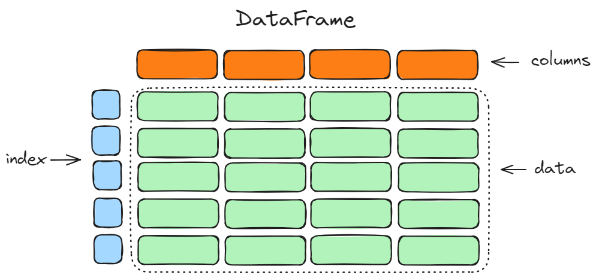

import Tabs from '@theme/Tabs';
import TabItem from '@theme/TabItem';

# DataFrame

## Giới thiệu 

`DataFrame` là cấu trúc dữ liệu chính và cũng là đặc trưng của pandas. Cũng giống như SQL Table, 
`DataFrame` là một bảng gồm một hay nhiều cột dữ liệu. Hoặc có thể nói rõ hơn là DataFrame là tập 
hợp các Series lại với nhau.


Cách khởi tạo DataFrame như sau

```python
df = pd.DataFrame(data=None, index=None, columns=None, dtype=None, copy=False)
``` 

Cũng giống như Series, `data` của DataFrame có nhiều cách khởi tạo khác nhau như:

- `dict` của Series, `dict` của `numpy.array`/`List`
- Mảng 2 chiều `numpy.ndarray`, `List` của `List`
- [Mảng có cấu trúc](https://numpy.org/doc/stable/user/basics.rec.html)
- Từ 1 `Series`
- Từ `DataFrame` khác

Tùy vào cấu trúc của `data` mà chúng ta có thể bỏ qua biến `index`. Biến `columns` thể hiện tên
của các `Series`. `dtype` sẽ định nghĩa các kiểu dữ liệu của dữ liệu, chúng ta sẽ thảo luận về nó 
ở phần kế tiếp của chương này. `copy` dùng để  tạo bản sao từ dữ liệu `data`, nó chỉ ảnh hưởng khi 
`data` là DataFrame khác hoặc numpy.ndarray, việc copy này sẽ tránh trường hợp 2 biến cùng trỏ về 
cùng 1 bộ nhớ.

## Các cách khởi tạo

### Khởi tạo DataFrame từ dict của Series

Khi không truyền biến `index` vào, thì index của `DataFrame` sẽ là hợp giữa 2 index của `Series` và
chúng sẽ được sắp xếp theo thứ tự từ vựng. Nếu ta không truyền `columns` thì các cột của `DataFrame` sẽ
được sắp xếp theo thứ tự truyền vào các keys của dict. 

Khi truyền biến `index` vào, tương tự như Series, chỉ những index nằm trong `index` mới được chọn, còn 
những index bị thiếu sẽ được điền giá trị `NaN`

Khi truyền giá trị `columns`, DataFrame sẽ chọn những `Series` thuộc dict có key thuộc `columns`, giá trị
trong `columns` không có trong key của dict sẽ được gán `NaN`

```python
d = {
            "one": pd.Series([1, 2, 3], index=["c", "b", "a"]),
            "two": pd.Series([1, 2, 3, 4], index=["c", "a", "b", "d"])
        }
pd.DataFrame(d)
```

<pythonoutput>
```
   one  two
a  3.0    2
b  2.0    3
c  1.0    1
d  NaN    4
```
</pythonoutput>

```python
pd.DataFrame(d, index=["d", "b", "a"])
```

<pythonoutput>
```
   one	two
d  NaN	  4
b  2.0	  3
a  3.0	  2
```
</pythonoutput>

```python
pd.DataFrame(d, index=["d", "b", "a"], columns=["two", "three"])
```

<pythonoutput>
```python
   two	three
d	 4	  NaN
b	 3	  NaN
a	 2	  NaN
```
</pythonoutput>

### Khởi tạo DataFrame từ dict của numpy.ndarray/List

Đối với việc khởi tạo này, bắt buộc các mảng phải có cùng độ dài. Khi không truyền `index` vào thì 
index của DataFrame sẽ được tạo từ `0` đến `len(n) - 1` trong đó `n` là độ dài của mảng. Khi truyền 
giá trị `columns`, DataFrame sẽ chọn những key thuộc dict và cũng thuộc `columns`, giá trị trong 
`columns` không có trong key của dict sẽ được gán `NaN`
```python
d = {
            "one": [1, 2, 3, 4],
            "two": [1, 2, 3, 4],
            "three": [1, 2, 3, 4]
        }
pd.DataFrame(data=d,
                     index=["a", "b", "c", "d"],
                     columns=["one", "two", "four"])
```

<pythonoutput>
```
   one  two four
a    1    1   NaN
b    2    2   NaN
c    3    3   NaN
d    4    4   NaN
```
</pythonoutput>


### Khởi tạo DataFrame từ Mảng 2 chiều/ 2-d numpy.ndarray

Khi không truyền `index` vào thì index của `DataFrame` sẽ được tạo từ `0` đến `len(n) - 1` trong đó `n` 
là số lượng List con hoặc là số dòng hay `shape[0]` của `numpy.ndarray`. Khi không truyền `columns` 
thì tên columns sẽ được tạo từ `0` đến `len(n) - 1` với `n` là độ dài lớn nhất của List con hoặc `shape[1]`
của `numpy.ndarray` 

```python
pd.DataFrame(data=[[1, 2], [3, 4, 5]], 
                     index=["a", "b"], 
                     columns=['one','two','three'])
```

<pythonoutput>
```
   one  two  three
a    1    2    NaN
b    3    4    5.0
```
</pythonoutput>

```python
pd.DataFrame(data=np.random.rand(2,3), 
                     index=["a", "b"], 
                     columns=['one','two','three']))
```

<pythonoutput>
```
        one       two     three
a  0.662008  0.085735  0.331281
b  0.115360  0.358092  0.862477
```
</pythonoutput>

### Khởi tạo DataFrame từ danh sách các dict

Ở cách khởi tạo này, bạn hãy tưởng tượng rằng mỗi dict là một dòng của DataFrame với các key là tên 
cột và value là giá trị tại cột đó. Việc truyền thêm hoặc không truyền `index` cũng giống
như các trường hợp khởi tạo trên. 

:::info Lưu ý
Trong trường hợp này, nếu bạn truyền `columns` vào thì `columns` bắt buộc phải chứa tất cả
các key của dict 
:::

Trong ví dụ dưới đây, `columns` phải chứa toàn bộ keys `["one", "two", "three"]`, nếu thiếu 1 trong 3
sẽ phát sinh lỗi.

```python
d = [{"one": 1, "two": 2}, {"one": 4, "two": 5, "three": 6}]
pd.DataFrame(d, index=["a", "b"], columns=["one", "two", "three", "four"])
```

<pythonoutput>
```
   one  two  three  four
a    1    2    NaN   NaN
b    4    5    6.0   NaN
```
</pythonoutput>

### Khởi tạo DataFrame từ Mảng có cấu trúc

Mảng có cấu trúc là mảng mà các phần tử của nó là một cấu trúc, bao gồm các thành phần nhỏ hơn, các thành phần này được đặt tên và khai báo kiểu dữ liệu.
Dưới đây là một ví dụ Mảng có cấu trúc trong numpy

```python
data = np.array([('pikachu', 9, 27.0), ('mewtwo', 3, 81.0)],
                        dtype=[('name', 'U10'), ('age', 'i4'), ('weight', 'f4')])
pd.DataFrame(data)
```

<pythonoutput>
```
       name  age  weight
0   pikachu    9    27.0
1    mewtwo    3    81.0
```
</pythonoutput>

### Khởi tạo DataFrame từ namedtuple

Các trường trong `nametuple` sẽ được gán thành tên các columns trong `DataFrame`. Những giá trị của `namedtuple` sẽ được xem là 1 dòng trong `DataFrame`. 
Số lượng cột của `DataFrame` sẽ phụ thuộc vào số lượng giá trị của phần từ `namedtuple` đầu tiên. Nếu các phần tử phía sau có số lượng giá trị ít hơn thì 
sẽ được điền `NaN` và ngược lại sẽ trả ra lỗi nếu số lượng giá trị của `namedtuple` lớn hơn số lượng giá trị của phần tử  `namedtuple` đầu tiên.

Ví dụ về cách tạo namedtuple

```python
from collections import namedtuple
Point2D = namedtuple("Point2D", "x y")
Point3D = namedtuple("Point3D", "x y z")
```

Tạo DataFrame từ namedtuple `Point2D`

```python
pd.DataFrame([Point2D(0, 0), Point2D(0, 1), Point2D(0, 2)])
```

<pythonoutput>
```
   x  y
0  0  0
1  0  1
2  0  2
```
</pythonoutput>

Tạo DataFrame từ namedtuple cả `Point2D` và `Point3D`

```python
pd.DataFrame([Point3D(0, 0, 0), Point2D(0, 1), Point3D(0, 2, 3)])
```

<pythonoutput>
``` 
   x  y    z
0  0  0  0.0
1  0  1  NaN
2  0  2  3.0
```
</pythonoutput>

Như ta thấy, tại phần tử thứ 2 chỉ có 2 giá trị, trong khi phần tử thứ nhất có 3 giá trị, vậy nên phần tử bị thiếu tại cột `z` sẽ được gán `NaN`

### Khởi tạo DataFrame từ Series

```python
s = pd.Series(data=[0, 1, 2], index=["a", "b", "c"], name="meow")
pd.DataFrame(s)
```

<pythonoutput>
```
   meow
a     0
b     1
c     2
```
</pythonoutput>


`name` của Series sẽ là tên cột của DataFrame và `index` của Series sẽ là index của DataFrame nếu ta không truyền các biến `index`, `columns` khi khởi tạo `pd.DataFrame`

## Các hàm khởi tạo thay thế 

### DataFrame.from_dict

Cách khởi tạo 

```python 
pd.DataFrame.from_dict(data, orient='columns', dtype=None, columns=None)
```

`data` truyền vào là 1 dict, `orient` có 2 giá trị có thể đưa vào là `{"columns", "index"}`, `columns` là danh sách tên các cột của DataFrame.

:::info Lưu ý
Chỉ được truyền `columns` khi `orient="index"`. Khi `orient="columns"` sẽ báo lỗi. 
:::

Ví dụ tạo DataFrame khi `orient="columns"`. Với cách khởi tạo này tên các cột của DataFrame sẽ là key của dict

```python
data = {"col_1": [3, 2, 1, 0], "col_2": ["a", "b", "c", "d"]}
pd.DataFrame.from_dict(data)
```

<pythonoutput>
```
   col_1 col_2
0      3     a
1      2     b
2      1     c
3      0     d
```
</pythonoutput>

Ví dụ tạo DataFrame khi `orient="index"`. Với cách khởi tạo này index của DataFrame sẽ là key của dict. 

```python
data = {"col_1": [3, 2, 1, 0], "col_2": ["a", "b", "c", "d"]}
pd.DataFrame.from_dict(data, orient="index", 
                               columns=["one", "two", "three", "four"])
```

<pythonoutput>
```
   col_1 col_2
0      3     a
1      2     b
2      1     c
3      0     d
```
</pythonoutput>


### DataFrame.from_records

Cách khởi tạo 

```python
pd.DataFrame.from_records(data)
```

`data` truyền vào có thể là một mảng có cấu trúc  

```python
data = np.array([('Rex', 9, 81.0), ('Fido', 3, 27.0)],
                        dtype=[('name', 'U10'), ('age', 'i4'), ('weight', 'f4')])
pd.DataFrame.from_records(data, index=["a", "b"])
```

<pythonoutput>
```
   name  age  weight
a   Rex    9    81.0
b  Fido    3    27.0
```
</pythonoutput>

Dữ liệu có thể  một danh sách các namedtuple

```python
from collections import namedtuple
Point2D = namedtuple("Point2D", "x y")
Point3D = namedtuple("Point3D", "x y z")
pd.DataFrame.from_records([Point3D(0, 0, 0), Point2D(0, 1), Point3D(0, 2, 3)],
                          columns=["x","y","z"], index=["a", "b", "c"])
```

<pythonoutput>
```
   x  y    z
a  0  0  0.0
b  0  1  NaN
c  0  2  3.0
```
</pythonoutput>

Hoặc 1 danh sách các dict 

```python
d = [{"one": 1, "two": 2}, {"one": 4, "two": 5, "three": 6}]
pd.DataFrame.from_records(d, index=["a", "b"], columns=["one", "two", "three", "four"])
```

<pythonoutput>
```
   one  two  three  four
a    1    2    NaN   NaN
b    4    5    6.0   NaN
```
</pythonoutput>