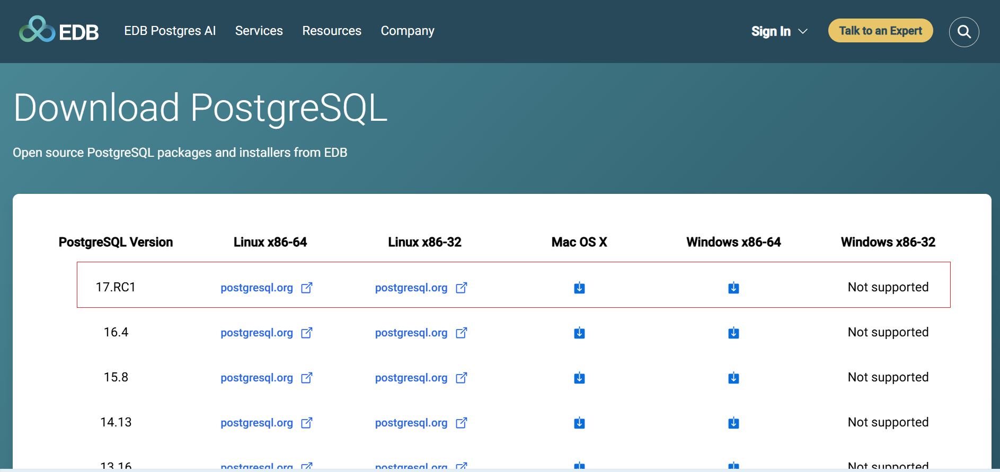

## Hướng dẫn cài đặt

Bạn có thể truy cập vào đường dẫn https://www.enterprisedb.com/downloads/postgres-postgresql-downloads để tải postgres cho các hệ điều hành khác nhau và version khác nhau.

Như ví dụ trong hình mình sẽ tải về phiên bản 17.RC1 cho Windows x86-64

Sau khi tải về, bạn có thể sử dụng `Ctrl + J` để xem các file đã tải về và chọn `postgres-17.0.1-windows-x64.exe`

Nếu như bạn nhấn vào file exe và hệ thống yêu cầu quyền cài đặt thì nhập user/pass của máy tính.

Sau khi nhấn Next, khung cài đặt sẽ gợi ý đường dẫn cài đặt là `C:\Program Files\PostgresSQL\17`

Sau khi nhấn Next, khung cài đặt sẽ đưa ra các lựa chọn cài đặt, bạn có thể tick không lựa chọn `pgAdmin4`, `Stack Builder` và `Command Line Tools`. Tuy nhiên mình khuyến khích nên tick chọn.

Sau khi nhấn Next, khung cài đặt sẽ đưa ra gợi ý đường dẫn nơi lưu trữ dữ liệu, mình để mặc định `C:\Program Files\PostgresSQL\17\data`

Sau khi nhấn Next, khung cài đặt sẽ yêu cầu bạn tạo `superuser` tức là user có quyền cao nhất. User này có username là `postgres` và mật khẩu là bạn tự đặt

Sau khi nhấn Next,khung cài đặt sẽ yêu cầu bạn điền Port cho Postgres, chúng ta nên để mặc định là `5432`

Sau khi nhấn Next, khung cài đặt sẽ yêu cầu bạn điền locale, bạn nên để Default

Sau đó nhấn Next và chờ Postgres cài đặt

Sau khi cài đặt kết thúc, tick Stack Builder để download và cấu hình các driver. Nhấn Finish

Khung cài đặt hiện lên cài đặt Stack Builder. Tại khung dropdown chọn Postgres 17

Chọn các Driver sau để cho phép Postgres kết nối đến các ngôn ngữ khác 

Sau khi nhấn Next, tại khung Downdload directory chọn nơi cài đặt chung với postgres. Như mình chọn là `C:\Program Files\PostgresSQL`

Sau đó đợi trình cài đặt các driver cần thiết

Sau đó nhấn Next

Tiếp tục nhấn Next, choinj nơi lưu trữ `pgJDBC`. Mình chọn mặc định `C:\Program Files\PostgresSQL\pgJDBC`

Sau đó nhấn Next và đợi Finish

Tương tự đối với cài đặt `psqlODBC`, bạn cũng chọn Mặc định `C:\Program Files\PostgresSQL\psqlODBC`

Sau đó nhấn Next và đợi Finish

## Hướng dẫn sử dụng PgAdmin4

Bạn vào Explorer và theo đường dẫn sau `C:\Program Files\PostgreSQL\17\pgAdmin 4\runtime`. Sau đó chọn `pgAdmin4`

Nhập password của superuser để kết nối đến db

